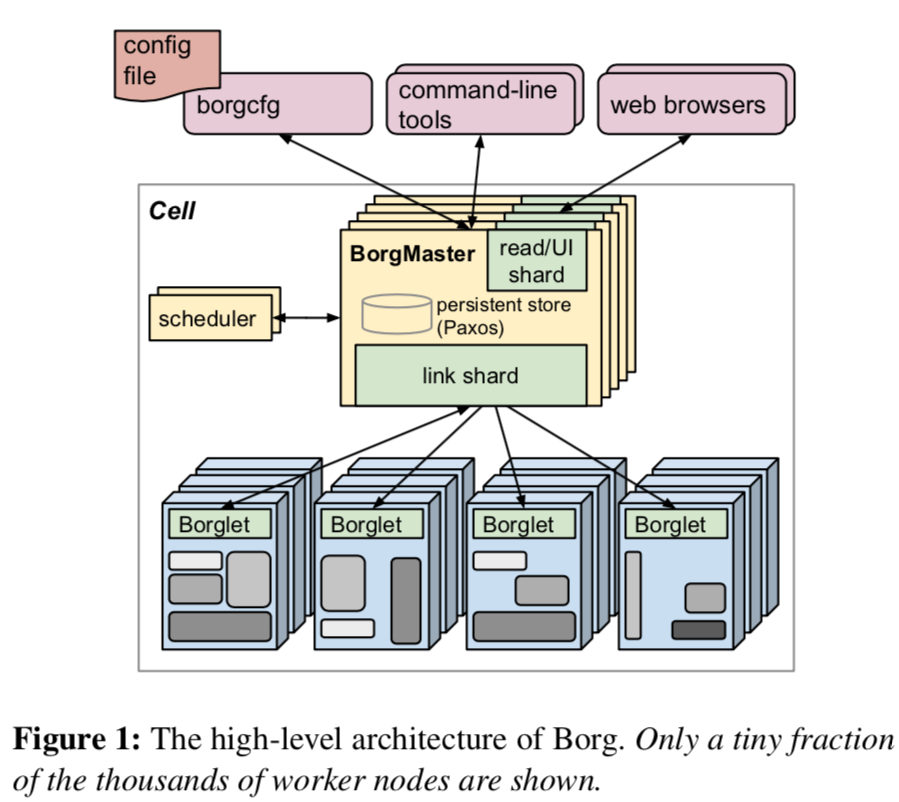
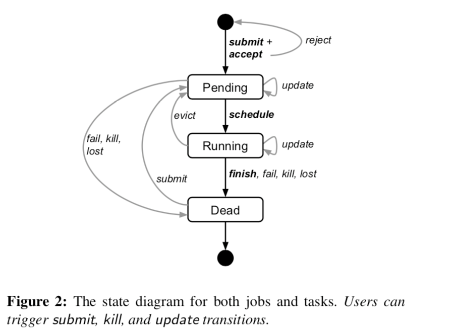
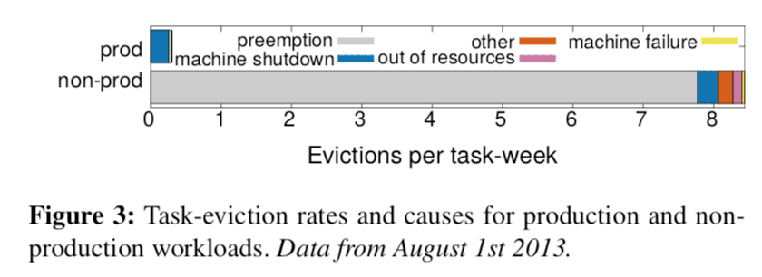
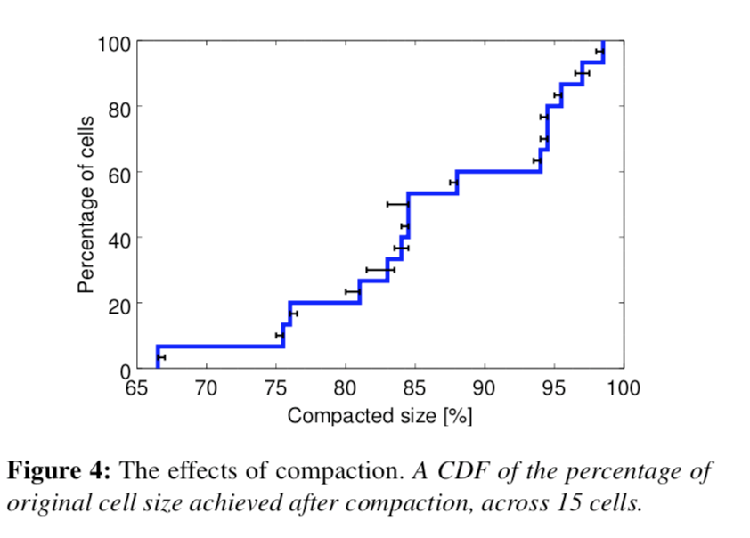
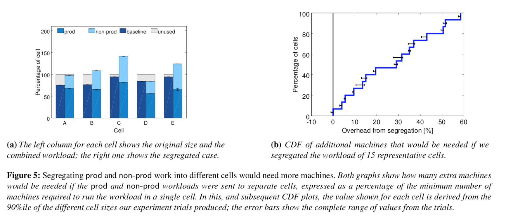
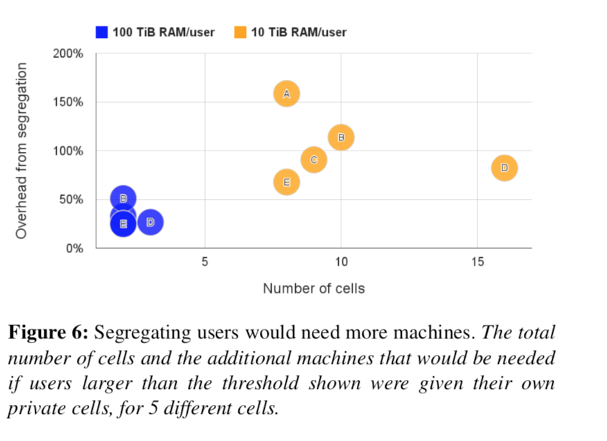
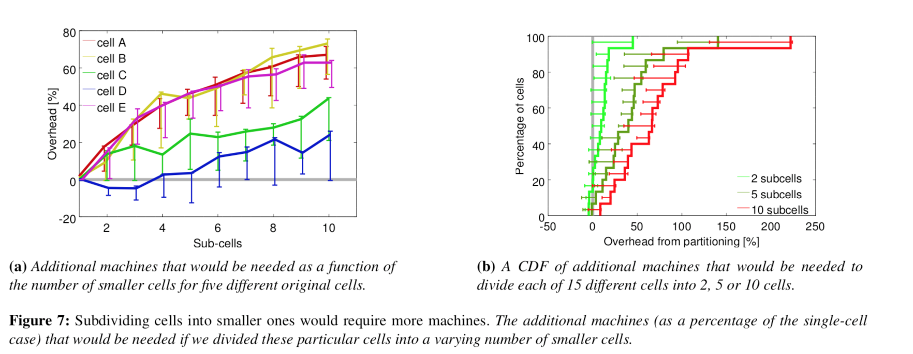
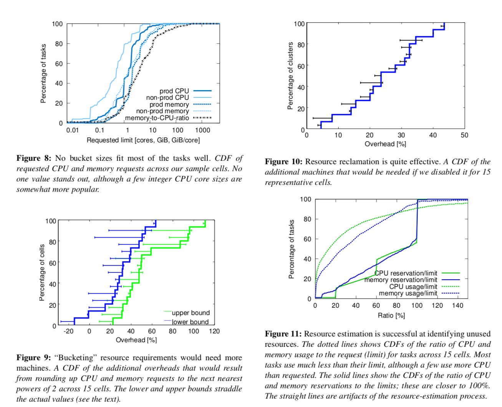
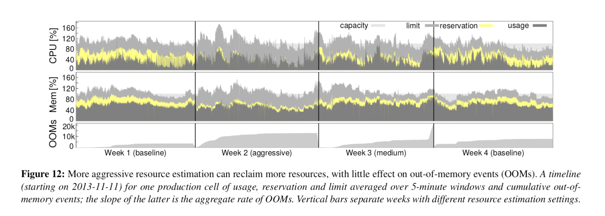
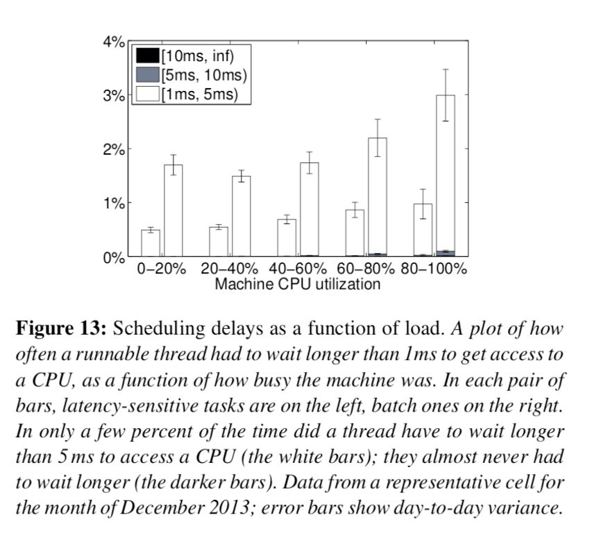

# borg

# 摘要

Google’s Borg system is a cluster manager that runs hundreds of thousands of jobs, from many thousands of different applications, across a number of clusters each with up to tens of thousands of machines.

borg 系统是一个集群管理系统， borg 运行了成千上万的jobs，来自于数千个不同的应用， 能够跨集群管理， 每个集群可以有成千上万个机器。。。

test

It achieves high utilization by combining admission control, efficient task-packing, over-commitment, and machine sharing with process-level performance isolation. It supports high-availability applications with runtime features that minimize fault-recovery time, and scheduling policies that reduce the probability of correlated failures. Borg simplifies life for its users by offering a declarative job specification language, name service integration, realtime job monitoring, and tools to analyze and simulate system behavior.

borg 通过管理控制， 高效的task 包装， 超售， 以及进程级别的性能隔离 实现了资源的高效利用。 它支持具有运行时特性的高可用应用程序, 最小化故障恢复时间， 以及具有降低相关故障率的调度策略。 borg 通过提供一个声明式的语言规范、name service 集成、实时job 监控，和分析和模拟系统行为的工具, 简化了用户的工作

We present a summary of the Borg system architecture and features, important design decisions, a quantitative analysis of some of its policy decisions, and a qualitative examination of lessons learned from a decade of operational experience with it.

我们总结了borg系统的架构和特定， 重要的设计决策，定量分析了它的一些策略决策， 并且总结了十年来运维经验和学到的东西。

# 介绍

The cluster management system we internally call Borg admits, schedules, starts, restarts, and monitors the full range of applications that Google runs. This paper explains how.

在我们内部，这个集群管理系统我们称作为borg。它管理，调度，启动，重启， 监控着在google里运行的应用程序的整个生命周期, 这篇论文介绍了它是如何做到的。

Borg provides three main benefits: it \(1\) hides the details of resource management and failure handling so its users can focus on application development instead; \(2\) operates with very high reliability and availability, and supports applications that do the same; and \(3\) lets us run workloads across tens of thousands of machines effectively. Borg is not the first system to address these issues, but it’s one of the few operating at this scale, with this degree of resiliency and completeness. This paper is organized around these topics, concluding with a set of qualitative observations we have made from operating Borg in production for more than a decade

borg 提供了三个主要的好处：

* 隐藏了具体的资源管理和错误处理， 因此使用者可以专注于应用程序的开发
* 本身具有高可靠和高可用性。 并且支持应用程序的高可靠和高可用
* 让用户的工作负载可以高效的运行于成百上千的机器上

borg 并不是第一个专注于解决这些问题的系统。 但是，他是少数的几个能够在这种规模下运行的系统之一。 而且它具有如此程度的弹性和完整性。 这篇论文围绕着这些主题进行展开, 通过我们数十年来在生产环境中对borg所做的一系列定性的观察作为结论。



# 用户视角

Borg’s users are Google developers and system administrators \(site reliability engineers or SREs\) that run Google’s applications and services. Users submit their work to Borg in the form of jobs, each of which consists of one or more tasks that all run the same program \(binary\). Each job runs in one Borg cell, a set of machines that are managed as a unit. The remainder of this section describes the main features exposed in the user view of Borg.

borg 的用户是google 的开发人员和系统管理员，他们在borg上运行google 的应用程序和服务。 用户以job的形式提交他们的工作负载给borg，每个job 包含了一个或者多个task，这些task 运行了相同的程序（二进制）


每个job 运行在borg 的cell 里， 这个cell 可以认为是多台机器组成的管理单元

```

这个cell 相当于kubernetes一个集群
```

本章节剩余部分主要介绍了在用户视角下borg系统提供的主要功能

## 工作负载

Borg cells run a heterogenous workload with two main parts. The first is long-running services that should “never” go down, and handle short-lived latency-sensitive requests \(a few μs to a few hundred ms\). Such services are used for end-user-facing products such as Gmail, Google Docs, and web search, and for internal infrastructure services \(e.g., BigTable\). The second is batch jobs that take from a few seconds to a few days to complete; these are much less sensitive to short-term performance fluctuations. The workload mix varies across cells, which run different mixes of applications depending on their major tenants \(e.g., some cells are quite batch-intensive\), and also varies over time: batch jobs come and go, and many end-user-facing service jobs see a diurnal usage pattern. Borg is required to handle all these cases equally well.

borg 主要运行两种异构的工作负载，

* 第一种叫做 long-running 服务，这些服务理论上应该用不宕机，永远运行下去。 并且处理段时间的敏感请求。 这种服务是面向于终端用户的产品， 比如Gmail，Google Docs 网页搜索，内部技术设施服务（bigtable）
* 另一种叫做 batch jobs，这种jobs 一般需要几秒 到几天的时间来完成。这些服务通常对短期的性能波动不敏感。 工作负载的混合在cell之间是不同的， cell 是根据租户来运行不通的应用程序的组合\(有些cell 是批处理密集型的\) ，而且随着时间的退役，也会有所不同： 批处理任务 挥之即来，随之即去。 许多面型终端的服务job 每天都有使用模式。 borg 需要妥善的处理这两种情况。

A representative Borg workload can be found in a publiclyavailable month-long trace from May 2011 \[80\], which has been extensively analyzed \(e.g., \[68\] and \[1, 26, 27, 57\]\).

Many application frameworks have been built on top of Borg over the last few years, including our internal MapReduce system \[23\], FlumeJava \[18\], Millwheel \[3\], and Pregel \[59\]. Most of these have a controller that submits a master job and one or more worker jobs; the first two play a similar role to YARN’s application manager \[76\]. Our distributed storage systems such as GFS \[34\] and its successor CFS, Bigtable \[19\], and Megastore \[8\] all run on Borg.

最近几年， 许多应用程序框架都已经构建在了borg 上。包括我们内部的map reduce 系统， Flumenjava， millwhell， pregel。 他们中大部分都有一个控制器

这个控制器用来提交一个master job 和多个work job。前两个框架类似于YARN的应用程序管理器 ， 我们的分布式粗才能系统， GFS， 他的后继者 CFS bigtable 和megastore 都运行在borg上。

For this paper, we classify higher-priority Borg jobs as “production” \(prod\) ones, and the rest as “non-production” \(non-prod\). Most long-running server jobs are prod; most batch jobs are non-prod. In a representative cell, prod jobs are allocated about 70% of the total CPU resources and represent about 60% of the total CPU usage; they are allocated about 55% of the total memory and represent about 85% of the total memory usage. The discrepancies between allocation and usage will prove important in §5.5.

在这篇论文里， 我们把搞优先级的borg job 归类为prod\(生成的意思\) ，剩下的归类于 non-prod\(非生产的\) ， 大多数的长期服务是prod，大多数的batch jobs 是non-prod.

```

这里隐含了一个意思， 都是生成的job 可能无法再细分优先级， 如果再继续分优先级， 这就要更加细粒度的抢占策略， 这样很可能导致上层用户服务的不可用， 从产品层面和收费层面 估计不可行 所以优先级 抢占可能仅仅发生在 prod 与non-prod 之间

```

在一个比较典型的cell中， prod job 给分配了70%的CPU资源，然而实际使用了60%的资源。 分配了55%的内存，然而实际使用了85%的内存。 在5.5章 展示了分配 和实际值的差是很重要的（旁边， 类似于kubernetes 的request 和limit）

## 集群和cell

The machines in a cell belong to a single cluster, defined by the high-performance datacenter-scale network fabric that connects them. A cluster lives inside a single datacenter building, and a collection of buildings makes up a site.1 A cluster usually hosts one large cell and may have a few smaller-scale test or special-purpose cells. We assiduously avoid any single point of failure.

一个cell 里的所有机器 都属于一个单个集群。 集群是有高性能的数据中心级别的网络光纤连接的。 一个集群安装在一个单独的楼里，多个楼组成了一个site，一个集群通常包括一个大的cell 以及一些小规模的用于测试或者其他特性的cell。 我们会尽量避免单点故障


Our median cell size is about 10 k machines after excluding test cells; some are much larger. The machines in a cell are heterogeneous in many dimensions: sizes \(CPU, RAM, disk, network\), processor type, performance, and capabilities such as an external IP address or flash storage. Borg isolates users from most of these differences by determining where in a cell to run tasks, allocating their resources, installing their programs and other dependencies, monitoring their health, and restarting them if they fail.

排除测试cell， 我们中等规模的cell 大约有1w台机器。 有一些会大的很多。一个cell 中的机器很多都是异构的: 大小\( CPU 内存， 硬盘， 网络\) 处理器类型， 性能， 以及外部ip地址 或者flash 存储。 borg 给用户隔离了这些差异。 让用户单纯的运行task，分配资源，安装应用程序和其他的依赖， 监控，以及在出现故障时候重启。

## job 和 tasks

A Borg job’s properties include its name, owner, and the number of tasks it has. Jobs can have constraints to force its tasks to run on machines with particular attributes such as processor architecture, OS version, or an external IP address. Constraints can be hard or soft; the latter act like preferences rather than requirements. The start of a job can be deferred until a prior one finishes. A job runs in just one cell.

jobs 属性包括： name， 拥有者，一组task。jobs 可以提供约束来强制他的task 运行在具有特定架构的机器上。这些架构包括：处理器， 操作系统版本， 或者外部IP。 约束条件可以是硬约束也可以是软约束。 软约束相当于最好而不是要求。 job 的启动可以被延迟，直到一个优先的job完成了。 一个job 只能运行在一个cell中。

```

这里的约束相当于kubernetes的node seleter 以及现在普遍使用的 affinity， affinity 分为 nodeaffinity 和 podaffinity 以及 podantiaffinity , 同时k8s 也提供了 软约束和硬约束 preferredDuringSchedulingIgnoredDuringExecution 和 requiredDuringSchedulingIgnoredDuringExecution , 约束条件支持多种形式

```

Each task maps to a set of Linux processes running in a container on a machine \[62\]. The vast majority of the Borg workload does not run inside virtual machines \(VMs\),because we don’t want to pay the cost of virtualization. Also, the system was designed at a time when we had a considerable investment in processors with no virtualization support in hardware.

每个task 对应了一组linux process，这些process 运行在机器的容器里。 

```

注意 绝大多数borg 的工作负载没有运行在虚拟机中， 因为我们不想支付虚拟化带来的成本， 而且在这个系统的设计之初，我们已经在不支持硬件虚拟化的处理器上做了大量的投入， 估计那时候还没有硬件虚拟化的事

```

A task has properties too, such as its resource requirements and the task’s index within the job. Most task properties are the same across all tasks in a job, but can be overridden – e.g., to provide task-specific command-line flags. Each resource dimension \(CPU cores, RAM, disk space, disk access rate, TCP ports,2 etc.\) is specified independently at fine granularity; we don’t impose fixed-sized buckets or slots \(§5.4\). Borg programs are statically linked to reduce dependencies on their runtime environment, and structured as packages of binaries and data files, whose installation is orchestrated by Borg.

task 也有属性， 如它的资源需求，task 在job 中的索引位置. 在一个job 中的所有task中， 大多数task的属性都是相同的， 但是可以被重写。 例如： 提供了task 专用命令行参数。 每个资源需求（cpu 内存，磁盘空间，访问速率， tcp端口等等）都可以按照一个粒度单独的提供 ，borg 程序是静态连接的。 目的是为了降低他们对运行环境的依赖。 这些应用程序的二进制和数据文件被打包成一个package。 应用程序的安装完全依靠borg 进行编排。

```
kubernetes 的 pod和 container 跟 borg 的job task 异曲同工。 现在业内的容器也是普遍使用镜像来讲应用程序打包， 解决依赖的问题。 现在的镜像格式遵循OCI image spec
```

Users operate on jobs by issuing remote procedure calls \(RPCs\) to Borg, most commonly from a command-line tool, other Borg jobs, or our monitoring systems \(§2.6\). Most job descriptions are written in the declarative configuration language BCL. This is a variant of GCL \[12\], which generates protobuf files \[67\], extended with some Borg-specific keywords. GCL provides lambda functions to allow calculations, and these are used by applications to adjust their configurations to their environment; tens of thousands of BCL files are over 1 k lines long, and we have accumulated tens of millions of lines of BCL. Borg job configurations have similarities to Aurora configuration files \[6\].

用户通过RPC 来操作borg 的job。 大多数还是通过命令行 或者监控系统。

```
 Google 内有深厚的技术积累， 开发人员和使用者反而觉得命令行比界面操作便利 和 快速。 而国内大部分的容器产品或者思维方式，还是把api 或者命令行进行界面化
```

大多数的job 描述都是使用BCL 这种声明式配置语言编写的

```
kubernetes 的对资源的编写也是声明式的 yaml 或者json 文件
```

BCL 是GCL的一个变种， 它能够生成protobuf 文件。 GCL提供了lambda funtion 来允许计算。这样应用程序使用它来调整自己的配置。 成千上万的BCL文件超过一千行, 在系统中我们总共跑了上千万行的BCL。 borg job配置非常类似于aurora配置文件。

Figure 2 illustrates the states that jobs and tasks go through during their lifetime.

下图展示了job 和task 的整个生命周期



A user can change the properties of some or all of the tasks in a running job by pushing a new job configuration to Borg, and then instructing Borg to update the tasks to the new specification. This acts as a lightweight, non-atomic transaction that can easily be undone until it is closed \(committed\). Updates are generally done in a rolling fashion, and a limit can be imposed on the number of task disruptions\(reschedules or preemptions\) an update causes; any changes that would cause more disruptions are skipped.

用户可以改变一个运行中job 里的一些或者所有的task属性，通过push 一个新的job 配置文件， 它会告知borg来把job 的task 更新成新的配置。

```
类似于kubectl apply
```

这个操作类似于一个轻量级，非原子性的事务。这种操作可以很容易的undone 知道它是关闭。 更新通常是滚动式的， 可以限制因为更新导致task中断的数量

```
kubectl scale
```

Some task updates \(e.g., pushing a new binary\) will always require the task to be restarted; some \(e.g., increasing resource requirements or changing constraints\) might make the task no longer fit on the machine, and cause it to be stopped and rescheduled; and some \(e.g., changing priority\) can always be done without restarting or moving the task.

一些task 更新\( 例如 推送一个新的二进制\) 经常需要task 重启。 有些更新的task （例如 增加了资源需求， 或者更新了约束条件） 可能不在适合部署在原有的机器上， 导致它需要停止，并且进行重新调度。 一些task（改变了优先级）无需移动或者重启即可完成。

Tasks can ask to be notified via a Unix SIGTERM signal before they are preempted by a SIGKILL, so they have time to clean up, save state, finish any currently-executing requests, and decline new ones. The actual notice may be less if the preemptor sets a delay bound. In practice, a notice is delivered about 80% of the time.

Task 要求能够接受unix sigterm 通过SKIGKILL 在他们被抢占之前， 因此他们还是有一些时间去清理， 保存状态，完成任何一个当前执行的请求, 并拒绝新的请求。 如果抢占者使用了延迟限制，实际的通知可能会少一些 .

## Allocs

A Borg alloc \(short for allocation\) is a reserved set of resources on a machine in which one or more tasks can be run; the resources remain assigned whether or not they are used. Allocs can be used to set resources aside for future tasks, to retain resources between stopping a task and starting it again, and to gather tasks from different jobs onto the same machine – e.g., a web server instance and an associated logsaver task that copies the server’s URL logs from the local disk to a distributed file system. The resources of an alloc are treated in a similar way to the resources of a machine; multiple tasks running inside one share its resources. If an alloc must be relocated to another machine, its tasks are rescheduled with it.

alloc\( allocation 的简称\) 是单台机器上一组保留的计算资源。 这些保留的计算资源用来运行一个或者多个task。 这些资源保持被分配状态不管他们有没有被使用。 Allocation 可以被用来给将要创建的task 分配资源， 用来在停止或者启动task之间保留资源。 并且可以狙击不同job 下的task 运行在相同机器上。 例如 一个web server 的实例和一个相关的把server 的url 日志发送到分布式文件系统的实例。 alloc 的资源很像机器的资源。 多个task 共享这些资源.

如果一个allco 必须被重新定位到其他机器， 他的tasks 也会跟着重新调度, \(**不懂 ~~~~**\)

An alloc set is like a job: it is a group of allocs that reserve resources on multiple machines. Once an alloc set has been created, one or more jobs can be submitted to run in it. For brevity, we will generally use “task” to refer to an alloc or a top-level task \(one outside an alloc\) and “job” to refer to a job or alloc set.

一个alloc set 类似一个job， 他是一组allocs 保留了多个机器的资源。 一旦一个alloc set 被创建， 一个或者多个job 可以被提交进去跑。 总而言之， 我们通常会用task 表示一个alloc 或者一个top-level的task和job 来表示一个job 或者alloc set。


## 优先级， 配额和管理控制

What happens when more work shows up than can be accommodated? Our solutions for this are priority and quota.

Every job has a priority, a small positive integer. A highpriority task can obtain resources at the expense of a lowerpriority one, even if that involves preempting \(killing\) the latter. Borg defines non-overlapping priority bands for different uses, including \(in decreasing-priority order\): monitoring, production, batch, and best effort \(also known as testing or free\). For this paper, prod jobs are the ones in the monitoring and production bands.

如果资源被超量使用时候会发生什么情况呢？ 我们的解决方案就是优先级和配额

每个job 都有一个优先级，一个小的正整数。 高优先级的task 在损失低优先级task代价的情况下可以获得资源。 即使是杀死低优先级的task。 borg 定义了一个不重叠的优先级段 给不同的用户（包括优先级降序）: 监控， prod，batch，和高性能（测试或者免费） 在本篇论文中， prod job 是在监控和生成的段里。

Although a preempted task will often be rescheduled elsewhere in the cell, preemption cascades could occur if a high-priority task bumped out a slightly lower-priority one, which bumped out another slightly-lower priority task, and so on. To eliminate most of this, we disallow tasks in the production priority band to preempt one another. Finegrained priorities are still useful in other circumstances –e.g., MapReduce master tasks run at a slightly higher priority than the workers they control, to improve their reliability.

虽然一个被抢占的task 经常会被调度到cell 中其他地方， 它总能在一个cell中找到一席之地。抢占瀑布可能会发生： 就是如果一个高优先级的task 抢占了一个低优先级的task，而这个低优先级的task 又抢占了另一个更低优先级的task，如此等等，会发生抢占瀑布。 为了避免这种情况， 我们不允许prod 级别的task 互相排挤抢占

```
 borg 这个理论给我们一个好的提示，就是如果两个用户的task 都是生产级别的，那我们不能让两个用户的task 互相抢占， 即使你给更多的钱 ， 哈哈 ~~~, 我们只能让生产的 去抢占batch 去抢占测试的， 这样才对
```

合理粒度的优先级总是有用的，在一定场景下，例如： mapreduce master 的task 运行在一个比较高的优先级 比那些workers，这是为了提高他们的高可靠性

Priority expresses relative importance for jobs that are running or waiting to run in a cell. Quota is used to decide which jobs to admit for scheduling. Quota is expressed as a vector of resource quantities \(CPU, RAM, disk, etc.\) at a given priority, for a period of time \(typically months\). The quantities specify the maximum amount of resources that a user’s job requests can ask for at a time \(e.g., “20TiB of RAM at prod priority from now until the end of July in cell xx”\). Quota-checking is part of admission control, not scheduling: jobs with insufficient quota are immediately rejected upon submission.

优先级对于那些在cell中运行或者等待运行的job展示了相对重要性。 Quota 是用来决定那个jobs 被认可调度， Quota 是在一个特定的时间段内一个给定优先级的一组资源：cpu，内存， disk等等， 这些数量决定了一个用户job在一次能够请求的最大资源。

Quota-checking 是管理控制的一部分， 这并不是调度层的，配额不足的job 在提交时候会立刻被拒绝。

```
 这一点跟kubernetes 不一样， kubernetes在调度层才知道配额是否不足， 如果配额不足， 在调度的事件中才会提示
```

Higher-priority quota costs more than quota at lowerpriority. Production-priority quota is limited to the actual resources available in the cell, so that a user who submits a production-priority job that fits in their quota can expect it to run, modulo fragmentation and constraints. Even though we encourage users to purchase no more quota than they need, many users overbuy because it insulates them against future shortages when their application’s user base grows. We respond to this by over-selling quota at lower-priority levels: every user has infinite quota at priority zero, although this is frequently hard to exercise because resources are oversubscribed. A low-priority job may be admitted but remain pending \(unscheduled\) due to insufficient resources.

高优先级的配额比低优先级的配额话费更多。 生成级别的配额会被限制在一个cell中实际的可用资源中。 所以，提交适合他们配额的生产级别job的用户可以期望它来运行，modulo fragmentation and constraints \(没搞明白\) 。

尽管 我们鼓励用户购买的配额不要超过他们的需求

许多用户超买（不是超卖）因为当他们的应用程序的用户突然爆发时候， 他们因为已经超买了可以杜绝这种短期的影响。 我们做出的回应是对低优先级的进行超卖（超售\): 每个用户在优先级为0 时候， 都有无限的配, 尽管这个很难执行 因为资源已经超额预订了。 一个低优先级的job 会被接纳， 但是由于资源不足，仍然会处于pending 状态。

Quota allocation is handled outside of Borg, and is intimately tied to our physical capacity planning, whose results are reflected in the price and availability of quota in different datacenters. User jobs are admitted only if they have sufficient quota at the required priority. The use of quota reduces the need for policies like Dominant Resource Fairness \(DRF\) \[29, 35, 36, 66\].

Quota 的分配在borg之外， borg 不负责此事。这和我们的物理资源容量规划有关。 这些计划在不同的数据中心产生不同的价格和quota可用性。 用户jobs只有在具有足够的配额和所需要的优先级时候才能被允许。 配额的使用减少了对像主要资源公平性政策的需求。

Borg has a capability system that gives special privileges to some users; for example, allowing administrators to delete or modify any job in the cell, or allowing a user to access restricted kernel features or Borg behaviors such as disabling resource estimation \(§5.5\) on their jobs.

borg 有一个容量系统 给某些用户一些特殊权限。 例如： 允许管理员删除或者修改cell里的job，或者允许用户访问受限的kernel feature，或者禁止borg对他们的jobs进行资源评估。

## 命名和监控

It’s not enough to create and place tasks: a service’s clients and other systems need to be able to find them, even after they are relocated to a new machine. To enable this, Borg creates a stable “Borg name service” \(BNS\) name for each task that includes the cell name, job name, and task number. Borg writes the task’s hostname and port into a consistent, highly-available file in Chubby \[14\] with this name, which is used by our RPC system to find the task endpoint. The BNS name also forms the basis of the task’s DNS name, so the fiftieth task in job jfoo owned by user ubar in cell cc would be reachable via 50.jfoo.ubar.cc.borg.google.com. Borg also writes job size and task health information into Chubby whenever it changes, so load balancers can see where to route requests to.

单纯创建和安置task 是不够的： 一个service 的客户端和其他系统需要能够找到他们， 即使他们换了一个机器。 为了搞定这个， borg创建了一个稳定的 ‘borg name service’ 名字给每一个task。 这个名字包括cell 名字， job 名字和task number。

```
 container 的命名规范 kubernetes 也有点类似
```

borg 把task 的hostname 和端口写在一个持久化的高可用文件里。这个文件被用来我们的RPC系统来发现task 的endpoint。

```
 kubernetes 实际上是把pod 的信息注册到etcd中， 然后由endpoint controller 来发现这些endpoint
```

BNS 那么也是构成了task dns name的基础部分，所以cc cell中的ubar 用户的在jfoo job中的第50个task 的dns 名称会是： 50.jfoo.ubar.cc.borg.google.com。 borg 也会写job 的大小和task 的健康信息到持久化文件中无论他改变与否。所以loadbalancer 可以通过它来决定路由请求。

Almost every task run under Borg contains a built-in HTTP server that publishes information about the health of the task and thousands of performance metrics \(e.g., RPC latencies\). Borg monitors the health-check URL and restarts tasks that do not respond promptly or return an HTTP error code. Other data is tracked by monitoring tools for dashboards and alerts on service level objective \(SLO\) violations.

在borg上 几乎每个task 都会内置一个http server ，用来公开这个task 的健康状况和数千个性能metrics,\(例如rpc 延迟\) 。borg 监控这个监控探测的url。 并且重启那些没有返回的或者返回一个http错误码的task。其他的数据 是有监控工具来跟踪。

```
kubernetes 也有相应的监控探测接口 Probe 分别是 readinessProbe 和 livenessProbe
```

A service called Sigma provides a web-based user interface \(UI\) through which a user can examine the state of all their jobs, a particular cell, or drill down to individual jobs and tasks to examine their resource behavior, detailed logs, execution history, and eventual fate. Our applications generate voluminous logs; these are automatically rotated to avoid running out of disk space, and preserved for a while after the task’s exit to assist with debugging. If a job is not running Borg provides a “why pending?” annotation, together with guidance on how to modify the job’s resource requests to better fit the cell. We publish guidelines for “conforming” resource shapes that are likely to schedule easily.

一个叫sigma的服务提供了一个基于web UI 的访问， 通过它 用户可以检查 所有jobs 的状态、一个特定的cell、或者深入到特定的jobs 和task里去检测资源状态、详细日志、执行历史、和最终的结果。 我们的应用程序产生大量的日志，他们自动的rotate 避免占用大量的磁盘空间，并且在task 退出后保留一段时间来debug。 如果一个job 没有running。 borg 提供一个为什么pending的annotation，同时指导用户怎样修改job的资源来最好的适应cell。 我们发布了比较容易调度的指导方针。

Borg records all job submissions and task events, as well as detailed per-task resource usage information in Infrastore, a scalable read-only data store with an interactive SQL-like interface via Dremel \[61\]. This data is used for usage-based charging, debugging job and system failures, and long-term capacity planning. It also provided the data for the Google cluster workload trace \[80\].

borg 将所有job的提交和task 事件， 以及每个task 资源使用信息 记录在了技术设施存储中， 这个存储是一个可扩展的只读的具有sql-like 的交互接口，这些数据用于usage-based charging ,debug ,系统差错和长期容量规划。 他提供了borg 集群负载追踪的数据来源

All of these features help users to understand and debug the behavior of Borg and their jobs, and help our SREs manage a few tens of thousands of machines per person.

所有的features 帮助用户理解和debug borg和他们jobs的行为， 并且帮助SRE工程师们管理程序上万的主机。

# borg 架构

A Borg cell consists of a set of machines, a logically centralized controller called the Borgmaster, and an agent process called the Borglet that runs on each machine in a cell \(see Figure 1\). All components of Borg are written in C++.

一个borg的cell 包含一组机器，一个逻辑的中心控制器称作为borgmaster， 运行在cell里的每个集群上的agent 称作为borglet。borg 所有的组件都用c++ 写的。

```
borgmaster 对应kubernetes 的 etcd + apiserver+ scheduler + controller-manager , borglet 对应kubernetes 的kubelet
```

## borgmaster

Each cell’s Borgmaster consists of two processes: the main Borgmaster process and a separate scheduler \(§3.2\). The main Borgmaster process handles client RPCs that either mutate state \(e.g., create job\) or provide read-only access to data \(e.g., lookup job\). It also manages state machines for all of the objects in the system \(machines, tasks, allocs, etc.\), communicates with the Borglets, and offers a web UI as a backup to Sigma.

每个cell 里的borgmaster 包含两个进程： master 主进程 和一个单独的调度进程。 这个主进程处理client端的rpc请求，包括修改状态或者提供只读数据访问。 它也管理系统中（机器 task alloc 等）所有对象的状态机， 与borglet的交互， 并提供一个webui。

The Borgmaster is logically a single process but is actually replicated five times. Each replica maintains an inmemory copy of most of the state of the cell, and this state is also recorded in a highly-available, distributed, Paxos-based store \[55\] on the replicas’ local disks. A single elected master per cell serves both as the Paxos leader and the state mutator, handling all operations that change the cell’s state, such as submitting a job or terminating a task on a machine. A master is elected \(using Paxos\) when the cell isbrought up and whenever the elected master fails; it acquires a Chubby lock so other systems can find it. Electing a master and failing-over to the new one typically takes about 10 s, but can take up to a minute in a big cell because some in-memory state has to be reconstructed. When a replica recovers from an outage, it dynamically re-synchronizes its state from other Paxos replicas that are up-to-date.

borgmaster 是一个逻辑的单进程， 但是实际上有5个副本。 每个副本在内存中保存了cell大多数状态的拷贝。 这些状态也被记录在副本的本地磁盘上，一个基于paxos的高可用，分布式的存储。每个cell 都有一个单独选举出来的master，它同时作为paxos的leader 和 状态的修改者， 处理所有变更cell状态的操作请求，例如提交一个job 或者在一个机器上中断一个task。 当cell 启动或者当一个master 故障时候， 新的master会通过paxos 算法重新选举出来。 新的master 会获得一个chubby锁，这样其他的系统可以找到它。选举并转移到一个新的master 一般需要花费10s， 但是在一个大的cell里可以花费1分钟， 以为一些内存状态需要背重构。 当一个副本从停机中恢复后， 它会从其他的paxos 副本中动态的同步他的状态

The Borgmaster’s state at a point in time is called a checkpoint, and takes the form of a periodic snapshot plus a change log kept in the Paxos store. Checkpoints have many uses, including restoring a Borgmaster’s state to an arbitrary point in the past \(e.g., just before accepting a request that triggered a software defect in Borg so it can be debugged\); fixing it by hand in extremis; building a persistent log of events for future queries; and offline simulations.

在某一个时刻 borgmaster的状态被称为检查点checkpoint， 以定期快照 加 日志变更的形式存储在paxos 存储里。 checkpoints 有很多用途： 包括恢复过去任意时间点的borgmaster的状态（例如 在borg中 在接收触发软件探测的请求之前，这样可以被用来调试） 通过手工进行修复，构建一个持久化的日志事件供日后查询 和离线仿真。

A high-fidelity Borgmaster simulator called Fauxmaster can be used to read checkpoint files, and contains a complete copy of the production Borgmaster code, with stubbed-out interfaces to the Borglets. It accepts RPCs to make state machine changes and perform operations, such as “schedule all pending tasks”, and we use it to debug failures, by interacting with it as if it were a live Borgmaster, with simulated Borglets replaying real interactions from the checkpoint file. A user can step through and observe the changes to the system state that actually occurred in the past. Fauxmaster is also useful for capacity planning \(“how many new jobs of this type would fit?”\), as well as sanity checks before making a change to a cell’s configuration \(“will this change evict any important jobs?”\).

一个高保真的borgmaster 模拟器被称作为 Fauxmaster。 Fauxmaster 可以读取checkpoint 文件， 并且包含了一个生产borgmaster的全部代码拷贝， 并且对borglet提供stubbed-out 接口。 它接受RPC请求来改变机器状态，执行操作， 例如： 调度所有等待的tasks。 并且我们用它去debug failures。 就像是跟在线的borgmaster进行交互一样。 通过模拟的borglet 重放checkpoint files 里的真实 交互。 用户可以单步执行 并且观察这个系统在过去发生状态的变化。Fauxmaster 也用于容量规划（可以适合多少此类型的jobs） 也可以在更改cell配置之前做相关检查。

## scheduling 调度

When a job is submitted, the Borgmaster records it persistently in the Paxos store and adds the job’s tasks to the pending queue. This is scanned asynchronously by the scheduler, which assigns tasks to machines if there are sufficient available resources that meet the job’s constraints. \(The scheduler primarily operates on tasks, not jobs.\) The scan proceeds from high to low priority, modulated by a round-robin scheme within a priority to ensure fairness across users and avoid head-of-line blocking behind a large job. The scheduling algorithm has two parts: feasibility checking, to find machines on which the task could run, and scoring, which picks one of the feasible machines.

当一个job提交后， borgmaster 把它持久化到paxos存储中，并且增加job task 到一个pending 队列中。 调度器异步扫描等待队列， 如果有足够的可用资源 来满足job的约束条件，调度器会分配task到机器上。（调度器主要是操作task 而不是job）

```
kubernetes 队列中存的是pod， 实际调度也是pod 跟borg 还有点不一样， 最根本原因估计是pod 和 container 是不能分离到多个machine 上的
```

调度器根据优先级从高到底进行扫描， 在同一个优先级下，通过轮转的方式来确保对每个用户公平， 避免队首阻塞大型作业。 调度算法分为两部分： 可行性检查， 为了找出task 适合的机器， 第二部分是打分， 从中选出一个合适的机器。

```

kubernetes 的scheduler 调度算法分为预选 和 优选 跟borg 的很相似

```

In feasibility checking, the scheduler finds a set of machines that meet the task’s constraints and also have enough “available” resources – which includes resources assigned to lower-priority tasks that can be evicted. In scoring, the scheduler determines the “goodness” of each feasible machine. The score takes into account user-specified preferences, but is mostly driven by built-in criteria such as minimizing the number and priority of preempted tasks, picking machines that already have a copy of the task’s packages, spreading tasks across power and failure domains, and packing quality including putting a mix of high and low priority tasks onto a single machine to allow the high-priority ones to expand in a load spike.

在可行性检查中， 调度器找到一组机器来满足task 的约束， 并且这些机器有足够的资源： 包括已经分配给低优先级的可以被驱逐的已经分配的资源。

在打分中， 调度器决定了每个可行机器的适宜性。 这个打分考虑到了用户定义的preferences，但是大部分都会取决于内置的标准：例如最小化被抢占task的个数, 选择已经有task package 的机器， 将task 分散在供电和故障域,

Borg originally used a variant of E-PVM \[4\] for scoring, which generates a single cost value across heterogeneous resources and minimizes the change in cost when placing a task. In practice, E-PVM ends up spreading load across all the machines, leaving headroom for load spikes – but at the expense of increased fragmentation, especially for large tasks that need most of the machine; we sometimes call this “worst fit”.

borg 早起使用E-PVM来打分 ,E-PVM 对异构的资源生成一个单独的成本值，当放置task时，使成本的改变最小。 实际上E PVM 会分散负载到所有机器上， 为负载高峰预留资源。 但是这样的代价是增加了碎片， 特别是对需要大部分机器的大型任务而言， 我们有时候称他们为最差匹配

The opposite end of the spectrum is “best fit”, which tries to fill machines as tightly as possible. This leaves some machines empty of user jobs \(they still run storage servers\), so placing large tasks is straightforward, but the tight packing penalizes any mis-estimations in resource requirements by users or Borg. This hurts applications with bursty loads, and is particularly bad for batch jobs which specify low CPU needs so they can schedule easily and try to run opportunistically in unused resources: 20% of non-prod tasks request less than 0.1 CPU cores.

与之相对的还有最佳匹配，它是尽可能的在机器上塞满任务。 这就空出了一些机器没有用户的jobs。 因此放置大型job就比较直接。 但是这中紧密的package 会惩罚任何一个用户或者borg对资源需求的错误估计。 这严重影响伤害了具有激增负载的应用程序，并且对那些需要少量cpu 的batch jobs 特别不友好，这些batch jobs 申请少量CPU目的是能够更容易的去调度和运行在不用的资源上： 20%的non-prod task 申请小于0.1个CPU核。

Our current scoring model is a hybrid one that tries to reduce the amount of stranded resources – ones that cannot be used because another resource on the machine is fully allocated. It provides about 3–5% better packing efficiency \(defined in \[78\]\) than best fit for our workloads.

我们当前的评分模型是混合的。 它视图降低这个搁浅stranded资源的数量。（指的是因为一台机器的其他资源已经完全被分片了而不能在被使用了） ，它比最佳匹配 提升了3-5%的package 效率。

If the machine selected by the scoring phase doesn’t have enough available resources to fit the new task, Borg preempts \(kills\) lower-priority tasks, from lowest to highest priority, until it does. We add the preempted tasks to the scheduler’s pending queue, rather than migrate or hibernate them.3

如果一个被选的机器被评分系统认为没有足够的资源去分配新的task，borg 抢占kill 低优先级的task， 按照由低到高的顺序， 直到它可以有合适的资源。我们把被强占的task 增加到调度器的pending 队列中， 而不是迁移或者休眠他们。

```

这样如果有合适的资源后，会重新调度他们
```

Task startup latency \(the time from job submission to a task running\) is an area that has received and continues to receive significant attention. It is highly variable, with the median typically about 25 s. Package installation takes about 80% of the total: one of the known bottlenecks is contention for the local disk where packages are written to. To reduce task startup time, the scheduler prefers to assign tasks to machines that already have the necessary packages \(programs and data\) installed: most packages are immutable and so can be shared and cached. \(This is the only form of data locality supported by the Borg scheduler.\) In addition, Borg distributes packages to machines in parallel using treeand torrent-like protocols.

task 启动延迟（job提交到task running的时间）是一个重点关注的区域。 启动延迟时间是高度可变的。 中等时间大约是25s，package的安装占用了大约80%的时间： 一个已知的瓶颈是软件包写磁盘的争用。为了减少task 启动时间， 调度器更喜欢把那些task 分配到那些已经有pacakge安装的机器里： 大多数的package 是不可变的， 并且可以被共享和缓存。（这是borg调度器唯一的数据局部性支持） ,另外， borg 使用类似BT协议 分发package 到机器上。

```

kubernetes 调度器貌似没有对镜像是否已经安装的调度算法， kubernetes 的镜像分发也没用使用BT协议

```

Additionally, the scheduler uses several techniques to let it scale up to cells with tens of thousands of machines \(§3.4\). 此外 调度器采用多种技术让它能够扩展到数万台机器的cell中。

## borglet

The Borglet is a local Borg agent that is present on every machine in a cell. It starts and stops tasks; restarts them if they fail; manages local resources by manipulating OS kernel settings; rolls over debug logs; and reports the state of the machine to the Borgmaster and other monitoring systems.

borglet 是安装在cell中每个机器上的agent。 它是用来启动和停止task。如果task fail，它来重启他们。 通过os 内核来管理本地资源， 滚动调试日志， 向borgmaster或者其他的监控系统来记录machine的状态。

The Borgmaster polls each Borglet every few seconds to retrieve the machine’s current state and send it any outstanding requests. This gives Borgmaster control over the rate of communication, avoids the need for an explicit flow control mechanism, and prevents recovery storms \[9\].

borgmaster 每个几秒轮训borglet 来获得机器的当前状态， 并向其发送输出请求。borgmaster 控制通信频率， 避免了显式的流量控制需求，阻止了恢复风暴

```

k8s 的kubelet 是主动上报的， borg 是主动拉取的， 跟普罗米修斯相似

```

The elected master is responsible for preparing messages to send to the Borglets and for updating the cell’s state with their responses. For performance scalability, each Borgmaster replica runs a stateless link shard to handle the communication with some of the Borglets; the partitioning is recalculated whenever a Borgmaster election occurs. For resiliency, the Borglet always reports its full state, but the link shards aggregate and compress this information by reporting only differences to the state machines, to reduce the update load at the elected master.

选举出来的master 负责准备信息发送给borglet，并根据borglet的相应来更新cell的状态。为了性能可扩展，每个borgmaster 副本运行一个无状态的链接分片去处理一部分的borglet 通信。 borgmaster 选举后 会重新计算分片. 对于弹性， borglet 经常报告他的所有状态，但是连接分片通过聚合和比较仅仅汇报这个变化的部分，这样来降低master更新的负担

If a Borglet does not respond to several poll messages its machine is marked as down and any tasks it was running are rescheduled on other machines. If communication is restored the Borgmaster tells the Borglet to kill those tasks that have been rescheduled, to avoid duplicates. A Borglet continues normal operation even if it loses contact with the Borgmaster, so currently-running tasks and services stay up even if all Borgmaster replicas fail.

如果一个borglet 在几次轮训后没有相应，它所在的机器会被标记为下线。 跑在上面的任何task 都会被重新调度到其他机器上。 如果通信恢复了， borgmaster 告诉borglet 去删掉那些已经被重新调度的task， 去避免重复。 borglet 继续正常运行即使它失去了master的联系， 因此 即使所有master 副本都故障了， 当前运行的task 和service 都会正常运行.

## scalability

We are not sure where the ultimate scalability limit to Borg’s centralized architecture will come from; so far, every time we have approached a limit, we’ve managed to eliminate it. A single Borgmaster can manage many thousands of machines in a cell, and several cells have arrival rates above 10000 tasks per minute. A busy Borgmaster uses 10–14 CPU cores and up to 50 GiB RAM. We use several techniques to achieve this scale.

我们并不确定对borg 这种中心架构的最终可扩展的限制来自于哪里，到目前为止， 每次我们遇到了上限， 我们都消除了这种限制。 单个borgmaster 可以管理一个cell中的上千台machine是， 许多cell里平均每分钟会有1w个task到达，一个繁忙的borgmaster 使用了10-14个cpu核， 和50GB 内存。 我们使用多种基础来达到这种扩展.

Early versions of Borgmaster had a simple, synchronous loop that accepted requests, scheduled tasks, and communicated with Borglets. To handle larger cells, we split the scheduler into a separate process so it could operate in parallel with the other Borgmaster functions that are replicated for failure tolerance. A scheduler replica operates on a cached copy of the cell state. It repeatedly: retrieves state changes from the elected master \(including both assigned and pending work\); updates its local copy; does a scheduling pass to assign tasks; and informs the elected master of those assignments. The master will accept and apply these assignments unless they are inappropriate \(e.g., based on out of date state\), which will cause them to be reconsidered in the scheduler’s next pass. This is quite similar in spirit to the optimistic concurrency control used in Omega \[69\], and indeed we recently added the ability for Borg to use different schedulers for different workload types.

早起版本的borgmaster 有一个简单的，同步循环来处理请求， 调度任务，和与borglet 的通信。 为了处理大规模的cell，我们把调度分离出了一个单独的进程，因此它可以和其他的borgmaster 功能并行的执行。 这些master 有多个副本用来容错。 一个调度器副本执行在一个缓存的cell 状态拷贝。 他重复的执行下面操作： 从选举master中检索状态变化\(包括已经分配的和pending work\), 更新他的本地copy，执行一个调度来分配task，把分配信息通知给master。 borgmaster 接受并且应用这些分配，如果他们不适合例如 基于过时的数据状态） ， 这就会导致他们进入到下一轮的调度。 这于omega 使用的乐观optimistic 并发控制很相似， 我们最近给borg增加了一个能力 对于不同负载调用不同调度器的功能。

```

kubernetes 也支持多种调度器，支持用户自定义调度， kubernetes 的scheduler 也和apiserver 做了分离

```

To improve response times, we added separate threads to talk to the Borglets and respond to read-only RPCs. For greater performance, we sharded \(partitioned\) these functions across the five Borgmaster replicas §3.3. Together,

为了提高相应时间， 我们增加独立线程去本别通信和相应只读的RPC， 为了更好的性能， 我们将这些功能划分给了5个master副本。

these keep the 99%ile response time of the UI below 1s and the 95%ile of the Borglet polling interval below 10 s.

这样， 保持了99%的ui相应时间小于1s， 95%de borglet 轮训间隔小于10s

Several things make the Borg scheduler more scalable:

许多设计提高调度器扩展性

**Score caching**: Evaluating feasibility and scoring a machine is expensive, so Borg caches the scores until the properties of the machine or task change – e.g., a task on the machine terminates, an attribute is altered, or a task’s requirements change. Ignoring small changes in resource quantities reduces cache invalidations.

缓存评分: 计算一台机器的可行性和评分是比较昂贵的。因此borg 缓存了这些评分 直到machine的属性或者task 有了改变。 例如： 一个机器上的task终止，一个属性修改了， 或者task的需求改变。 忽略小额的资源变化减少了缓存的失效性。

```

kubernetes sheduler 内部也是用了大量的缓存， scheduler 内部维护了一个大的数据接口，自己算每个host 的资源状态， 有任何一个node或者pod变化都会更新这个大缓存。 但是scheduler 是在每次pod创建时候，对每个host 进行的实时打分
```

**Equivalence classes**: Tasks in a Borg job usually have identical requirements and constraints, so rather than determining feasibility for every pending task on every machine, and scoring all the feasible machines, Borg only does feasibility and scoring for one task per equivalence class – a group of tasks with identical requirements.

任务等效类： 同一个job里的task 通常具有相同的请求和约束， 因此 borg仅仅对等效类中的task 做可行性和打分，而不是对每个机器上的每一个pending task 进行可行性检查。


**Relaxed randomization**: It is wasteful to calculate feasibility and scores for all the machines in a large cell, so the scheduler examines machines in a random order until it has found “enough” feasible machines to score, and then selects the best within that set. This reduces the amount of scoring and cache invalidations needed when tasks enter and leave the system, and speeds up assignment of tasks to machines. Relaxed randomization is somewhat akin to the batch sampling of Sparrow \[65\] while also handling priorities, preemptions, heterogeneity and the costs of package installation.

relaxed 随机： 在一个大的cell中对多有机器进行可行性和评分是很浪费的


因此调度器会随机的检查机器，直到他发现了足够可行性检查的机器去评分， 并且从中选择一个最好的一个来评分。

```

印象中kubernetes 是对所有的机器进行评分， 有空看看代码
```

这减少了评分次数和缓存失效次数当task进入和离开系统时候， 提升了task 分配给machines 的能力。 Relaxed randomization 是有时候类似于batch 采样技术。但是borg 还处理了优先级，抢占，异构和软件安装包的成本。

In our experiments \(§5\), scheduling a cell’s entire workload from scratch typically took a few hundred seconds, but did not finish after more than 3 days when the above techniques were disabled. Normally, though, an online scheduling pass over the pending queue completes in less than half a second.

在我们的实验中， 调度一个cell的整个工作负载通常需要几百秒， 但是禁用上面的技术的话， 3天都不够。正常情况下，半秒就能完成一遍在线调度的等待队列

# Availability 可用性



Failures are the norm in large scale systems \[10, 11, 22\]. Figure 3 provides a breakdown of task eviction causes in 15 sample cells. Applications that run on Borg are expected to handle such events, using techniques such as replication, storing persistent state in a distributed file system, and \(if appropriate\) taking occasional checkpoints. Even so, we try to mitigate the impact of these events. For example, Borg:

大型系统里 故障是很常见的。 figure 3 提供了在15个简单cell里异常退出的原因。 运行在borg里的应用程序希望去处理事件，可以采用多副本，保存持久化状态到分布式文件系统的技术。 如果可能的话，使用occasional checkpoints. 当然 我们尝试奸情这些事件的影响，例如，borg提供了：

• automatically reschedules evicted tasks, on a new machine if necessary;

自动重新调度驱逐的task , 如果有必要，重新分配到一个新机器上.

• reduces correlated failures by spreading tasks of a job across failure domains such as machines, racks, and power domains;

通过将一个job的task 分散到故障域（例如 机器， 机架，电源域） 来减少相关故障。

• limits the allowed rate of task disruptions and the number of tasks from a job that can be simultaneously down during maintenance activities such as OS or machine upgrades;

限制任务受影响的速率和job中同时终止的task 数量 在机器或者OS的维护期间，

• uses declarative desired-state representations and idempotent mutating operations, so that a failed client can harmlessly resubmit any forgotten requests;

s使用声明式的预期状态表示，因此一个故障的客户端可以重复提交任何遗忘的请求

• rate-limits finding new places for tasks from machines that become unreachable, because it cannot distinguish between large-scale machine failure and a network partition;

对于那些无法访问的机器上的task是， 要限制重新找到新地方的速率. 因为他不能区分是大规模的机器故障还是网络问题

• avoids repeating task::machine pairings that cause task or machine crashes; and

避免重复的 导致task::machine 崩溃的机器配对

• recovers critical intermediate data written to local disk by repeatedly re-running a logsaver task \(§2.4\), even if the alloc it was attached to is terminated or moved to another machine. Users can set how long the system keeps trying; a few days is common.

通过重新执行日志保存任务恢复写到磁盘中的关键数据， 即使关联的这个alloc 已经中断或者转移到其他机器上。 用户可以设置系统持续尝试多久， 通常情况下是几天时间。

A key design feature in Borg is that already-running tasks continue to run even if the Borgmaster or a task’s Borglet goes down. But keeping the master up is still important because when it is down new jobs cannot be submitted or existing ones updated, and tasks from failed machines cannot be rescheduled.

borg 的一个关键设计是 就算master 或者borglet 退出了， 所有已经运行的task 还会继续运行, 但是保证master 一直运行非常重要， 因为当master down 掉， 新的jobs就不能被提交或者现存的job 也不能被更新，存在于故障的机器上的task 也不能被重新调度

Borgmaster uses a combination of techniques that enable it to achieve 99.99% availability in practice: replication for machine failures; admission control to avoid overload; and deploying instances using simple, low-level tools to minimize external dependencies. Each cell is independent of the others to minimize the chance of correlated operator errors and failure propagation. These goals, not scalability limitations, are the primary argument against larger cells.

master 用一种组合的技术来确保它在实际中获得99%的的高可用性： 多副本应对机器故障， 管理控制来避免过载， 使用简单，底层的工具来部署实例 ，最小化的减少依赖。 每个cell彼此孤立，最小化的减少了关联错误操作和古装传播的机会。这些目标，不是扩展的限制，是我们反对cell规模过大的主要论据

# Utilization 利用率

One of Borg’s primary goals is to make efficient use of Google’s fleet of machines, which represents a significant financial investment: increasing utilization by a few percentage points can save millions of dollars. This section discusses and evaluates some of the policies and techniques that Borg uses to do so.

borg的主要目标是充分利用google 大量的机器（这个是一大笔金融投入）: 提升几个百分点的使用率能够节省几百万美元， 本章节讨论和评估了一些borg使用的技术和策略

## Evaluation methodology 评估方法

Our jobs have placement constraints and need to handle rare workload spikes, our machines are heterogenous, and we run batch jobs in resources reclaimed from service jobs. So, to evaluate our policy choices we needed a more sophisticated metric than “average utilization”. After much experimentation we picked cell compaction: given a workload, we found out how small a cell it could be fitted into by removing machines until the workload no longer fitted, repeatedly re-packing the workload from scratch to ensure that we didn’t get hung up on an unlucky configuration. This provided clean termination conditions and facilitated automated comparisons without the pitfalls of synthetic workload generation and modeling \[31\]. A quantitative comparison of evaluation techniques can be found in \[78\]: the details are surprisingly subtle.

我们的工作有部署约束和处理负载峰值， 我们的机器是异构的， 并且我们通过回收服务性jobs来运行batch jobs,因此 为了评估我们的策略， 我们需要一个比 “平均使用率” 更加复杂的指标。经过大多数实验后，我们选择了“cell compaction” : 给定一个工作负载， 通过不断减少cell 里的主机 直到工作负载不再适合 从而得知最小的一个cell规模。 重复的开始重新打包工作负载来确保我们不会因为一个不佳的配置二挂起。 它提供了清晰的终止条件， 简化了自动比较. 这个评估技术的比较可以在\[78\]中找到： 出奇的详细

It wasn’t possible to perform experiments on live production cells, but we used Fauxmaster to obtain high-fidelity simulation results, using data from real production cells and workloads, including all their constraints, actual limits, reservations, and usage data \(§5.5\). This data came from Borg checkpoints taken on Wednesday 2014-10-01 14:00 PDT. \(Other checkpoints produced similar results.\) We picked 15 Borg cells to report on by first eliminating special-purpose, test, and small \(&lt; 5000 machines\) cells, and then sampled the remaining population to achieve a roughly even spread across the range of sizes.

在生产环境中不太可能进行测试。 但是我们使用fauxMaster 去获得高保真的 模拟效果， fauxmaster 使用率真实生成环境中cell 和workload 的数据。 包括他们所有的约束，实际限制条件， 预留 和使用数据量。 这些数据来源于borg 2014-10-01 的checkpoint，（其他快照也会产生类似的结果） 我们通过排除特殊用途， 测试 和小规模的cell（小于5000 个机器），然后选择了15个borg cell 来记录。然后对剩下的进行sample\(抽样\)， 移栽大小范围内实现大致的分布。

To maintain machine heterogeneity in the compacted cell we randomly selected machines to remove. To maintain workload heterogeneity, we kept it all, except for server and storage tasks tied to a particular machine \(e.g., the Borglets\). We changed hard constraints to soft ones for jobs larger than half the original cell size, and allowed up to 0.2% tasks to go pending if they were very “picky” and could only be placed on a handful of machines; extensive experiments showed that this produced repeatable results with low variance. If we needed a larger cell than the original we cloned the original cell a few times before compaction; if we needed more cells, we just cloned the original.

为了在比较cell中保持机器的异构性，我们随机移除机器。为了保持工作负载的异构， 我们保留所有负载， 除了试图绑定到特定机器的服务或者存储task（例如borglet）我们把那些超过cell 大小一半的jobs 由硬限制改为软限制， 并且允许0.2%的任务pending状态， 如果他们特别挑剔,并且仅仅只能放置到一部分机器上； 大量的实验证明了 这产生了方差很小的可重复的结果。 如果我们需要一个大点的cell , 我在比较前把cell 复制几倍， 如果我们需要更多的cell， 我们只需要复制原来的cell。

Each experiment was repeated 11 times for each cell with different random-number seeds. In the graphs, we use an error bar to display the min and max of the number of machines needed, and select the 90%ile value as the “result” – the mean or median would not reflect what a system administrator would do if they wanted to be reasonably sure that the workload would fit. We believe cell compaction provides a fair, consistent way to compare scheduling policies, and it translates directly into a cost/benefit result: better policies require fewer machines to run the same workload.

每个实验在使用不同rand-number 种子情况下， 对每个cell 重复了11次， 在上图中， 我们使用了error bar 来展示我们需要的机器的最大值和最小值， 并且选择了90%的ile 值作为结果。 这个平均值或者中位数不会反映系统管理员如果想要合理的确定工作负载适合的话会做什么。 我们相信cell 比较方法 提供了一个公平的，一致性的方式来比较调度策略， 并且他直接转换出了一个成本/收益 的结果： 更好的策略需要更少的机器来运行相同的工作负载.

Our experiments focused on scheduling \(packing\) a workload from a point in time, rather than replaying a longterm workload trace. This was partly to avoid the difficulties of coping with open and closed queueing models \[71, 79\], partly because traditional time-to-completion metrics don’t apply to our environment with its long-running services, partly to provide clean signals for making comparisons, partly because we don’t believe the results would be significantly different, and partly a practical matter: we found ourselves consuming 200 000 Borg CPU cores for our experiments at one point—even at Google’s scale, this is a non-trivial investment.

我们的实验专注于即时调度， 而不是重放一个长时间的负载追踪。 这部分原因是避免拷贝开发和关闭队列模型的困难。 部分原因是因为传统的时间完成指标不适合我们的长时间运行的服务。 部分原因是可以提供明确比较结果， 部分原因是因为我们不相信结果会有显著差异， 而且部分是实际的问题： 我们发现在google 的扩容中为了我们的实验一次消费了20w个cpu核数, 这个也是一个不小的投资。

In production, we deliberately leave significant headroom for workload growth, occasional “black swan” events, load spikes, machine failures, hardware upgrades, and large-scale partial failures \(e.g., a power supply bus duct\). Figure 4 shows how much smaller our real-world cells would be if we were to apply cell compaction to them. The baselines in the graphs that follow use these compacted sizes.

生产环境中， 我们特意保留了一些“black swan”\(黑天鹅\) 来应对负载增长， 机器故障 和硬件升级, 图4 展示了如果我们让cell 压缩， 实际的cell 可以被压缩到多小。 下图使用了压缩好的大小。



## Cell  sharing cell 共享

Nearly all of our machines run both prod and non-prod tasks at the same time: 98% of the machines in shared Borg cells, 83% across the entire set of machines managed by Borg. \(We have a few dedicated cells for special uses.\)

几乎所有机器同一时刻都运行了prod 和 non-prod 的task： 在共享cell 里是 98%的机器， 由borg 管理的机器里大约是83%。 （我们还有一些cell 是专用的）



Since many other organizations run user-facing and batch jobs in separate clusters, we examined what would happen if we did the same. Figure 5 shows that segregating prod and non-prod work would need 20–30% more machines in the median cell to run our workload. That’s because prod jobs usually reserve resources to handle rare workload spikes, but don’t use these resources most of the time. Borg reclaims the unused resources \(§5.5\) to run much of the non-prod work, so we need fewer machines overall.

鉴于很多外部组织奖面向用户和batch job 运行在不同单独的集群中， 我们检查一下如果我们这样做会发生什么， 图5 展示了在中等cell中运行我们的工作负载， 把prod 和non-prod 隔离分开的话，需要增加20%-30%的机器。 这是因为prod 机器通常需要保留资源来处理负载峰值， 但是大多数时间不需要这些资源。 borg reclaim\(回收\)这些不用的资源去运行更多的non-prod work， 因此我们需要更少的机器。



Most Borg cells are shared by thousands of users. Figure 6 shows why. For this test, we split off a user’s workload into a new cell if they consumed at least 10 TiB of memory \(or 100 TiB\). Our existing policy looks good: even with the larger threshold, we would need 2–16× as many cells, and 20–150% additional machines. Once again, pooling resources significantly reduces costs.

大多数borg cell 被数千个用户共享 ， 图6展示了为什么要共享。测试中， 如果用户消费了至少10TiB 的内存，我们把他们的负载分离到一个新的cell中。 我们目前的策略是有效的： 即使在大的阀值下， 我们需要1-16倍的cell，增加10-150%的机器， 资源池化显著的降低了成本

But perhaps packing unrelated users and job types onto the same machines results in CPU interference, and so we would need more machines to compensate? To assess this, we looked at how the CPI \(cycles per instruction\) changedfor tasks in different environments running on the same machine type with the same clock speed. Under these conditions, CPI values are comparable and can be used as a proxy for performance interference, since a doubling of CPI doubles the runtime of a CPU-bound program. The data was gathered from ∼ 12000 randomly selected prod tasks over a week, counting cycles and instructions over a 5 minute interval using the hardware profiling infrastructure described in \[83\], and weighting samples so that every second of CPU time is counted equally. The results were not clear-cut.

但是把不相关的用户和job类型放到同一台机器上可能会导致cpu 的interference\(冲突\) ，那难道我们需要更多的机器来compensate\(补偿\)吗？ 为了assess\(评估\)这一点， 我们观察了CPI是如何变化的 在不同环境下的task 运行在具有相同时钟频率的相同环境的机器上， 在这种条件下， CPI\(执行每条指令所需要的时钟数， 越大则程序越慢\) 是可比较的， 并且用于a proxy for 性能特性. 因为2倍的cpi 代表2被的执行时间。 数据是从一周内大约12000 个随机选择的pod task 中选择的， 使用【83】中介绍的硬件分析工具 记录5分钟内的时钟数和指令数，并且对采样加权重， 如此一来能让cpu的时间片平等处理。 这个结果并非明确的

\(1\) We found that CPI was positively correlated with two measurements over the same time interval: the overall CPU usage on the machine, and \(largely independently\) the number of tasks on the machine; adding a task to a machine increases the CPI of other tasks by 0.3% \(using a linear model fitted to the data\); increasing machine CPU usage by 10% increases CPI by less than 2%. But even though the correlations are statistically significant, they only explain 5% of the variance we saw in CPI measurements; other factors dominate, such as inherent differences in applications and specific interference patterns \[24, 83\].

我们 发现CPI在同一时间间隔内的两种测量成正相关： 机器上cpu的使用总量， 和机器上task 的数量。 向一台机器增加一个task，会使其他task的CPI 增加0.3%。 尽管这种correlations 相关性在statistically 统计上显著，也只是解释了在CPI测试中 大约5%的差额，还有其他的因素dominate （主导），例如 应用程序inherent 固有的差别和特定的interference干扰模式

\(2\) Comparing the CPIs we sampled from shared cells to ones from a few dedicated cells with less diverse applications, we saw a mean CPI of 1.58 \(σ = 0.35\) in shared cells and a mean of 1.53 \(σ = 0.32\) in dedicated cells – i.e., CPU performance is about 3% worse in shared cells.

通过比较从共享cell 到运行少数应用程序的专属cell中获取的采样,我们看到在共享cell 中CPI mean 平均值为1.58， 专用cell 的平均值为1。53 ， 也就是说， 共享cell 的性能差3%.

\(3\) To address the concern that applications in different cells might have different workloads, or even suffer selection bias \(maybe programs that are more sensitive to interference had been moved to dedicated cells\), we looked at the CPI of the Borglet, which runs on all the machines in both types of cell. We found it had a CPI of 1.20 \(σ = 0.29\) in dedicated cells and 1.43 \(σ = 0.45\) in shared ones, suggesting that it runs 1.19× as fast in a dedicated cell as in a shared one, although this over-weights the effect of lightly loaded machines, slightly biasing the result in favor of dedicated cells.

为了解决应用程序在不同cell 中有不同工作负载的问题， 甚至遭受选择偏差（或许对interference干扰敏感的应用程序被转移到dedicated 专用cell中）,我们观察了borglet 的CPI，（borglet 运行于cell中所有类型的机器中） ， 我们发现专用cell中的borglet CPI为1.2 ， 而共享cell中borglet CPI是1，43， 这表明了在专属cell中 比共享cell 快1.19倍。虽然这over-weights 了负载较轻的机器的影响， 结构稍微偏向于专用cell。

These experiments confirm that performance comparisons at warehouse-scale are tricky, reinforcing the observations in \[51\], and also suggest that sharing doesn’t drastically increase the cost of running programs. But even assuming the least-favorable of our results, sharing is still a win: the CPU slowdown is outweighed by the decrease in machines required over several different partitioning schemes, and the sharing advantages apply to all resources including memory and disk, not just CPU.

这些实验表明了在warehouse-scale 的性能比较是很棘手的， 重新强化了在【51】中的观察， 并且也暗示了共享没有drastically\(大福的\) 增加应用程序的开销。 但是 假设从最不利的结果来看， 共享仍然是有利的： cpu 的降速通过增加需要多种不同分区方案的机器所抵消outweighed ，并且共享的优势应用于所有资源， 包括内存， disk 不仅仅是cpu

## large cells 大型cell

Google builds large cells, both to allow large computations to be run, and to decrease resource fragmentation. We tested the effects of the latter by partitioning the workload for a cell across multiple smaller cells – by first randomly permuting the jobs and then assigning them in a round-robin manner among the partitions. Figure 7 confirms that using smaller cells would require significantly more machines.

google 构建了大型的cell， 意识为了允许大型计算任务， 而是降低资源碎片fragmentation.。 我们通过将这些工作负载从一个cell 分散到多个小cell中测试了后者的效果-- 首先 随机排列这些jobs， 然后随机分配到各个小的cell中， 图7 确认了使用小的cell可能需要significantly 显著的增加更多的机器，



## Fine-grained resource requests 细粒度资源请求

Borg users request CPU in units of milli-cores, and memory and disk space in bytes. \(A core is a processor hyperthread, normalized for performance across machine types.\) Figure 8 shows that they take advantage of this granularity: there are few obvious “sweet spots” in the amount of memory or CPU cores requested, and few obvious correlations between these resources. These distributions are quite similar to the ones presented in \[68\], except that we see slightly larger memory requests at the 90%ile and above.

borg 用户请求cpu 的单位是0.001 核， 内存和硬盘的单位是字节。（一个核实际上是一个cpu的超线程， ） 图8 展示了 用户使用的粒度：在内存和cpu 请求中有很少明显的”sweet pot“, 在这些资源中也没用明显的相关性。 这与【68】的分布非常相似， 只是我们看到90％ile及以上的内存请求略大。

Offering a set of fixed-size containers or virtual machines, although common among IaaS \(infrastructure-as-a-service\) providers \[7, 33\], would not be a good match to our needs. To show this, we “bucketed” CPU core and memory resource limits for prod jobs and allocs \(§2.4\) by rounding them up to the next nearest power of two in each resource dimension, starting at 0.5 cores for CPU and 1 GiB for RAM. Figure 9 shows that doing so would require 30–50% more resources in the median case. The upper bound comes from allocating an entire machine to large tasks that didn’t fit after quadru-pling the original cell before compaction began; the lower bound from allowing these tasks to go pending. \(This is less than the roughly 100% overhead reported in \[37\] because we supported more than 4 buckets and permitted CPU and RAM capacity to scale independently.\)

尽管iaas 普遍提供一株固定大小规格的容器或者虚拟机 ，但是不是很符合我们的需求。 为了说明这一点， 我们把给prod job 和allocs 的cpu核数和内存资源限制 形成一个个桶， 通过向上取整接近2的幂, 这些桶从cpu 0.5核和1G内存 开始。图9 展示了 在一般情况下 这需要增加30-50%的资源。这个上限来自于把整个机器分配给那些大的任务， 那些大的任务在压缩之前把原始cell 四倍化后就不合适了。 下限是允许这些task 一直pending

## Resource reclamation 资源回收

A job can specify a resource limit – an upper bound on the resources that each task should be granted. The limit is used by Borg to determine if the user has enough quota to admit the job, and to determine if a particular machine has enough free resources to schedule the task. Just as there are users who buy more quota than they need, there are users who request more resources than their tasks will use, because Borg will normally kill a task that tries to use more RAM or disk space than it requested, or throttle CPU to what it asked for. In addition, some tasks occasionally need to use all their resources \(e.g., at peak times of day or while coping with a denial-of-service attack\), but most of the time do not.

job 可以定义资源限额，代表了每个task能够获得资源的上限。borg 用这个限制 来决定是否这个用户有足够的quota 配额来提交作业， 并用来决定一个特定的机器是否有足够的资源来调度这个task。正像那些购买了比他们需要的更多的配额那样， 这些用户会请求他们task 实际需求更多的资源。 borg 也会杀死一个task， 这些task 会使用比他们请求的更多的资源或者限制他们请求的cpu使用量。 另外一些task 只是偶尔occasionally 需要他们所请求的资源（在一天的高峰期， 或者受到了拒绝服务供给） ， 但是大多数时间 他们用不了

Rather than waste allocated resources that are not currently being consumed, we estimate how many resources a task will use and reclaim the rest for work that can tolerate lower-quality resources, such as batch jobs. This whole process is called resource reclamation. The estimate is called the task’s reservation, and is computed by the Borgmaster every few seconds, using fine-grained usage \(resourceconsumption\) information captured by the Borglet. The initial reservation is set equal to the resource request \(the limit\); after 300 s, to allow for startup transients, it decays slowly towards the actual usage plus a safety margin. The reservation is rapidly increased if the usage exceeds it.

不要浪费这些分配出来的资源，虽然当前他们没有被消费， 我们估算了一个task 会用多少资源， 并且回收剩余的能够容忍的低质量资源的work， 比如 batch jobs。 这整个过程称作为资源回收，这个估算称作为任务的资源预留， 这些是由master 在几秒时间计算出来， 根据borglet 提供的细粒度的资源信息。 最初的initial 预留值 设置为资源的请求值（the limit）. 300s后， 为了允许启动瞬变， 预留值缓慢下降到使用使用量加一个安全值，如果这个使用量超过他， 这个预留值会迅速增加。

The Borg scheduler uses limits to calculate feasibility \(§3.2\) for prod tasks,4 so they never rely on reclaimed resources and aren’t exposed to resource oversubscription; for non-prod tasks, it uses the reservations of existing tasks so the new tasks can be scheduled into reclaimed resources.

borg 调度器使用limit 来计算prod task 的可行性feasibility。 因此他们从不依赖于回收资源 。并且不会暴露出资源超售的问题。 对于non-prod 的task， 它使用现存task 的预留值， 因此新的task 可以在一个可回收资源中调度.

A machine may run out of resources at runtime if the reservations \(predictions\) are wrong – even if all tasks useless than their limits. If this happens, we kill or throttle nonprod tasks, never prod ones.

一台机器可能在一定时刻出现运行资源不足， 如果这些预留资源是错误的，。即使所有任务都在资源限额之内， 如果这种情况发生了， 我们杀掉或者限制throttle non-prod 的task， 从来不对prod 下手.

Figure 10 shows that many more machines would be required without resource reclamation. About 20% of the workload \(§6.2\) runs in reclaimed resources in a median cell.

图10 表明了没有资源回收的话需要更多的机器， 在一个中等cell中 大约20%的工作负载运行在回收资源中。

We can see more details in Figure 11, which shows the ratio of reservations and usage to limits. A task that exceeds its memory limit will be the first to be preempted if resources are needed, regardless of its priority, so it is rare for tasks to exceed their memory limit. On the other hand, CPU can readily be throttled, so short-term spikes can push usage above reservation fairly harmlessly.

在图11 中，我们看到更多详细情况， 图11 展示了 预留值和使用率的比例， 一个超过内存限制的task 会首先被抢占， 不论优先级有多高。所以很少有超过内存限制的task。 另一方面, cpu可以被很容易的throttled 限制， 因此短期的峰值会超过预留值的使用量， 但是这个无伤大雅

Figure 11 suggests that resource reclamation may be unnecessarily conservative: there is significant area between the reservation and usage lines. To test this, we picked a live production cell and adjusted the parameters of its resource estimation algorithm to an aggressive setting for a week by reducing the safety margin, and then to an medium setting that was mid-way between the baseline and aggressive settings for the next week, and then reverted to the baseline.

图11 表明了资源回收可能是不必要的保守 conservative： 这里在预留值和使用量之间还有很大的差距， 为了测试这种情况， 我们选择了线上cell ,将其估算算法的参数调整为一觉激进的设置 即减少安全margin， 然后下一周后采用一个在基准和激进的中间策略， 最后恢复到基准策略。

Figure 12 shows what happened. Reservations are clearly closer to usage in the second week, and somewhat less so in the third, with the biggest gaps shown in the baseline weeks \(1st and 4th\). As anticipated, the rate of out-of-memory \(OOM\) events increased slightly in weeks 2 and 3.5 After reviewing these results, we decided that the net gains outweighed the downsides, and deployed the medium resource reclamation parameters to other cells.

图12 展示了结果， 第二周的预留值明显接近了使用量， 第三周稍微大点， 最大的是第一周和第四周， 和anticipated 预期一样， 第二周和第三周的OOM比率增加了。在参照这个结果后，我们认为利大于弊， 于是在其他cell中也采用了十渡策略的资源回收参数。





# isolation 隔离

50% of our machines run 9 or more tasks; a 90%ile machine has about 25 tasks and will be running about 4500 threads \[83\]. Although sharing machines between applications increases utilization, it also requires good mechanisms to prevent tasks from interfering with one another. This applies to both security and performance.

50% 的机器上运行里9个以上的task， 90%的机器运行了大约25个task， 大约4500个线程. 尽管应用之间共享机器增加了使用率， 但是这也需要个好的机制来阻止一个task interfering 干扰另一个task。 这个同样适用于安全和性能。

## security isolation

We use a Linux chroot jail as the primary security isolation mechanism between multiple tasks on the same machine. To allow remote debugging, we used to distribute \(and rescind\) ssh keys automatically to give a user access to a machine only while it was running tasks for the user. For most users, this has been replaced by the borgssh command, which collaborates with the Borglet to construct an ssh connection to a shell that runs in the same chroot and cgroup as the task, locking down access even more tightly.

我们使用linux chroot 作为统一个机器上多个task 之间主要的安全隔离机制， 并且允许远程debug， 我们分发ssh key 来让用户访问一个机器，如果这台机器上跑着这个用户的task， 对于大多数的用户， 现在已经被borgssh 命令替换， borgssh 和borglet 命令共建了ssh 连接，连接到运行在同一个chroot 和cgroup 下的shell， 这样限制会更加的彻底tightly.

VMs and security sandboxing techniques are used to run external software by Google’s AppEngine \(GAE\) \[38\] and Google Compute Engine \(GCE\). We run each hosted VM in a KVM process \[54\] that runs as a Borg task.

GAE 和GCE 使用vm 和安全沙箱 技术来运行外部的软件， 我们吧运行在kvm进程中的每个host vm 都作为一个borg task 来运行。

```

 这难道是borg 也管理vm ？？？？？

```

## performance isolation 性能隔离

Early versions of Borglet had relatively primitive resource isolation enforcement: post-hoc usage checking of memory, disk space and CPU cycles, combined with termination of tasks that used too much memory or disk and aggressive application of Linux’s CPU priorities to rein in tasks that used too much CPU. But it was still too easy for rogue tasks to affect the performance of other tasks on the machine, so some users inflated their resource requests to reduce the number of tasks that Borg could co-schedule with theirs, thus decreasing utilization. Resource reclamation could claw back some of the surplus, but not all, because of the safety margins involved. In the most extreme cases, users petitioned to use dedicated machines or cells.

早起版本的borglet 使用一种相对原始的primitive 的资源隔离措施： 事后检查内存，硬盘和cpu的使用量， 终止使用过多内存和硬盘的task，积极使用linux cpu 有限制来控制rein使用过多cpu 的task, 但是rogue\(粗暴\)的task 还是太容易影响同一机器上的其他task，因此一些用户就inflated\(膨胀， 抬高\) 他们的资源request数量， 来降低本来borg 可以使他们共存的task的数量， 这样就降低了资源使用率。资源回收 可以claw back（回收） 部分surplus（盈余）。 但是不是所有的， 因为还涉及到 safety margins. 在大多数极端情况， 用户会要求使用转悠机器或者cells.

```

这也是现在国内大部分现状

```

Now, all Borg tasks run inside a Linux cgroup-based resource container \[17, 58, 62\] and the Borglet manipulates the container settings, giving much improved control because the OS kernel is in the loop. Even so, occasional low-level resource interference \(e.g., memory bandwidth or L3 cache pollution\) still happens, as in \[60, 83\].

现在所有borg task 运行于linux cgroup-based 的资源容器中， 并且borglet 控制这这些资源容器的设置， 因为操作系统是在loop中， 因此提供了更好的控制。尽管如此，偶尔会发生自层资源的冲突干扰。

 **这一点 此论文也论证了 container 也有一定的局限性** 

To help with overload and overcommitment, Borg tasks have an application class or appclass. The most important distinction is between the latency-sensitive \(LS\) appclasses and the rest, which we call batch in this paper. LS tasks are used for user-facing applications and shared infrastructure services that require fast response to requests. High-priority LS tasks receive the best treatment, and are capable of temporarily starving batch tasks for several seconds at a time.

为了应对overload 过载和overcommitment 过量使用， borg tasks 都有一个应用class 或者appclass 属性。 这最重要的区别是延迟敏感\(LS\)appclass 和我们在此论文中称作为batch 的其他类别。 LS tasks 包括面向用户的应用程序 和 需要快速响应的共享基础设施服务。 高级版的LS tasks 会获得最高的待遇， 可以让batch task 处于短暂几秒的钟的饥饿等待状态。

A second split is between compressible resources \(e.g., CPU cycles, disk I/O bandwidth\) that are rate-based and can be reclaimed from a task by decreasing its quality of service without killing it; and non-compressible resources \(e.g., memory, disk space\) which generally cannot be reclaimed without killing the task. If a machine runs out of non-compressible resources, the Borglet immediately terminates tasks, from lowest to highest priority, until the remaining reservations can be met. If the machine runs out of compressible resources, the Borglet throttles usage \(favoring LS tasks\) so that short load spikes can be handled without killing any tasks. If things do not improve, Borgmaster will remove one or more tasks from the machine.

另一种区分是： 可压缩资源（例如cpu， 磁盘io带宽） ，这些都是基于速率的， 通过降低服务质量而不是杀死他们来回收。 不可压缩的资源（例如内存， 磁盘空间） ，一般来说不杀死task 是不能回收这些资源的。 如果一个机器runs out of 用光了这些不可压缩的资源， borglet 会立刻中断这些task， 从低优先级的顺序开始。知道剩余的预留可以满足条件。 如果机器用光了可压缩的资源， borglet 会throttles 限制 使用率（偏好LS task） ，这样不用杀死task 来处理短期负载， 如果没有改善， 则borgmaster 会从这个机器上移除一个或者多个task

A user-space control loop in the Borglet assigns memory to containers based on predicted future usage \(for prod tasks\) or on memory pressure \(for non-prod ones\); handles Out-of-Memory \(OOM\) events from the kernel; and kills tasks when they try to allocate beyond their memory limits, or when an over-committed machine actually runs out of memory. Linux’s eager file-caching significantly complicates the implementation because of the need for accurate memory-accounting.

borglet 有一个用户态的控制循序： 给容器分配内存， 对于prod task 是基于未来 predicted预测的使用量， 对于non-prod task 基于内存压力； 处理来自内核的OOM事件； 杀掉哪些已经超过自身内存限额的task， 或者当一个过载的机器使用完所有内存。 linux 的 文件缓存 显著的（significantly） 让这些实现复杂化（complicates）因为需要精确计算内存的使用量。

```

kubernetes 吧swap 给关了
```

To improve performance isolation, LS tasks can reserve entire physical CPU cores, which stops other LS tasks from using them. Batch tasks are permitted to run on any core, but they are given tiny scheduler shares relative to the LS tasks. The Borglet dynamically adjusts the resource caps of greedy LS tasks in order to ensure that they do not starve batch tasks for multiple minutes, selectively applying CFS bandwidth control when needed \[75\]; shares are insufficient because we have multiple priority levels.

为了增强隔离， LS任务 可以预留整个物理CPU核数， 以组织其他的LS task 来使用它们。 batch task 可以允许运行在任何一个物理核上。相比LS task， 它们只被分配了少量的可怜的调度资源。 borglet 动态的调整 贪婪的（greedy）LS task 们的容量 为了确保在大多数时间内不让batch task 处于饥饿pending 状态。必要时候会选择CFS带宽控制， 仅仅用份额是不够的， 我们有多个优先级

**borglet 允许 cpu 绑定， 但是kubernetes 不行**

Like Leverich \[56\], we found that the standard Linux CPU scheduler \(CFS\) required substantial tuning to support both low latency and high utilization. To reduce scheduling delays, our version of CFS uses extended per-cgroup load history \[16\], allows preemption of batch tasks by LS tasks, and reduces the scheduling quantum when multiple LS tasks are runnable on a CPU. Fortunately, many of our applications use a thread-per-request model, which mitigates the effects of persistent load imbalances. We sparingly use cpusets to allocate CPU cores to applications with particularly tight latency requirements. Some results of these efforts are shown in Figure 13. Work continues in this area, adding thread placement and CPU management that is NUMA-, hyperthreading-, and power-aware \(e.g., \[81\]\), and improving the control fidelity of the Borglet.

Like Leverich \[56\], 我们发现标准CPU 调度器CFS 需要 大福（substantial） 调优（tuning） 来支持低延迟和高利用率， 为了降低调度延迟， 我们使用的CFS版本 对每个cgroup都有负载历史。 允许LStask 抢占batch task。 当有多个LS task 运行在一个cpu时候， 会减少其调度量。 幸运的是， 我们大多数的应用程序使用一个线程处理一个请求的模型， 这降低了持续负载失衡的影响。 我们sparingly\(节俭的 少量的\)使用cpuset 来给哪些对延迟要求特别高的应用程序分片cpu核数. 这些努力的效果在图13中展示。 我们继续在这方面投入， 增加线程 placement 和cpu 管理， 超线程， 来提高borglet 的控制精度

Tasks are permitted to consume resources up to their limit. Most of them are allowed to go beyond that for compressible resources like CPU, to take advantage of unused \(slack\) resources. Only 5% of LS tasks disable this, presumably to get better predictability; fewer than 1% of batch tasks do. Using slack memory is disabled by default, because it increases the chance of a task being killed, but even so, 10% of LS tasks override this, and 79% of batch tasks do so because it’s a default setting of the MapReduce framework. This complements the results for reclaimed resources \(§5.5\). Batch tasks are willing to exploit unused as well as reclaimed memory opportunistically: most of the time this works, although the occasional batch task is sacrificed when an LS task needs resources in a hurry.

task 被允许在他们limit之内消费资源。 大多数他们被允许使用超出上限资源的可压缩资源， 如CPU， 利用空闲资源。 仅仅5%的LS task 禁止这么做， presumably\(大概\)是为了获得更好的可预测性。 小于1%的batch task 也禁止了。 使用slack memory 默认被禁止， 因为这增加了task 被kill 的几率。 不过即使这样，10%的LS task 解除了这种限制， 79%的 的batch task 也解除了限制， 因为这是mapreduce 框架的默认设置。 这补偿了资源回收的后果， batch task 愿意 利用（exploit）未被使用的内存或者回收的内存： 大多数时间他们都能正常工作， 尽管偶尔batch task 会牺牲（sacrificed） 当一个LS task 突然需要资源时候



# related work

Resource scheduling has been studied for decades, in contexts as varied as wide-area HPC supercomputing Grids, networks of workstations, and large-scale server clusters. We focus here on only the most relevant work in the context of large-scale server clusters.

资源调度已经研究了10来年， 例如广域高性能 计算网络， 工作站网络， 和大规模服务集群等。 我们这里只关注最相关的大规模服务集群这个场景

Several recent studies have analyzed cluster traces from Yahoo!, Google, and Facebook \[20, 52, 63, 68, 70, 80, 82\], and illustrate the challenges of scale and heterogeneity inherent in these modern datacenters and workloads. \[69\] contains a taxonomy of cluster manager architectures.

最近一些来自google，yahoo， fb 的研究已经分析了集群traces， illustrate\(举例 阐明\)了在现代数据中心和工作负载中， 规模和异构带来的挑战【69】包含了对集群管理架构的分类

Apache Mesos \[45\] splits the resource management and placement functions between a central resource manager \(somewhat like Borgmaster minus its scheduler\) and multiple “frameworks” such as Hadoop \[41\] and Spark \[73\] using an offer-based mechanism. Borg mostly centralizes these functions using a request-based mechanism that scales quite well. DRF \[29, 35, 36, 66\] was initially developed for Mesos; Borg uses priorities and admission quotas instead. The Mesos developers have announced ambitions to extend Mesos to include speculative resource assignment and reclamation, and to fix some of the issues identified in \[69\].

mesos 把资源管理和放置功能 分拆到一个集中资源管理器\(类似于去掉调度器的borgmaster\)和多个框架之间\(如hadoop 和spark\) 。 borg 把这些功能集中起来， 使用基于请求的机制， 并且扩展性非常好。 DRF 最初是为mesos 开发的。 borg 使用优先级和管理配额来替代。 mesos 开发者已经宣布 了他们扩展mesos 的ambitions\(熊心壮志\):包括 预测性资源分配和回收， 以及解决他们中的一些问题

YARN \[76\] is a Hadoop-centric cluster manager. Each application has a manager that negotiates for the resources it needs with a central resource manager; this is much the same scheme that Google MapReduce jobs have used to obtain resources from Borg since about 2008. YARN’s resource manager only recently became fault tolerant. A related opensource effort is the Hadoop Capacity Scheduler \[42\] which provides multi-tenant support with capacity guarantees, hierarchical queues, elastic sharing and fairness. YARN has recently been extended to support multiple resource types, priorities, preemptions, and advanced admission control \[21\]. The Tetris research prototype \[40\] supports makespan-aware job packing.

YARN 是一个针对hadoo 的集群管理器， 每个应用都有另外的管理器， 这些资源管理器与中心资源管理器negotiates（谈判所需要的资源）：这跟大约2008年才开始google 的MapReduce 作业已经使用的想borg获取资源的模式如出一辙。 YARN的资源管理器最近才支持容错，。 一个相关的开源项目是Hadoop Capacity Scheduler， 他提供了多租户下容量保证， 多长队列， 弹性\(elastic\)共享和公平调度, YARN 最近扩展支持了多种资源类型， 优先级和抢占， 和高级的准入控制。 The Tetris research prototype \[40\] 支持完成时间感知的作业装箱

Facebook’s Tupperware \[64\], is a Borg-like system for scheduling cgroup containers on a cluster; only a few details have been disclosed, although it seems to provide a form of resource reclamation. Twitter has open-sourced Aurora\[5\], a Borg-like scheduler for long running services that runs on top of Mesos, with a configuration language and state machine similar to Borg’s.

FB 的Tupperware ， 一个类似borg的系统， 在集群中支持调度cgroup的containers。但是仅仅少量细节被披露出来， 虽然他看起来也体用了一个资源回收的形式。 twitter 有一个开源醒目 aurora， 类似borg 调度器， 用于运行长期运行的服务， 它运行于mesos 之上。 使用的配置语言和机器状态和borg 类似

The Autopilot system from Microsoft \[48\] provides “automating software provisioning and deployment; system monitoring; and carrying out repair actions to deal with faulty software and hardware” for Microsoft clusters. The Borg ecosystem provides similar features, but space precludes a discussion here; Isaard \[48\] outlines many best practices that we adhere to as well.

微软的Autopilot 系统提供了一个： 自动化的软件供应和部署， 系统监控， 和才有修复处理软件故障的功能， borg 生态系统提供了类似的功能， 但是篇幅所限 不再深入讨论

Quincy \[49\] uses a network flow model to provide fairnessand data locality-aware scheduling for data-processing DAGs on clusters of a few hundred nodes. Borg uses quota and priorities to share resources among users and scales to tens of thousands of machines. Quincy handles execution graphs directly while this is built separately on top of Borg.

quincy 使用率网络流量模型提供公平的数据局部性感知调度。 borg使用配额和优先级去共享资源， 可以扩展到成千上万太机器。Q

Cosmos \[44\] focuses on batch processing, with an emphasis on ensuring that its users get fair access to resources they have donated to the cluster. It uses a per-job manager to acquire resources; few details are publicly available.

cosmos 转注意batch 处理上， 强敌啊用户可以公平访问他们已经捐献给集群的资源。 每个作业分别有一个管理器来获取资源， 只有很少的细节公开。

Microsoft’s Apollo system \[13\] uses per-job schedulers for short-lived batch jobs to achieve high throughput on clusters that seem to be comparably-sized to Borg cells. Apollo uses opportunistic execution of lower-priority background work to boost utilization to high levels at the cost of \(sometimes\) multi-day queueing delays. Apollo nodes provide a prediction matrix of starting times for tasks as a function of size over two resource dimensions, which the schedulers combine with estimates of startup costs and remote-dataaccess to make placement decisions, modulated by random delays to reduce collisions. Borg uses a central scheduler for placement decisions based on state about prior allocations, can handle more resource dimensions, and focuses on the needs of high-availability, long-running applications; Apollo can probably handle a higher task arrival rate.

微软的apollo 系统 为每个短期batch job 分配一个调度器 来获取高的吞吐量。 这个和borg cell 很相似。 applo 投机性的（opportunistic） 执行低优先级的后台任务 来提升资源使用率， 代价是有事长待数天的队列延迟。 appolo 各个节点提供一个关于开始时间的预测矩阵。 调度器总和开始时间， 启动开销， 远程数据访问开销来决定放置位置， 并用一个随机延迟来减少冲突， borg 使用中央调度器来安置决定基于之前的分配， 可以处理更多的资源唯独， 而且专注于高可用， long running 应用 。 appolo 或许能处理比borg 更高任务到达率

Alibaba’s Fuxi \[84\] supports data-analysis workloads; it has been running since 2009. Like Borgmaster, a central FuxiMaster \(replicated for failure-tolerance\) gathers resource-availability information from nodes, accepts requests from applications, and matches one to the other. The Fuxi incremental scheduling policy is the inverse of Borg’s equivalence classes: instead of matching each task to one of a suitable set of machines, Fuxi matches newly-available resources against a backlog of pending work. Like Mesos, Fuxi allows “virtual resource” types to be defined. Only synthetic workload results are publicly available.

阿里巴巴的伏羲 支持数据分析工作负载的应用。 它运行于2009年， 像borgmaster 一样， 一个中心的fuxiMaster（多副本用于容错） 从节点上行收集可用资源， 接受应用的资源请求， 然后匹配两者。 伏羲的增量调度策略和borg 的等价类是相反的： 伏羲用最新的可用的资源来匹配等待队列的任务， 而borg 是用task 来匹配最合适的一组机器。像mesos 伏羲允许虚拟资源类型， 仅仅对合成工作负载的实验结果是公开的。

Omega \[69\] supports multiple parallel, specialized “verticals” that are each roughly equivalent to a Borgmaster minus its persistent store and link shards. Omega schedulers use optimistic concurrency control to manipulate a shared representation of desired and observed cell state stored in a central persistent store, which is synced to/from the Borglets by a separate link component. The Omega architecture was designed to support multiple distinct workloads that have theirown application-specific RPC interface, state machines, and scheduling policies \(e.g., long-running servers, batch jobs from various frameworks, infrastructure services like cluster storage systems, virtual machines from the Google Cloud Platform\). On the other hand, Borg offers a “one size fits all” RPC interface, state machine semantics, and scheduler policy, which have grown in size and complexity over time as a result of needing to support many disparate workloads, and scalability has not yet been a problem \(§3.4\).

omega 支持多个平法的 调度器， 相当于borgmaster 没有持久存储和连接分片的调度器， omega 调度器使用使用乐观的（optimistic） 并发该控制方式去操作一个共享的几圈预期和冠辰状态表示。集群状态存储在一个持久的存储中，用单独的连接与borglet 同步。 omega 架构设计为支持多种不同的工作负载， 他们有特定的RPC接口， 状态机， 和调度策略， 相反， borg 提供一个通用方案， 通用的rpc ， 状态机， 和调度策略， 为支持不同的负载， 起规模和复杂度逐渐增加， 但目前来看还不是一个大问题

Google’s open-source Kubernetes system \[53\] places applications in Docker containers \[28\] onto multiple host nodes. It runs both on bare metal \(like Borg\) and on various cloud hosting providers, such as Google Compute Engine. It is under active development by many of the same engineers who built Borg. Google offers a hosted version called Google Container Engine \[39\]. We discuss how lessons from Borg are being applied to Kubernetes in the next section.

google 的开源kubernetes 系统把应用放在docker 容器里， 它运行于bare metal 和 云主机提供商， 例如gce。它正处在 许多构建borg 的工程师快速的开发中， google 提供了一个托管\(hosted\)的版本叫gce。 我们会在下一节讨论kubernetes 在borg 中学到了哪些

The high-performance computing community has a long tradition of work in this area \(e.g., Maui, Moab, Platform LSF \[2, 47, 50\]\); however the requirements of scale, workloads and fault tolerance are different from those of Google’s cells. In general, such systems achieve high utilization by having large backlogs \(queues\) of pending work.

在高性能计算社区 对这个社区有长时间的传统研究。 但是这个和google 的cell 锁面对的规模， 负载和容错是不容的， 哪些系统需要让任务在一个很长的队列中等待。

Virtualization providers such as VMware \[77\] and datacenter solution providers such as HP and IBM \[46\] provide cluster management solutions that typically scale to O\(1000\) machines. In addition, several research groups have prototyped systems that improve the quality of scheduling decisions in certain ways \(e.g., \[25, 40, 72, 74\]\).

虚拟化供应商， 例如vmware， 和数据中心解决方案提供商 HP ， IBM 提供了典型的情况， 可以扩展到1000台， 另外一些研究小组以多种方式提升了调度质量

And finally, as we have indicated, another important part of managing large scale clusters is automation and “operator scaleout”. \[43\] describes how planning for failures, multitenancy, health checking, admission control, and restartability are necessary to achieve high numbers of machines per operator. Borg’s design philosophy is similar and allows us to support tens of thousands of machines per operator \(SRE\).

最后， 如同我们indicated\(指出的:\) 大规模集群管理的另一个最重要的部分是 自动化 和 "operator scaleout" . \[43\]描述了 失效计划， 多租户， 健康检查， 准入控制和 可重启对实现一个运维人员对大量机器的管理是必须的。 borg 的设计philosophy（哲学）也是这样的， 允许职称我们每个SRE 管理上万台机器

# lessons and future work 经验教育和未来工作

In this section we recount some of the qualitative lessons we’ve learned from operating Borg in production for more than a decade, and describe how these observations have been leveraged in designing Kubernetes \[53\].

在本章节中， 我们总结里数十年来生成环境运行borg 的经验和教训。 然后介绍设计kubernetes 是如何吸收这些经验的

## lessons learned: the bad

We begin with some features of Borg that serve as cautionary tales, and informed alternative designs in Kubernetes.

我们从borg 的一些特性开始， 这些特性作为警示作用，然后介绍kubernetes的替代设计

Jobs are restrictive as the only grouping mechanism for tasks. Borg has no first-class way to manage an entire multi-job service as a single entity, or to refer to related instances of a service \(e.g., canary and production tracks\). As a hack, users encode their service topology in the job name and build higher-level management tools to parse these names. At the other end of the spectrum, it’s not possible torefer to arbitrary subsets of a job, which leads to problems like inflexible semantics for rolling updates and job resizing. To avoid such difficulties, Kubernetes rejects the job notion and instead organizes its scheduling units \(pods\) using labels – arbitrary key/value pairs that users can attach to any object in the system. The equivalent of a Borg job can be achieved by attaching a job:jobname label to a set of pods, but any other useful grouping can be represented too, such as the service, tier, or release-type \(e.g., production, staging, test\). Operations in Kubernetes identify their targets by means of a label query that selects the objects that the operation should apply to. This approach gives more flexibility than the single fixed grouping of a job.

job 是被限制为一组规则的task， borg 没有first-class 方式去管理整个多个job 的service 作为一个整体， 为了关联相关的服务实例（例如 测试和生产） ， 作为一个技巧， 用户吧他们的服务拓扑编码到作业名字中， 并且构建了高级别的管理工具去分析他们的名字。 这个问题的另一面就是， 没办法指向一个job 的子集， 这将导致了僵硬的语义。以至于无法回滚和改变作业的实例数目。 为了避免这种困难， kubernetes 不在使用job 的概念， 转而使用label 来调度他的调度单元（pod）,标签是key/value 的键值对， 用户可以对系统的任何对象打上标签， borg 可以等效的对job 打上 【job: job name】 来实现一组pod。 但是其他有用的分组可以用标签来表示， 例如服务， 层级， 发布类型（生成， 就绪和测试） 。 Kubernetes中的操作通过选择操作应该应用于的对象的标签查询来标识它们的目标。这样会更加灵活

One IP address per machine complicates things. In Borg, all tasks on a machine use the single IP address of their host, and thus share the host’s port space. This causes a number of difficulties: Borg must schedule ports as a resource; tasks must pre-declare how many ports they need, and be willing to be told which ones to use when they start; the Borglet must enforce port isolation; and the naming and RPC systems must handle ports as well as IP addresses.

每个机器使用一个IP地址太复杂了complicates。 在borg 中， 在一个机器上的所有task 使用他们主机上的同一个IP地址， 共享host 的端口空间。 这将导致了许多困难： borg 必须把端口也作为调度资源， task 必须预先声明他们需要多少个端口，

Thanks to the advent of Linux namespaces, VMs, IPv6, and software-defined networking, Kubernetes can take a more user-friendly approach that eliminates these complications: every pod and service gets its own IP address, allowing developers to choose ports rather than requiring their software to adapt to the ones chosen by the infrastructure, and removes the infrastructure complexity of managing ports.

对亏了 linux Namespace， 虚拟机和IPV6 。 以及sdn， kubernetes可以使用更加用户友好的方式来消除（eliminates）这种复杂性： 每个pod 和service 都有他自己专有的IP， 允许开发者选择端口， 而不是让他们的软件支持从基础设施中获得分配， 这也消除了管理端口的复杂性。

Optimizing for power users at the expense of casual ones. Borg provides a large set of features aimed at “power users” so they can fine-tune the way their programs are run \(the BCL specification lists about 230 parameters\): the initial focus was supporting the largest resource consumers at Google, for whom efficiency gains were paramount. Unfortunately the richness of this API makes things harder for the “casual” user, and constrains its evolution. Our solution has been to build automation tools and services that run on top of Borg, and determine appropriate settings from experimentation. These benefit from the freedom to experiment afforded by failure-tolerant applications: if the automation makes a mistake it is a nuisance, not a disaster.

以牺牲普通用户为代价为高级用户做优化： borg 提供了大量的一组特性来针对资深用户， 他们可以仔细的提交他们程序运行方式BCL 规范大约有230个参数）：这个最初的目的就是为了支持google 中大型资源的用户， 对于他们来说，提升效率是最显著的paramount.。 不幸的是， 负载的API 让初级用户变得很困难, 并且限制了他的演进。 我们的解决方案是构建一个自动化的工具和服务运行在borg 上层。 从实验中决定最合理的配置。 这些得益于容错的应用程序提供的实验自由： 如果这个自动化带来了失误， 这也是一个麻烦（nuisance） 并不会导致一个灾难

## Lessons learned: the good

On the other hand, a number of Borg’s design features have been remarkably beneficial and have stood the test of time.

另一方面， 大量borg 设计特性是非常有益的，并且经过了时间的考验（have stood the test of time）

Allocs are useful. The Borg alloc abstraction spawned the widely-used logsaver pattern \(§2.4\) and another popular one in which a simple data-loader task periodically updates the data used by a web server. Allocs and packages allow such helper services to be developed by separate teams. The Kubernetes equivalent of an alloc is the pod, which is a resource envelope for one or more containers that are always scheduled onto the same machine and can share resources. Kubernetes uses helper containers in the same pod instead of tasks in an alloc, but the idea is the same.

allocs 是有用的， borg 的alloc 抽象适用于广泛的日志保存模式， 另一个流行的方式是 一个简单的日志加载task 定期更新web 服务器使用的数据。 allocs 和打包机制 允许那些辅助服务被多个小组开发。 kubernetes 对应于alloc 的概念是pod。一个pod 代表了一个或者多个container， 这些container 经常要调度到一个机器上，并共享一些资源， kubernetes 使用pod里的帮助容器 来替换alloc 的task， 原理是一样的.

Cluster management is more than task management.

集群管理不仅仅是任务管理

Although Borg’s primary role is to manage the lifecycles of tasks and machines, the applications that run on Borg benefit from many other cluster services, including naming and load balancing. Kubernetes supports naming and load balancing using the service abstraction: a service has a name and a dynamic set of pods defined by a label selector. Any container in the cluster can connect to the service using the service name. Under the covers, Kubernetes automatically load-balances connections to the service among the pods that match the label selector, and keeps track of where the pods are running as they get rescheduled over time due to failures.

尽管borg 的主要角色是管理task 和machine 的生命周期， 运行于borg 的应用程序受益于其他集群服务， 包括域名服务和负载均衡。 kubernetes支持域名和负载均衡 通过使用service 的抽象： 一个service 有一个name 和有label 定义的动态的一组pod。 集群里的任何一个容器都可以使用service name 访问service。 幕后， kubernetes 自动连接该service的负载，分散到label定义的pod中。 kubernetes 会保持这些pod 的追踪， 哪些重新调度了哪些失败了

Introspection is vital. Although Borg almost always “just works,” when something goes wrong, finding the root cause can be challenging. An important design decision in Borg was to surface debugging information to all users rather than hiding it: Borg has thousands of users, so “self-help” has to be the first step in debugging. Although this makes it harder for us to deprecate features and change internal policies that users come to rely on, it is still a win, and we’ve found no realistic alternative. To handle the enormous volume of data, we provide several levels of UI and debugging tools, so users can quickly identify anomalous events related to their jobs, and then drill down to detailed event and error logs from their applications and the infrastructure itself.

Introspection\(自省\) 是vital（重要的）， 尽管borg 总体上是工作良好的 , 当有时候出了问题后, 找到根本原因是一个非常挑战的事情， borg 的一个重要的设计思路是 把所有的调试信息surface（浮出水面）给所有用户而不是隐藏起来。 borg 有上千个用户， 因此 "self-help" 自助 是debug 的第一步。 尽管丢弃一些特性和改变用户依赖的内部策略对于我们来说是很难的， 但是这还是成功的， 我们还没有找到实际的可选方式。 为了处理大量的（enormous）数据， 我们提供了多层次的UI 和调试工具， 因此用户可以很快的定位他们job相关的事件， 深入挖掘来自应用程序和基础设施本身的具体事件和错误日志

Kubernetes aims to replicate many of Borg’s introspection techniques. For example, it ships with tools such as cAdvisor \[15\] for resource monitoring, and log aggregation based on Elasticsearch/Kibana \[30\] and Fluentd \[32\]. The master can be queried for a snapshot of its objects’ state. Kubernetes has a unified mechanism that all components can use to record events \(e.g., a pod being scheduled, a container failing\) that are made available to clients.

k8s 旨在复制大部分的borg 自省技术， 例如， 它附带的工具： cadvisor 用来资源监控， 基于Elasticsearch/Kibana 和Fluentd 的日志汇聚， master 用来查看某个对象快照状态。 k8s 提供了机制， 所有可以被记录的事件 都可以被客户访问

The master is the kernel of a distributed system.

master 是分布式系统的核心

Borgmaster was originally designed as a monolithic system, but over time, it became more of a kernel sitting at the heart of an ecosystem of services that cooperate to manage user jobs. For example, we split off the scheduler and the primary UI \(Sigma\) into separate processes, and added services for admission control, vertical and horizontal autoscaling, re-packing tasks, periodic job submission \(cron\), workflow management, and archiving system actions for off-line querying. Together, these have allowed us to scale up the workload and feature set without sacrificing performance or maintainability.

borgmaster 最初设计为一个单体（monolithic）系统 但是随着时间推移， 它变成更像一个内核 位于协作管理用户job的服务生态系统的核心。 例如， 我们把scheduler 和主UI分离成了单独的进程， 增加了一组服务， 用来准入控制， 垂直和水平扩展， 重新打包task， 周期性作业提交job， 工作了管理， 和用于离线查询的系统活动归档。 总体而言， 这些允许我们扩展工作负载和特性集合， 但是不需要牺牲性能和可维护性。

The Kubernetes architecture goes further: it has an API server at its core that is responsible only for processing requests and manipulating the underlying state objects. The cluster management logic is built as small, composable micro-services that are clients of this API server, such as the replication controller, which maintains the desired number of replicas of a pod in the face of failures, and the node controller, which manages the machine lifecycle.

k8s 架构走的更远一些， 他有一个apiserver 作为核心， 它是用来相应和处理请求。 集群管理逻辑是构建在一个小的， 可组合的微服务\(apiserver 的客户端\) ， 如： rc 用来维护期望的pod 副本数目即使在故障情况下， 以及node controller， 管理着主机的声明周期

## conclusion 总结

Virtually all of Google’s cluster workloads have switched to use Borg over the past decade. We continue to evolve it, and have applied the lessons we learned from it to Kubernetes.

在过去的10年 几乎所有的google 负载都迁移到borg上， 我们仍在继续改进他， 并且把经验应用于k8s 上。

# Acknowledgments

The authors of this paper performed the evaluations and wrote the paper, but the dozens of engineers who designed, implemented, and maintained Borg’s components and ecosystem are the key to its success. We list here just those who participated most directly in the design, implementation, and operation of the Borgmaster and Borglets. Our apologies if we missed anybody.

The initial Borgmaster was primarily designed and implemented by Jeremy Dion and Mark Vandevoorde, with Ben Smith, Ken Ashcraft, Maricia Scott, Ming-Yee Iu, and Monika Henzinger. The initial Borglet was primarily designed and implemented by Paul Menage.

Subsequent contributors include Abhishek Rai, Abhishek Verma, Andy Zheng, Ashwin Kumar, Beng-Hong Lim, Bin Zhang, Bolu Szewczyk, Brian Budge, Brian Grant, Brian Wickman, Chengdu Huang, Cynthia Wong, Daniel Smith, Dave Bort, David Oppenheimer, David Wall, Dawn Chen, Eric Haugen, Eric Tune, Ethan Solomita, Gaurav Dhiman, Geeta Chaudhry, Greg Roelofs, Grzegorz Czajkowski, James Eady, Jarek Kusmierek, Jaroslaw Przybylowicz, Jason Hickey, Javier Kohen, Jeremy Lau, Jerzy Szczepkowski, John Wilkes, Jonathan Wilson, Joso Eterovic, Jutta Degener, Kai Backman, Kamil Yurtsever, Kenji Kaneda, Kevan Miller, Kurt Steinkraus, Leo Landa, Liza Fireman, Madhukar Korupolu, Mark Logan, Markus Gutschke, Matt Sparks, Maya Haridasan, Michael Abd-El-Malek, Michael Kenniston, Mukesh Kumar, Nate Calvin, Onufry Wojtaszczyk, Patrick Johnson, Pedro Valenzuela, Piotr Witusowski, Praveen Kallakuri, Rafal Sokolowski, Richard Gooch, Rishi Gosalia, Rob Radez, Robert Hagmann, Robert Jardine, Robert Kennedy, Rohit Jnagal, Roy Bryant, Rune Dahl, Scott Garriss, Scott Johnson, Sean Howarth, Sheena Madan, Smeeta Jalan, Stan Chesnutt, Temo Arobelidze, Tim Hockin, Todd Wang, Tomasz Blaszczyk, Tomasz Wozniak, Tomek Zielonka, Victor Marmol, Vish Kannan, Vrigo Gokhale, Walfredo Cirne, Walt Drummond, Weiran Liu, Xiaopan Zhang, Xiao Zhang, Ye Zhao, and Zohaib Maya.

The Borg SRE team has also been crucial, and has included Adam Rogoyski, Alex Milivojevic, Anil Das, Cody Smith, Cooper Bethea, Folke Behrens, Matt Liggett, James Sanford, John Millikin, Matt Brown, Miki Habryn, Peter Dahl, Robert van Gent, Seppi Wilhelmi, Seth Hettich, Torsten Marek, and Viraj Alankar. The Borg configuration language \(BCL\) and borgcfg tool were originally developed by Marcel van Lohuizen and Robert Griesemer.

We thank our reviewers \(especially Eric Brewer, Malte Schwarzkopf and Tom Rodeheffer\), and our shepherd, Christos Kozyrakis, for their feedback on this paper.

