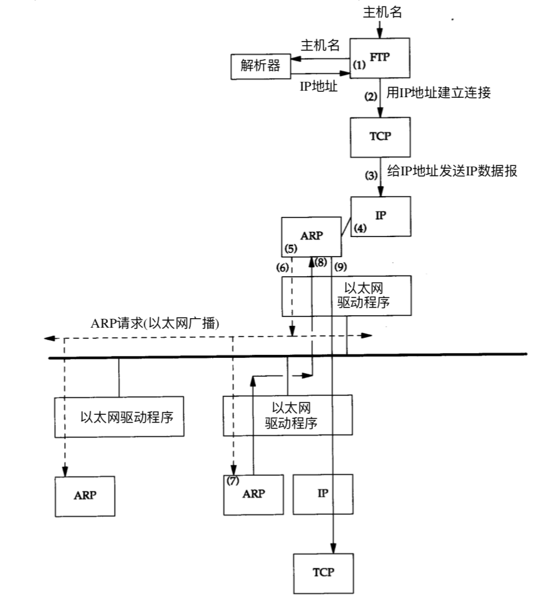
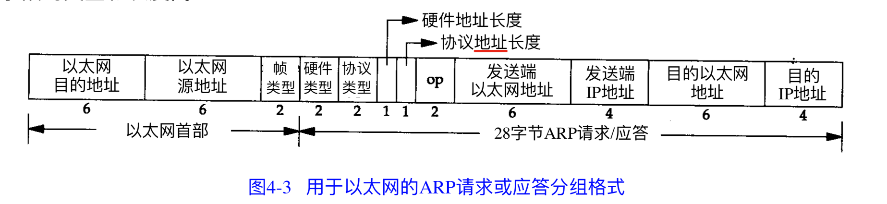
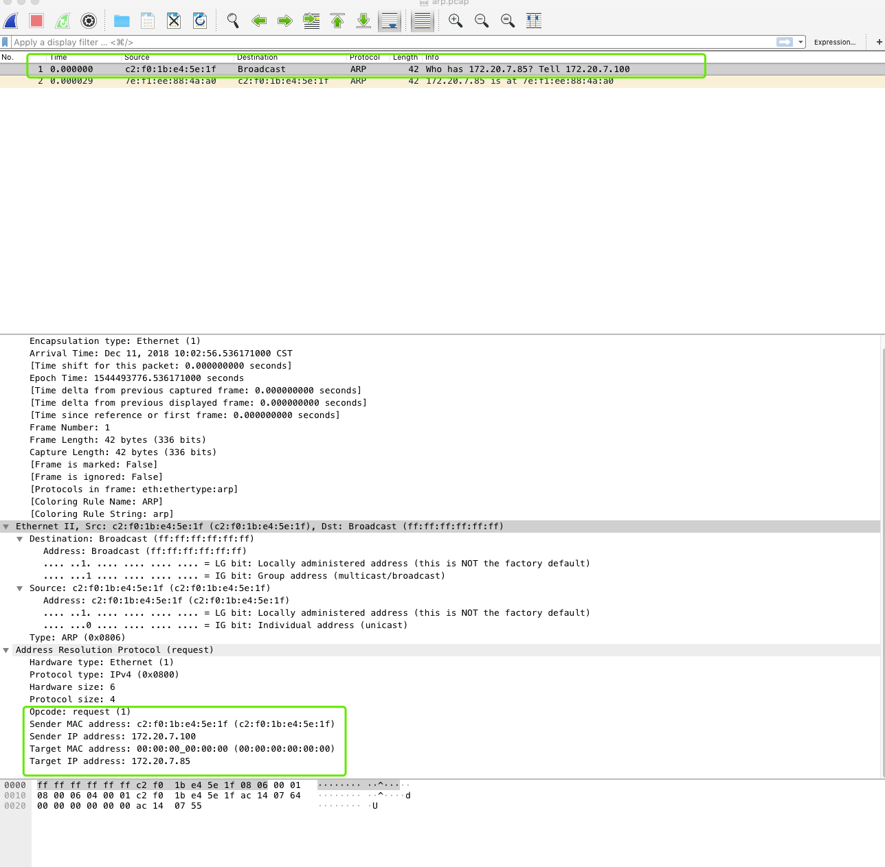
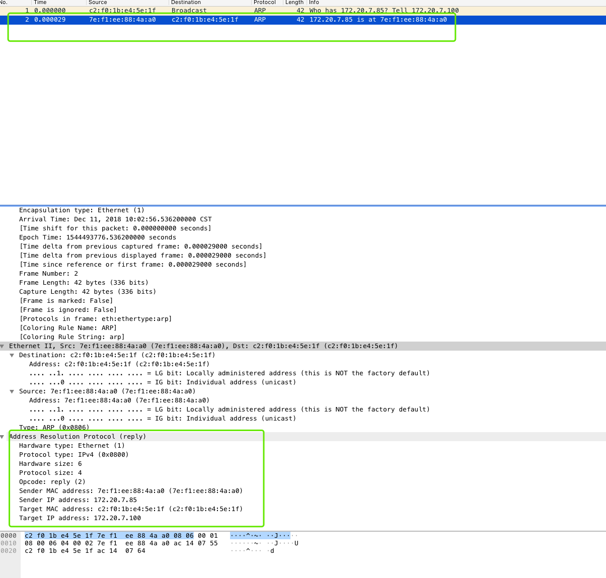

# arp

## arp

ARP 为IP地址 到对应硬件地址之间提供动态映射。 我们只所以用动态这个词是因为这个过程是自动完成的， 在用户态的应用程序或者系统管理员不比关心。

本文只讨论arp ， 暂时不讨论rarp。 rarp 是被那些没有磁盘驱动器的系统使用，

arp 发送一份成为ARP请求的以太网数据帧， 给以太网的每个主机。 这个过程成为广播。 arp 请求数据帧中包含目的主机的IP地址， 意思是如果你是这个ip地址的拥有者， 请回答对您的硬件地址。



目的主机的arp层收到这份广播报文后， 识别出这事发送端在询问他的IP地址， 于是发送一个arp 应答， 这个arp应答包含ip地址和对应的硬件地址

在arp 背后有一个基本概念， 那就是网络接口有一个硬件地址（48bit 6字节 标示不同的以太网或者令牌环网络接口） 在硬件层次上进行数据帧交换必须有正确的接口地址。 但是TCP IP 有自己的地址 32bit 的IP地址， 知道主机的IP地址，并不能让内核发送一帧数据给主机， 内核必须知道目的端的硬件地址才能发送数据。

arp 功能是在32bit 的IP地址和采用不同网络技术的硬件地址之间提供动态映射

## arp 高速缓存

arp 告诉运行的关键是由于每个主机都有一个arp高速缓存， 这个高速缓存存放了最近internet地址到硬件地址之间的映射记录。 高速缓存中每一项的生存时间为20分钟， 起始时间从被创建时开始算起。

## arp 分组格式

在以太网上解析IP地址时候， arp请求和应答分组格式如下所示：



以太网报文头中的前两个字段是以太网的源地址和目的地址， 目的地址如果**全为1** 的特殊地址是广播地址， 电缆上所有以太网接口都要接受广播的数据帧。

2个字节的帧类型表示后面的数据类型， 是arp 还是rarp ， 对于arp来说值为0x0806

操作字段指出四种操作类型， 分别是arp请求1， arp应答2， rarp请求3 rarp 应答4. 这个字段是必须的， 因为arp的请求和应答的帧类型字段值是相同的。

接下来的四个字段 是发送端硬件地址， 发送端协议地址（ip）目的端硬件地址， 目的端协议地址。

对于一个arp 请求来说， 除目的端硬件地址外的所有其他的字段都有填充值， 当系统受到一份目的端为本机的arp请求报文后， 就把硬件地址填进去 。 然后用两个目的端地址分别替换发送端地址，并把操作字段改为2，最后单播发送回去。

## arp 举例

```text
# 本机ip 172.20.7.100

# 人工模拟 arp 请求 85 的硬件地址
arp -i fake -d 172.20.7.85 

# tcp dump 抓包

tcpdump -i fake host 172.20.7.85 and arp -vv

# 通过wireshark 分析
# 如下图
```

arp 请求包:\(不包含链路层首部\)

操作类型为1， 发送端mac: c2:f0:1b:e4:5e:1f 发送端IP： 172.20.7.100, 目的端mac： （广播） 00:00:00:00:00:00 , 目的端IP : 172.20.7.85



arp 相应包\(不包含链路层首部\)

操作类型2， 发送端mac： 7e:f1:ee:88:4a:a0 （这是85 的mac 地址） 发送端IP : 172.20.7.85 目的端MAc: c2:f0:1b:e4:5e:1f 目的端IP: 172.20.7.100,



## arp 代理

如果arp 请求是从一个网络的主机发往另一个网络的主机， 那么链接这两个网络的路由器就可以回答该请求， 这个过程称作为委托arp 或者arp代理， 这一可以欺骗发起arp请求的发送端。是它误以为路由器就是目的主机。而事实上目的主机是在路由器的另一边。 路由器的功能相当于目的主机的代理， 把分组从其他主机转发给它。

## 免费arp

我们可以看到另一个arp的特性称作为免费arp， 他是指主机发送arp查找自己的ip地址， 通常它发生在系统引导期间进行接口配置的时候

例如centos7 中关于 ifup-eth 的脚本， 相关逻辑

```text
 # set IP address(es)
        for idx in {0..256} ; do
            if [ -z "${ipaddr[$idx]}" ]; then
                break
            fi

            if ! LC_ALL=C ip addr ls ${REALDEVICE} | LC_ALL=C grep -q "${ipaddr[$idx]}/${prefix[$idx]}" ; then
                if [ "${REALDEVICE}" != "lo" ] && [ "${arpcheck[$idx]}" != "no" ] ; then
                    # 发送免费arp 探测
                    ARPING=$(/sbin/arping -c 2 -w ${ARPING_WAIT:-3} -D -I ${REALDEVICE} ${ipaddr[$idx]})
                    if [ $? = 1 ]; then
                        ARPINGMAC=$(echo $ARPING |  sed -ne 's/.*\[\(.*\)\].*/\1/p')
                        net_log $"Error, some other host ($ARPINGMAC) already uses address ${ipaddr[$idx]}."
                        exit 1
                    fi
                fi

                if ! ip addr add ${ipaddr[$idx]}/${prefix[$idx]} \
                    brd ${broadcast[$idx]:-+} dev ${REALDEVICE} ${SCOPE} label ${DEVICE}; then
                    net_log $"Error adding address ${ipaddr[$idx]} for ${DEVICE}."
                fi
            fi

            if [ -n "$SRCADDR" ]; then
                sysctl -w "net.ipv4.conf.${SYSCTLDEVICE}.arp_filter=1" >/dev/null 2>&1
            fi
```

免费arp 有两个作用

* 一个主机可以通过它来确定另一个主机是否设置了相同的IP地址， 主机并不希望对此请求有一个回答， 但是如果收到了一个回答， 那么就会在终端日志上产生一个错误信息，“以太网地址 : a:b:c:d;e;f 发送来重复的ip地址”， 这一可以警告系统管理员某个系统不正确的设置
* 如果发送免费arp 的主机正好改变了硬件地址（很可能主机关机， 并换了一个接口网卡， 然后重新启动） 那么这个分组就可以使其他主机高速缓存中旧的硬件地址进行相应更新，一个比较著名的arp协议事实是， 如果主机收到某个ip地址的arp请求， 而且它已经在接受者的高速缓存中， 那么就要用arp请求中的发送端硬件地址对高速缓存中相应的内容进行更新。 主机接受到任何arp请求都要完成这个操作。 这个场景在容器中很适合， 容器的ip是动态变化的，每次更改，最好发送一条免费arp请求，让相邻主机更新自己的arp缓存。

免费arp 两个作用， 1 是探测ip冲突，2 是强制让相邻主机更新自己的的arp 缓存， 更新自己的mac 和ip的对应关系

