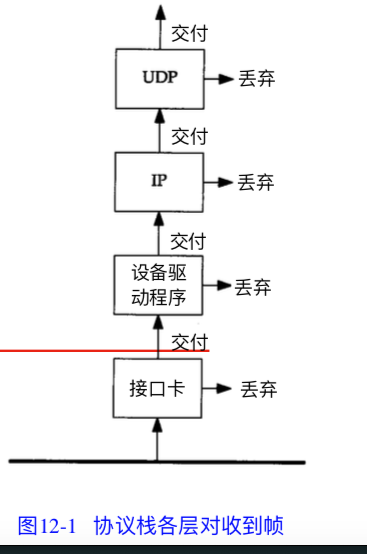
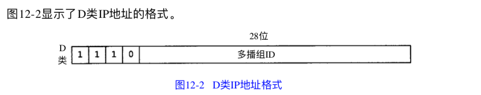

# 概述

IP 地址 除了大家广为知道的A B C D 类地址外， 还可以分为 三种IP地址: 单播地址， 广播地址， 和多播地址。

先从A B C D 类地址说起， 最初设计互联网时候， 为了便于寻址 以及层次化构造网络，  每个IP地址包括两个标识码

* 网络ID 同一个物理网络上的所有主机都使用同一个网络ID， 网络上的一个主机 有一个主机ID 与其对应，

* 主机ID

A 类地址 ： 0.0.0.0-127.255.255.255  每个网络最大主机数  16777214
B 类地址： 128.0.0.0-191.255.255.255 每个网络最大主机数  65534
C 类地址： 192.0.0.0-223.255.255.255 每个网络最大主机数  154

A类地址中， 第一个段号码 为网络号码， 剩下的三段号码 为本地计算机的号码， A类地址 就由1字节的网络地址 和 3 字节的主机地址组成。 网络地址的最高位必须是0， A类地址中网络表示长度为8位， 主机标识的长度为24位

因此A类地址 网络地址数量很少， 有126个网络，但是每个网络可以容纳的主机数可以很多，可以达到1600多万台

因为A 类地址 的网络地址最高位必须为0， 所以 8位中，只有7位表示网络标示， 所以A 类是 0.0.0.0 - 127.255.255.255

B类地址中， 需要两段号码 作为网络号， 即 16位， 剩下的两段号16位代表主机号， 但是要求b类的网络号必须是 10 开始的。所以B 类的IP地址是 128.0.0.0 - 191.255.255.255 ， B类适合中等规模的网络， 每个网络能够容纳的主机数位6w多台

C类地址 在IP 地址的四段号码中， 前三段号码为网络号码， 剩下的一段号码为本地计算机的号码。  C 类IP 有三字节的网络地址 和 1字节的主机地址组成。  但是要求C 类的网络地址的最高位必须是 "110" ， C 类IP地址中网络的表示长度为24位。

主机表示的长度为8位， 因此C 类的网络地址数量很多， 有209万多个网络， 适用于小规模的局域网， 每个网络最多只能包含254台计算机。

D 类地址， 在历史上缴做多播地址，（multicast address） 即组播地址， 在以太网中 多播地址命名了一组应该在这个网络中应用接受到一个分组的站点， 多播地址 最高位必须是 "1110" 范围从 224.0.0.0 - 239.255.255.255

从另一个角度来分析 IP地址分为 单播地址， 广播地址 和多播地址

# 多播 和广播

广播和多播 仅应用于** UDP **， 他们对于需要将报文同时传往多个接受者的应用来说十分重要。 

TCP 是一个面向连接的协议， 它意味着 分别运行与两个主机（由IP地址确定）的两个进程（由端口号确定） 之间存在一条连接。

通常每个以太网帧仅仅发往单个目的主机， 目的地址指明单个接受接口， 因为成为 **单播**  在这种方式下， 任意两个主机的通信不会干扰网内的其他主机

然后有时候， 一个主机要向网上所有其他主机发送帧， 这就是广播， 通过arp 和rarp 就可以看到这一过程。 

多播 处于单播和广播之间， 帧仅仅传送给属于多播组的多个主机

首先我们需要了解主机对信道传送过来帧的过滤过程

首先 网卡查看信道传送过来的帧， 确定是否接受该帧， 若接受后， 就讲它传送往设备驱动程序， 通常网卡仅接受那些目的地址为网卡物理地址或者广播地址的帧， 另外多数接口均被设置为混杂模式。 这种模式能接受每个帧的复制。

目前 大多数网卡胫骨配置都能接受目的地址为多播或者某些子网多播地址的帧。

对于以太网， 当地址中最高字节的最低位置为1时候， 表示该地址是一个多播地址 （01：00：00：00：00：00）

如果网卡收到一个帧， 这个帧被传送给设备驱动程序， 设备驱动程序将进行另外的帧过滤， 首先帧类型中必须制定要使用的协议（IP，arp等等 ）其次， 进行多播过滤来检测该主机是否属于多播地址说明的多播组

使用广播问题在于它增加了对广播数据不感兴趣的主机的处理负担

用一个UDP 广播应用作为例子：

如果网内有50台机器， 仅仅有20台参与该应用， 每次这20台主机中的一个发送广播数据时候， 其余30台不得不处理这些广播数据包， **一直到UDP层， 收到的UDP广播数据包才会被丢弃** 

这30个主机丢弃UDP广播数据包是因为这些主机没有使用这个目的端口

# 多播

多播的出现 减少了对应用不感兴趣的主机的处理负担， 使用多播， 主机可以加入一个或者多个多播组， 这样网卡将获悉主机属于哪个多播组，然后仅仅接受主机所在多播组的那些多播帧

# 广播

广播分为

## 受限的广播 255.255.255.255 

 该地址用于主机配置过程中IP数据报的目的地址。此时主机还不知道它所在的网络的网络掩码， 甚至连它的IP地址也不知道。

在任何情况下， 路由器都不转发目的地址为受限的广播地址的数据包， 这样数据包仅仅出现在本地网络中。

## 指向网络的广播

指向网络的广播地址是主机号全为1 的地址， 

## 指向子网的广播

指向子网的广播地址 主机号全为1， 且有特定子网号的地址。

## 指向所有子网的广播

指向所有子网的广播也需要了解目的网络的子网掩码， 以便与指向网络的广播地址区分开。 指向所有子网的广播地址的子网号 与 主机号全为 1

# 多播

IP多播提供两类服务

* 向多个目的地址传送数据， 有许多想多个接受者传送信息的应用， 

* 客户对服务器的请求。 

## 多播组ip地址

D 类地址开头都为111， 多播组IP地址， 包括为1110 的最高4bit 和多播组好， 他们通常可以表示为点分十进制数。 范围从 224.0.0.0 到  239.255.255.255

能够接受发往一个特定多播组地址数据的主机集合成为主机组， 一个主机组可以跨越多个网络， 主机组中成药可以随时加入或者离开主机组。

一些多播组地址被确定为知名地址， 也被当做永久主机组 

* 224.0.0.1 代表 该子网内所有系统组

* 224.0.0.2 代表该子网内的所有路由器组

* 多播地址 224.0.1.1 用做网络时间协议 NTP

单个物理网络的多播是简单的。多播进程将目的 I P 地 址 指 明 为 多 播 地 址 ， 设 备 驱 动 程 序 将 它转换为相应的以太网地址，然后把数据发送出去。

这些接收进程必须通知它们的 I P 层，它们 想接收的发往给定多播地址的数据报，并且设备驱动程序必须能够接收这些多播帧。

这个过程 就是“加入一个多播组”(使用“接收进程”复数形式的原因在于对一确定的多播信息，在同一 主机或多个主机上存在多个接收者，这也是为什么要首先使用多播的原因)。

当一个主机收到多 播数据报时，它必须向属于那个多播组的每个进程均传送一个复制。

这和单个进程收到单播 U D P 数据报的 U D P不 同 。 使 用 多 播 ， 一 个 主 机 上 可 能 存 在 多 个 属 于 同 一 多 播 组 的 进 程 。

当把多播扩展到单个物理网络以外需要通过路由器转发多播数据时，复杂性就增加了。 需要有一个协议让多播路由器了解确定网络中属于确定多播组的任何一个主机。这个协议就 是 I n t e r n e t 组 管 理 协 议 ( I G M P )

# 小结

广播是讲数据报文发送到网络中的所有主机 而多播是讲数据报文发送到网络的一个主机组。

** 两个概念的基本的在于当收到送往上一个协议栈的数据帧采用不同类型的过滤， 每个协议层均可以因为不同的里有丢弃数据包 **

D 类IP地址被称为多播组地址， 通常将其地位23bit 映射到相应以太网地址中，以便可以实现多播组地址到以太网地址的转换。由于地址映射是不唯一的， 因此需要其他的协议实现数据包的过滤

