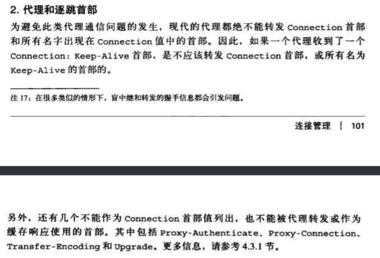

# http 编码机制

http url 字符集 有些url 中还会包含一些任意的二进制数据， 和一些特殊字符， 认识到对完整性的需求之后， url 的设计者就讲转义序列集成进去， 通过转义序列， 就可以用us-ascii字符集的有限自己对任意字符值或者数据进行编码了， 这样就实现了可移植性和完整性

为了避开安全字符集表示法带来的限制， 人们设计了一种编码机制， 用来在url中表示各种不安全的字符， 这种编码机制就是通过一种转义表示法表示不安全的字符， 这种转义表示法包含一个百分号，后面跟着两个表示字符ascii码的十六进制数

# http 报文

http 报文分为请求报文和应答报文

# HTTP 的连接处理

## 常被误解的connection 首部

HTTP 允许在客户端和最终的源端服务器之间存在一连串的HTTP中间实体(代理 高速缓存等等) 可以从客户端开始，逐跳的将HTTP报文经过这些中间设备，转发到源端服务器上去（或者进行反向传输）。

在某些情况下， 两个相邻的HTTP应用程序会为他们共享的连接应用一组选项。 HTTP 的connection 首部字段中有一个由逗号分隔的连接标签列表， 这些标签为此链接指定了一些不会传播到其他连接中去的选项，比如可以用connection: close 来说明发送完下一条报文之后必须关闭的连接。

connection 首部可以承载3种不同类型的标签，因此有时候会很令人费解：

* HTTP 首部字段名， 列出了只与此连接有关的首部

* 任意值标签， 用于描述此连接的非标准选项

* 值close， 说明操作完成之后需要关闭这条持久连接。

如果连接标签包含了一个http首部字段的名称，那么这个首部字段就包含了一些连接有关的信息，不能讲其转发出去。 在将报文转发出去之前，必须**删除 connection 首部列出的所有首部字段**，由于connection首部可以防止无意中对本地首部的转发，因此将逐跳首部名放入connection 首部被称为 **对首部的保护**

## keep-alive 操作

keep-alive 已经不在使用了， 当前的HTTP/1.1 规范也没有专门对他进行说明， 1.1 默认使用了持久化连接。如果http 1.1 想显示的关闭持久化连接， 必须在connection 中添加close 选项

在http 1.0 中 keep-alive 连接的客户端可以通过包含Connection： keep-alive 首部请求将一条连接保持在打开状态。

如果服务器愿意为下一条连接保持在打开状态，就在响应中包含相同的首部， 如果响应中没有包含keep-alive 的首部， 客户端就认为服务器端不支持keep-alive 会在发回响应报文之后关闭连接。 这都是说的http 1.0 的， http 1.1 客户端和服务器端默认都支持持久化连接。

## keep-alive 和哑代理

keep-alive 选项和Connection 组合， 往往会发生哑巴代理， 问题在于中间代理 比较二。

## http 1.1 的持久化连接

http 1.1 逐渐停止了对keep-alive 连接的支持， 用一种名为持久化连接（persistent connection） 的改进型设计取代了它。 持久连接的目的与keepalive 连接的目的相同 但是工作机制更优一些

与1.0 不同， http 1.1 持久连接在默认情况下是激活的， 除非特别说明， 否则1.1 默认连接都是持久的。如果要在事务处理结束之后将连接关闭， http 1.1 应用程序必须向报文中显示的添加一个Connection：close 首部 这是与以前http 版本很重要的区别。
在之前http 版本中， keep alive 要么是可选的， 要么压根就不支持。

### 持久化连接的限制和规则

* 发送了Connection：close 请求首部后， 客户端就无法在那条连接上发送更多的请求了

* 如果客户端不想在连接上发送其他请求了， 就应该在最后一条请求中发送一个Connection：close 请求首部。

* 只有当连接上所有的报文是正确的， 自定义报文长度时候， 也就是说实体主体部分的长度都和相应的Content-Length 一致 -- 连接才能保持持久连接

* 1.1 的代理必须能够分别管理与客户端和服务器端的持久连接， 每个持久连接都只适用于一跳传输

## 1.1 的管道化连接

http 1.1 允许在持久化连接上可选的使用请求管道， 这是在keep alive 连接上的进一步性能优化， ** 在响应到达之前， 可以将多条请求放入队列，** 当第一天请求通过网络流向地球另一端的服务器时候， 第二条 和第三条的请求也可以开始发送了， 在高延迟网络条件下， 这样做可以降低网络的环回时间，提高性能。

对管道化有几条限制:

* 如果http 客户端无法确认连接是持久的， 则不应该使用管道

* 必须按照与请求相同的顺序回送http 相应， http 报文中没有序列号标签， 因此如果收到的相应失序了， 就没办法将与其请求匹配起来

* HTTP 客户端必须做好连接会在任何时刻关闭的准备，还要准备好重发所有未完成管道化的请求， 如果客户端打开了一条持久化连接， 并立即发出了10条请求， 服务器可能只处理了， 比方说， 5条请求后就关闭了连接，剩下的5条请求会失败， 客户端必须能够应对这种过早关闭连接的情况，重新发送这些请求。

下图是串行连接， 持久化连接， 管道化持久连接的区别

