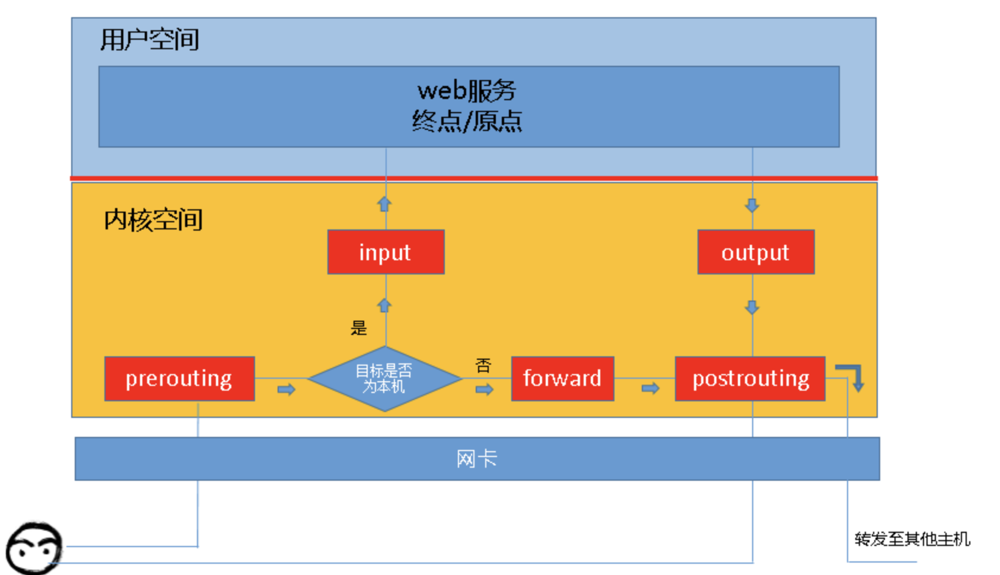
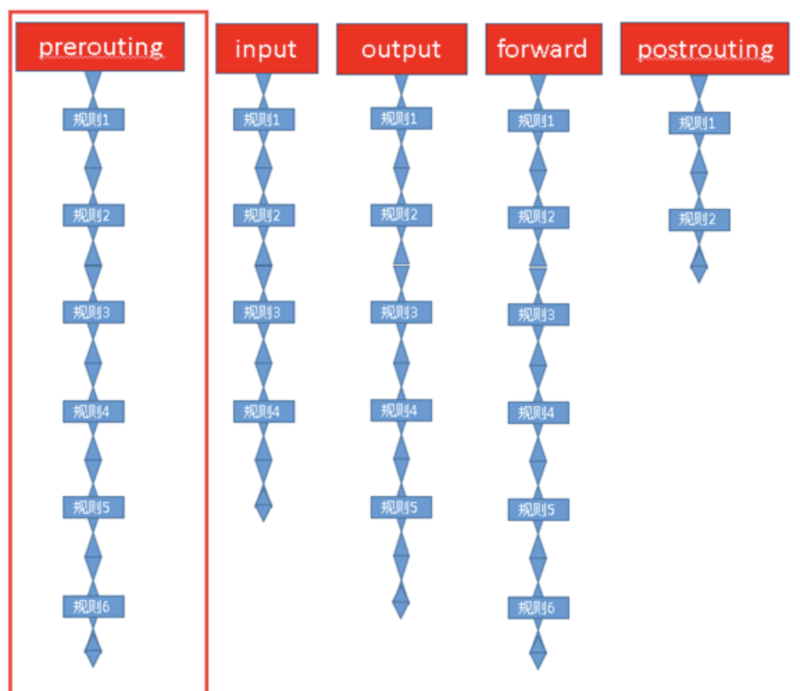
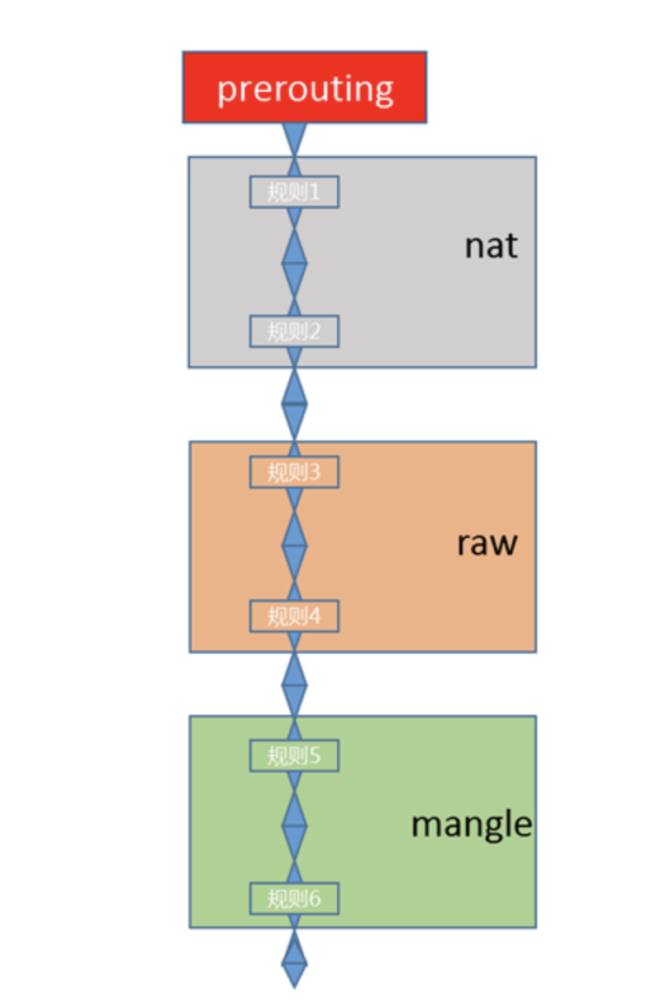
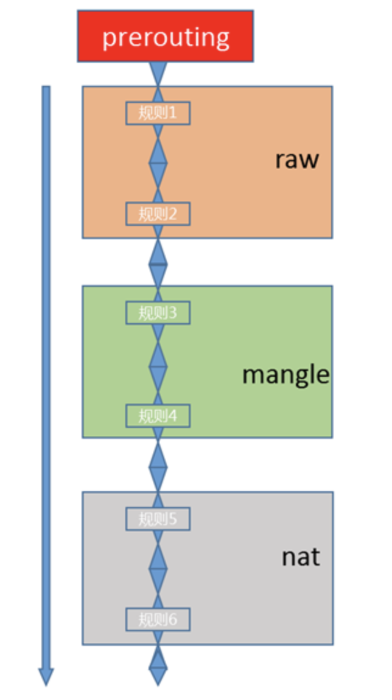
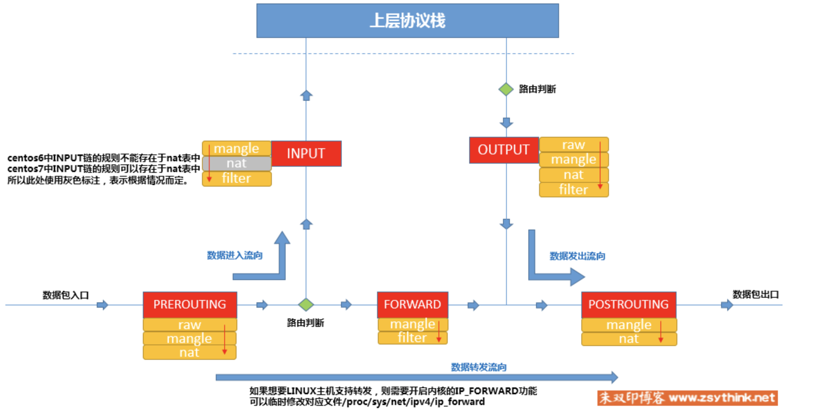
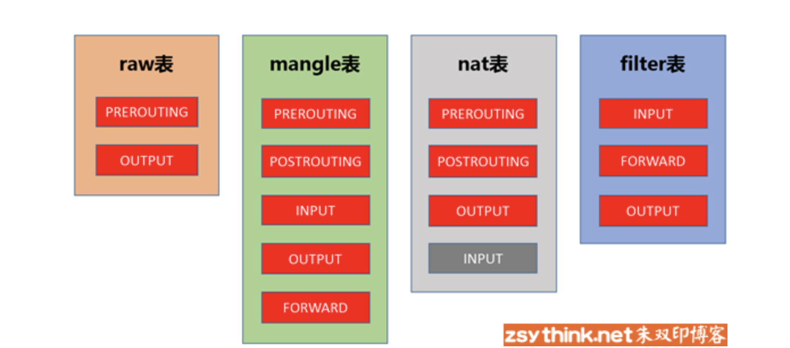

# iptables

## 防火墙相关概念

先描述一下相关概念：

### 从逻辑上讲。

 **防火墙可以大体分为主机防火墙和网络防火墙。**

主机防火墙： 针对单个主机进行防护

网络防火墙： 往往处于网络入口或者边缘， 针对网络入口进行防护。服务于防火墙背后的本地局域网。

网络防火墙和主机防火墙并不冲突， 可以理解为， **网络防火墙主外（集体），主机防火墙主内（个人）**

### 从物理上讲

**防火墙可以分为硬件防火墙 和 软件防火墙**

硬件防火墙： 在硬件级别实现部分防火墙功能，另一部分功能基于软件实现，性能高，成本高

软件防火墙： 应勇软件处理逻辑云星宇通用硬件平台之上的防火墙，性能低，成本低。

## iptables

iptables 其实不是真正的防火墙， 我们可以把它理解为一个客户端代理， 用户通过iptables这个代理， 讲用户的安全设定执行到相应的安全框架中， 这个安全框架才是真正的防火墙， 这个框架名字叫 **netfilter**

**netfilter** 才是防火墙真正的安全框架， netfilter 位于内核空间。

iptables 其实是一个命令行工具， 位于用户空间， 我们用这个功能操作真正的框架。

**netfilter/iptables** 组成linux 平台下的包过滤防火墙， 与大多数的Linux 软件一样， 这个包过滤防火墙是免费的。 它可以代替昂贵的商业防火墙解决方案，完成封包过滤， 封包重定向，和网络地址转换NAT等功能。

**Netfilter** 是Linux操作系统核心层内部的一个数据包处理模块， 它具有如下功能：

* 网络地址转换
* 数据包内容修改
* 以及数据包过滤的防火墙功能

所以说， iptables 并没有一个守护进程，iptables 并不能算是真正的服务

## iptables 基础

我们知道iptables 是按照规则办事的。我们就来说说规则（rules）， 规则其实就是网络管理员预定义的条件。**规则一般定义为：如果数据包头符合这样的条件， 就这样处理这个数据包**。规则存储在内核空间的信息报过滤表中，这些规则分别指定了 **源地址、目的地址、传输协议（如TCP UDP ICMP）和服务类型（如HTTP，FTP，SMTP）等**

当数据包与规则匹配时候，iptables就根据规则所定义的方法来处理这些数据包： 如放行（accept）， 拒绝（reject）和丢弃（drop）等。

配置防火墙的主要工作就是 **添加， 修改和删除这些规则**

当客户端访问服务器的web 服务世华， 客户端发送报文到网卡，而TCP IP协议栈是属于内核的一部分。 所以，客户端的信息会通过内核的TCP协议传输到用户空间的web 服务中。 而此时， 客户端报文的目标

终点为web服务所监听的套接字（IP: PORT） 上。当web 服务需要相应客户端请求时候，web 服务发出的相应报文的目标终点为客户端， 这时候web 服务所监听的IP 与端口反而变成了原点， 我们说过netfilter 才是真正的防火墙。 他是内核的一部分， 所以， 如果我们想要防火墙能够达到“防火”的目的， 则需要在内核中设置关卡， 所有进出的报文都要通过这些关卡， 经过检查后， 符合放行条件的才能放行， 符合阻拦条件的则需要组织， 于是就出现了 **input 关卡** **output 关卡**， 而这些关卡在iptables 中不被成为关卡， 而被成为 **链**

\*\*\*\*

其实我们上面描述的场景并不完善, 因为客户端发来的报文访问的目的地址可能并不是本机， 而是其他服务器。 当本机的内核支持 **IP_FORWARD**时， 我们可以将报文转发给其他服务器。 这个时候 我们就会提到iptables 中的其他**关卡**， 也就是其他的**链** ， 他们就是 

* 路由前

* 转发

* 路由后

* 另外还有上面提到的 input， output

也就是当我们启用了防火墙功能时候， 报文需要经过如下关卡， 也就是说， 根据实际情况的不同， 报文经过的**链** 可能不同。 如果报文需要转发， 则报文不会经过input 链发往用户空间， 而是直接在内核空间中经过forward 链和postrouting 链转发出去。

所以根据上图， 我们能够想象出某些常用场景，报文的流向：

* 到本机某进程的报文： PREROUTING --> INPUT

* 由本机转发的报文： PREOUTING --> FORWARD --> POSTROUTING

* 由本机某进程发出的报文， 通常为相应报文： OUT --> POSTROUTING

## 链的概念

现在我们想象一下， 这些**关卡** 在iptables 中为什么称作为**链**呢？

我们知道， 防火墙的作用就是在于对经过的报文匹配规则， 然后执行对应的动作， 所以当报文经过这些关卡时候， 则必须匹配这个关卡上的规则，但是这个关卡上可能不止有一条规则， 而是有很多规则。

当我们把这些规则串到一个链条上时候， 就形成了**链**。 所以我们把每个关卡想象成如下模样， 这样来说 **链** 更合适。

## 表的概念

我们再想想另外一个问题， 我们对每个**链**上都放置了一串规则， 但是这些规则有些很相似。 比如 A类规则都是对IP或者端口的过滤， B类规则是修改报文， 那么这个时候我们是不是能把实现相同功能的规则放在一起呢？

必须能！！！

我们把具有相同功能的规则的集合叫做 **表**， 所以说不同功能的规则， 我们可以放置在不同表中进行管理。而IPtables已经为我们定义了4种表。

* filter 表： 负责过滤功能， 

* nat 表： 网络地址转换

* mangle 表： 拆解报文， 做出修改， 并重新封装。

* raw 表： 关闭NAT表上启用的链接追踪机制

也就是说我们自定义的所有规则， 则都是这4种分类中的规则， 或者说所有规则都存在于这4张表中。

## 表 链 关系

但是我们需要注意的是， 某些 **链**中， 注定不会包含 **某类规则**， 就像某些关卡天生就不具备某些功能一样

A 关卡只能负责打击陆地敌人， 没有防空能力

B 关卡只负责打击空中敌人， 没有防御步兵能力

C 关卡可能比较NB， 技能防空 ，又能防御陆地敌人

D 关卡最屌， 海陆空都能防

下面我们来讲一下， 每个链上的规则都存在于哪些 表中

**下图只用于说明prerouting 链上的规则存在于哪些表中， 并没有描述表的顺序**

这幅图是什么意思呢， 意思是说 PREROUTING 链 只拥有NAT,RAW, 和mangle 表所对应的功能， 所以PREROUTING 的规则只能存放于NAT，RAW，和mangle表中

下面讲 每个**链**中规则都存在于哪些**表**中

* PREROUTING ： RAW, mangle, nat表

* INPUT: mangle, filter (centos7 有nat表， centos6 没有)

* FORWARD: mangle, filter

* OUTPUT: raw, mangle, nat , filter 表

* POSTROUTING: mangle， nat 表

但是！！！  **我们在实际使用过程中， 往往是通过 表 作为操作入口， 对规则进行定义**

从 链 的角度更容易从入门的角度理解， 但是为了以便在实际使用的时候， 更加顺畅的理解他们， 我们还要将**表** **链**的管理罗列出来

* raw 表 中的规则可以被哪些链使用： PREROUTING, OUTPUT

* mangle 表中规则可以被哪些链使用： PREROUTING,INPUT, FORWARD, OUTPUT, POSTROUTING

* nat 表中的规则可以被哪些链使用： PREROUTING, OUTPUT, POSTROUTING

* filter 表中的规则可以被哪些链使用： INPUT, FORWARD, OUTPUT

**我们还需要注意一点， 哪些表中的规则会放在 链最前面执行， 这就需要一个优先级问题**, 我们哪PREROUTING 链图是

prerouting 规则存放于三张表中， 三张表的执行优先级如下：

**raw --> mangle --> nat**

但是iptable 为我们定义了4张表， 当他们处于同一条链时候， 执行的优先级如下（由高到底）

raw --> mangle --> nat --> filter 

## 数据经过防火墙的流程

综合上述所有描述， 我们可以讲数据包通过防火墙的流程总结如下

下图中NAT表在centos7 的情况就不表明：

\*\*\*\*

\*\*\*\*

**sssssss**

## 引用



