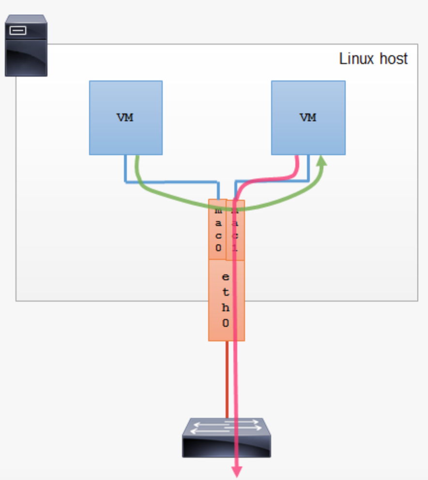

# bridge
bridge 是二层网络设备，用来连接 two Layer 2 (i.e. Ethernet) segments together. 
Frames between the two segments are forwarded based on the Layer 2 addresses (i.e. MAC addresses). 

bridge 实际上可以理解为二层交换机

一个bridge 根据mac 地址表来做转发， bridge 通过帧头中的地址来学习mac 地址。

bridge 可以是一个物理设备 也可以由纯软件实现。 从1999年后， linux kernel 能够在软件层面实现bridge 功能。

通过创建一个bridge， 你可以讲多个物理或者虚拟接口链接到一个二层segment。在一个linux主机中 讲两个物理设备连接起来的bridge 实际上讲这个host 转变成了物理二层交换机


交换机此时已经变成了一个专门的物理设备，软bridge 已经失去了他的地位。 然而，随着虚拟化的发展， 运行在物理机上的虚拟机需要2层连接到物理网络和其他的虚拟机上。 linux bridge 提供了一个非常好的技术，使得bridge 重新开始复兴。

一个bridge 可以将虚拟网络接口彼此连接， 也可以将虚拟网络接口和物理接口彼此连接， 把他们都连接到一个二层设备中。


你可以使用brctl 命令来配置linux host bridge， brctl 在bridge-utils包中

```
# brctl show
bridge name  bridge id          STP enabled  interfaces
br0          8000.080006ad34d1  no           eth0
                                             veth0
br1          8000.080021d2a187  no           veth1

```
bridge 有可能造成二层环路 ， 因此你可以设置STP选项 如果需要的话

## STP

生成树协议（英语：Spanning Tree Protocol，STP），是一种工作在OSI网络模型中的第二层(数据链路层)的通信协议，基本应用是防止交换机冗余链路产生的环路.用于确保以太网中无环路的逻辑拓扑结构.从而避免了广播风暴,大量占用交换机的资源.

生成树协议工作原理:任意一交换机中如果到达根网桥有两条或者两条以上的链路.生成树协议都根据算法把其中一条切断,仅保留一条.从而保证任意两个交换机之间只有一条单一的活动链路.因为这种生成的这种拓扑结构.很像是以根交换机为树干的树形结构.故为生成树协议


# macvlan 

macvlan 允许你配置多个二层地址在一个物理设备接口上。 macvlan 允许你给父接口物理设备(有时候称作为upper device)配置子接口（有时候也会称作slave device）,每个子接口都有自己独立mac 地址（自动生成）和独立的IP地址.

应用程序， vm 和容器 可以绑定到一个特定的子接口去直连物理网络，通过使用它们自己的mac 和ip地址。

子接口macvlan 不能改直接与它们的父接口通信，例如： vm 不能直接访问他的宿主机。 如果你需要vm 和宿主机互相通信，你应该增加另一个macvlan 子接口并且把主机的ip地址配置个这个子接口，物理接口实际上没有IP。 

macvlan 子接口用使用 mac0@etch0 的形式， 是为了清楚的定义子接口和父接口的关系， 子接口状态与父接口的状态做绑定， 如果父接口eth0 down 了， 子接口mac0@eth0 也down了


# macvlan mode

mac vlan 一共四种模式， **private bridge vepa Passthru**

## private

具有相同父接口的子接口之间是不能够互相通信的。 所有经过子接口的数据帧都会经过父接口去转发。虽然上层的物理交换机发现这个数据帧 是从一个子接口到另一个子接口的，但是数据帧最终还会被drop掉。


## VEPA

所有来自子接口的数据帧都会通过父接口转发出去。VEPA模式要求 物理交换机支持 IEEE 802.1Qbg aka Virtual Ethernet Port。

具有VEPA能力的交换机能否返回所有数据帧，这些数据帧的源和目的都来源于本地mavclan接口。 因此具有相同父接口的macvlan子接口能够互相通信通过外部的物理交换机。
Broadcast frames coming in through the parent interface get flooded to all macvlan interfaces in VEPA mode. 

当你在物理交换机上强制策略并且你想让所有vm -to- vm 通过物理交换机通信，VEPA模式是很有用的。

缺点：
数据帧 出 和 会 要经过父接口和物理交换机 ，性能会低


## bridge

macvlan 使用一个简单的bridge 来连接同一个父接口下的所有子接口。 在同一个父接口下，数据帧从一个子接口到另一个子接口会直接传递，而不需要发出去。
dcast frames get flooded to all other bridge ports and to the external interface, but when they come back from a VEP switch, they are discarded. Since all macvlan sub-interface  MAC addresses are known, macvlan bridge mode does not require MAC learning and does not need STP.

因为macvlan bridge模式下 父接口都已经知道了子接口的mac地址，所以不需要mac学习，不需要STP 即生成树协议

macvlan bridge 模式提供了vm之间快速通信，但是有一点我们需要注意： 如果父接口down了， 所有父接口下的子接口都会down，

当物理接口无法链接时候， 所有vm 不能够互相链接。




## Passthru

允许单个vm 能够直接连接到物理接口。 这个模式的优势是 vm能够更改mac地址和其他接口的参数。

这种模式很少用


# macvlan vs(versus) bridge

## macvlan

```
The macvlan is a trivial bridge that doesn’t need to do learning as it knows every mac address it can receive, so it doesn’t need to implement learning or stp. Which makes it simple stupid and and fast.

macvlan是一个不需要学习的小桥梁，因为它知道它可以接收到的每个mac地址，所以它不需要实现学习或stp。这使得它简单、愚蠢和快速。
```

* 当你只需要提供物理网络到你vm或者container的出口连接时候
* 会使用你较少的cpu 提供更好的输出

## bridge

* 当你需要在同一个host连接vm 或者container 
* 对于多个bridge 复杂的网络拓扑
* 你需要提供现金的flood控制， FDB操作等


# 引用




