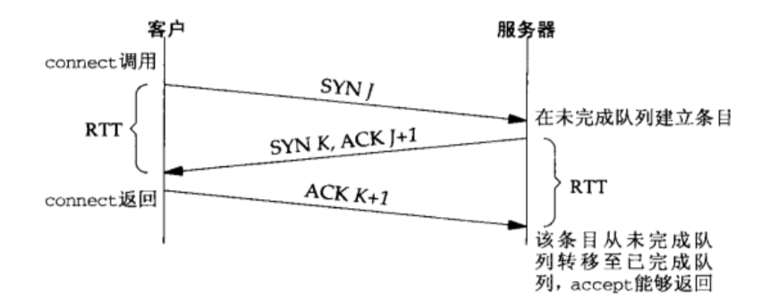
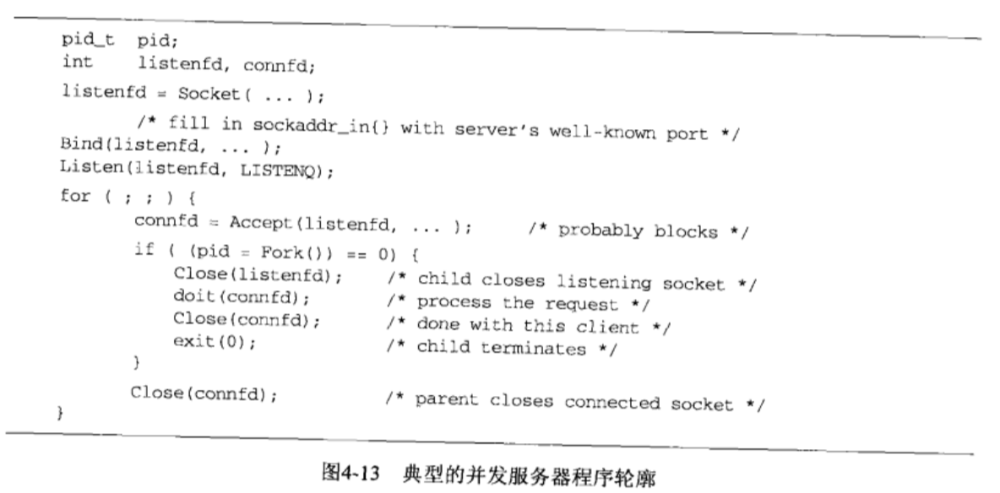

# socket 套接字

## 概述

主要讲解一下一个完整的TCP客户/服务器端 程序所需要的基本套接字函数。

## socket 函数

为了执行网络IO 一个进程必须做的第一件事就是调用socket函数。指定期望的通信协议类型（TCP UDP Unix域字节流协议等等）

```text
int socket(int family, int type, int protocal)

返回 若成功则为非负描述符， 若出错， 则为-1
```

其中family 参数指定协议族， 该参数也往往被称为协议域。 type参数指明套接字类型， protocal 应该设置为某个协议类型常值。并非所有family 与type的组合都是有效的。


socket 函数在成功返回一个小的非负整数值，他与文件描述符类似，我们把它称为套接字描述符。 简称sockfd。 为了得到这个套接字描述符， 我们只是指定了协议族（IPV4 IPV6 UNIX）和套接字类型 （字节流， 数据报文， 或者原始套接字）我们并没有指定本地协议地址或者远程协议地址

## connect 函数

TCP 客户端用connect 函数来建立与TCP服务器的链接

```text
int connect(int sockfd, const struct sockaddr *servaddr, socklen_t addrlen);
返回: 若成功则为0， 若出错则为-1
```

sockfd 是有socket 函数返回的套接字描述符， 第二个 第三个参数分别是一个指向套接字地址结构的指针和改结构大小。 套接字地址结构必须包含服务器IP地址和端口号

客户端在调用函数connect前不必非得调用bind函数， 因为如果需要的话， 内核会确定源IP地址， 并选择一个临时端口作为源端口。

如果是TCP套接字， 调用connect 函数将激发TCP 的三次握手过程， 而且仅仅在连接建立成功或者出错时候才返回， 其中出错返回可能有以下几种情况：

* 若TCP 客户没有收到SYN分节的相应， 则返回ETIMEOUT错误， 举例来说，调用connect函数时候， 4.4BSD内核发送一个SYN，若无相应则等待6s再发送一个， 若扔无响应则等待24s后在发送一个， 若总共等了75s后仍未收到相应则返回本错误
* 若对客户的相应是RST（表示复位或者重新连接），则表明该服务器主机在我们指定的端口上没有进程在等待与之链接（也许服务器进程压根没有 在运行）这是一种硬错误，客户一收到RST 就马上返回ECONNREFUSED（连接拒绝）错误.
* 若客户端发出的SYN在中间的某个路由器上引发了一个“destination unreachable” \(目的地不可达\) 的ICMP错误， 则认为是一种软错误。 客户主机内核保存该消息， 并按照第一种情况锁描述的时间间隔，继续发送SYN。 若在规定的时间后仍为收到相应， 则把保存的消息（即 ICMP错误）作为EHOSTUNREACH 或者ENETUNREACH（网络或者主机不可达）返回给进程

RST 是TCP在发生错误时候发送的一种TCP分节， 产生RST的三个条件是： 目的地位某个端口的SYN到达， 然而该端口上没有正在监听的服务器； TCP 想取消一个已有的连接； TCP 接受到一个根本不存在的连接上的分节。

## bind 函数

bind 函数把一个本地协议地址赋予一个套接字。 对于网际网协议， 协议地址是32位的IPV4 地址或者128位的IPV6 地址与16位的TCP或者UDP端口号的组合。

```text
int bind(int sockfd, const struct sockaddr *myaddr, socklen_t addrlen)
返回： 若成功则为0  若出错则为-1
```

第二个参数 是一个指向特定于协议的地址结构的指针， 第三个参数是该地址结构的长度。 对于TCP， 调用bind 函数可以指定一个端口号， 或者指定一个IP地址，也可以两者都指定， 还可以都不指定。

* 服务器在启动时候 捆绑他们众所周知端口
* 进程可以吧一个特定的IP地址捆绑到它的套接字上， 不过这个IP地址必须属于其所在主机的网络接口之一。 对于TCP客户， 这就为在该套接字上发送的IP数据报指派了源IP地址。 对于TCP服务器，这就限定该套接字只接受那些目的为这个IP地址的客户连接。TCP客户通常不把IP地址绑定到它的套接字上， 当连接套接字时候， 内核将根据所用外出网络接口来选择源IP地址， 而所用外出接口则取决于达到服务器所需要的路径。如果TCP服务器没有把IP地址捆绑到他的套接字上， 内核就把客户发送的SYN目的IP地址所谓服务器的源IP地址。

正如我们所说， 调用bind 可以指定IP地址或者端口， 可以两者都指定， 也可以都不指定

从bind 函数返回的一个常见错误是 EADDRINUSE \(address already in use 地址已经使用\)

## listen 函数

listen 函数仅仅由TCP服务器调用， 它做了两件事

* 当socket 函数创建一个套接字时候， 它被假设为一个主动套接字， 也就是说 它是一个将调用connect 发起链接的客户套接字。 listen 函数把一个未连接的套接字转换成一个被动套接字， 指示内核应该接受指向该套接字的链接请求。根据TCP状态转换图， 调用listen 导致套接字从CLOSED状态 转换到LISTEN状态。
* 本函数的第二个参数规定了内核应该为相应套接字排队的最大链接个数。

```text
int listen(int sockfd, int backlog)

返回： 若成功则返回0， 过出错则返回-1
```

本函数通常应该在调用socket 和bind 两个函数之后， 并在调用accept 函数之前调用。

为了理解其中的backlog 参数， 我们必须认识到内核为很合一个给定监听套接字维护两个队列：

* 未完成链接队列（incomplete connection queue）每个这样的SYN分节对应其中一项； 已由某个客户发出并到达服务器， 而服务器正在等待完成相应的TCP三路握手过程。 这些套接字处于SYN\_RCVD 状态
* 已完成对垒（completed connection queue）每个已经完成TCP三次握手过程的客户对应其中一项， 这些套接字处于 ESTABLISHED状态。

如下图， 描述了监听套接字的两个队列


每当在为完成连接队列中，创建一项时候， 来自监听套接字的参数就会被复制到即将建立的链接中。连接的创建机制是完全自动的， 无需服务器进程插手， 下图展示了用这两个队列连接时候所交换的分组。



当来自客户的SYN 到达时候， TCP在未完成链接的队列中创建一个新项， 然后相应以三次握手的第二个分节， 服务器的SYN相应，其中捎带对客户SYN的ACK， 这一项一直保持在未完成队列中， 直到三次握手的第三次分节， 到达或者该项超时为止。如果三次握手正常完成， 该项就从未完成队列中移到已完成链接队列的对尾。 当进程调用accept时候， 已完成队列中的对投项将返回给进程。 或者如果该队列为空， 那么进程将被投入睡眠 直到TCP在改队列中放入一项才唤醒它。

关于这个队列的处理， 以下几点需要考虑：

* Listen 函数的backlog 曾经被定义为两个队列总和的最大值。
* 源自berkeley的实现给backlog 增设了一个模糊因子： 把它乘以1.5 得到未处理队列的最大长度。 举例来说， 通常指定为5的backlog值实际上允许最多有8项在排队
* 不要把backlog 定义为0， 因为不同实现对此 有不同的解释
* 在三次握手正常完成的前提下（也就是说没有丢失分节， 从而没有重传） 为完成链接队列中任何一项在其中的存留时间就是一个RTT\(round trip time\), 而RTT的值 取决于特定的客户与服务器
* 当一个客户SYN到达时候， 若这些队列是满的， TCP就忽略该分节。 也就是不发送RST， 这么做是因为， 这种情况是暂时的， 客户TCP 将重发SYN， 期望不久能在这些队列中找到可用的空间。 要是服务器TCP立即响应以一个RST，客户的connect 调用会立刻返回一个错误。强制应用进程处理这种情况，而不是使用TCP的正常重传机制来处理。
* 在三次握手完成之后， 蛋在服务器调用accept 之前到达的数据， 应该由服务器TCP排队， 最大数据量为相应已经连接套接字的接受缓冲区大小。

## accept函数

accept 函数由TCP 服务器调用，用于从已经完成队列对头返回下一个已经完成的链接。 （注意， 这个时候， 某些链接很可能都已经收到了数据，而这些数据都存在链接套接字的缓冲区里） ，如果已经完成连接队列为空， 那么进程会被投入睡眠（假设套接字为默认的阻塞方式）

```text
int accept(int sockfd, struct sockaddr * cliaddr, socklen_t *addrlen)

返回： 若成功则为非负描述符， 若出错 则为-1
```

参数cliaddr 和addrlen 用来返回已连接的对端进程（客户）的协议地址。 addrlen是值 - 结果参数。

如果accept 成功， 那么返回值是又内核自动生成的一个全新描述符， 代表与所返回的TCP链接。 在讨论accept函数时候， 我们称它的第一个参数为监听套接字（listen socket）描述符（由socket创建， 随后用做bind 和listen 的第一个参数描述符）,称它的返回值为已连接套接字（connected socket）描述符， 区分这两个套接字非常重要， 一个服务器通常金俭创建一个监听套接字， 他在该服务器的生命期内一直存在， 内核为每个服务器进程接受的客户连接创建一个已连接套接字（也就是说它的TCP三次握手已经完成） 当服务器完成对某个给定客户的服务时候， 相应的已连接套接字就被关闭

## fork 和exec函数

在阐述如何编写并发服务器程序之前， 我们必须首先介绍一下unix的fork函数， 改函数（You写系统可能提供它的各种变体） 是unix中派生新进程的唯一方法

```text
pid_t fork(void)

返回 在子进程中为0 ， 在父进程中为子进程的进程ID， 若出错则为-1
```

如果您以前从未接触过该函数， 那么理解fork最困难之处在于调用它一次， 它却返回两次， 它在调用进程（称为父进程）中返回一次， 返回值是新派生进程（称为子进程）的进程ID号， 在子进程中又返回一次， 返回值为0，因此返回值本身告知当前进程是子进程还是父进程

fork 在子进程返回0 而不是父进程ID的原因在于， 任何子进程只有一个父进程， 而子进程总是可以通过调用getppid 取得父进程的进程id， 相反， 父进程可以有许多子进程。 而且无法获取各个子进程的进程id。 如果父进程想要跟踪所有子进程的进程ID， 那么它必须记录每次调用fork的返回值。

父进程中调用fork 之前打开的所有描述符在fork返回之后由子进程共享。 我们将看到网络服务器利用了这个特性： 父进程调用accept 之后调用fork， 锁接受的已经连接套接字随后就在父进程与子进程之间共享。 通常情况下，子进程接着读写这个已经连接的套接字，父进程则关闭这个已经连接的套接字。

fork 有两个典型的用法

* 一个进程创建一个自身的副本， 这样每个副本可以在另一个副本执行其他任务的同事处理各自的某个操作，
* 一个进程想要执行另一个程序， 既然创建新进程的唯一办法是调用fork， 该进程鱼食首先调用fork创建一个自身的副本， 然后其中一个副本（通常为子进程）调用exec 吧自身替换成新的程序，这是诸如shell之类程序的典型用法

存放在硬盘上的可执行程序文件能够被unix 执行的唯一方法是： 由一个现有进程调用六个exec函数中的某一个， exec 吧当前进程镜像替换成新的程序文件， 而且该程序通常从main函数开始执行， 进程id 并不改变， 我们称调用exec 的进程为调用进程（calling process）成新的执行的程序为新程序（new program）

下图是典型的并发服务器程序轮廓 



## close 函数

```
int close(int sockfd)
返回： 若成功则为0  若出错则为-1
```

close 一个TCP套接字的默认行为是把该套接字标记成已经关闭。 然后立即返回到调用进程， **切记**

该套接字描述符不能再由调用进程使用， 也就是说它不能再作为read 或者write 的第一个参数。

然而， TCP将尝试发送已排队等待发送到对端的任何数据， 发送完毕后发生的是正常的TCP链接终止序列， 即TCP4次挥手中的前两次， 发送FIN包


### 描述符引用计数

我们上文中提到过， 并发服务器中父进程关闭已连接套接字只是导致相应描述符的引用技术值减一。 既然引用计数值扔大于0， 这个close 调用并不引发TCP的四分组链接终止序列。对于父进程与子进程共享已经链接套接字的并发服务器来说， 这正是锁期望的。

所以父进程对于accept 出来的sockfd 执行close 操作 和， 子进程对sockfd 执行close 操作最终出现的效果是不一样的， 前者是把引用计数减一， 后者会标记这个套接字关闭， 后续会等待排队序列发送完后， 执行四次挥手的终止序列。

如果我们确实想在某个TCP链接上发送一个FIN包， 那么可以改用shutdown 函数， 以替代close

我们还需要清楚的是， 如果父进程对每个有accept 返回的已经链接套接字都不调用close， 那么并发服务器中将会发生什么呢？？？ 首先父进程最终将耗尽可用描述符。因为任何进程在任何时刻可以拥有的打开着的描述符通常是有限制的， 不过更重要的是， 
没有一个客户链接会被终止， 当子进程关闭已经链接的套接字时候， 它的引用计数值将有2递减为1， 并且保持为1， 因为父进程永远不关闭任何已连接套接字。 这会翻盖TCP链接终止序列的发生， 导致链接一直打开着。


