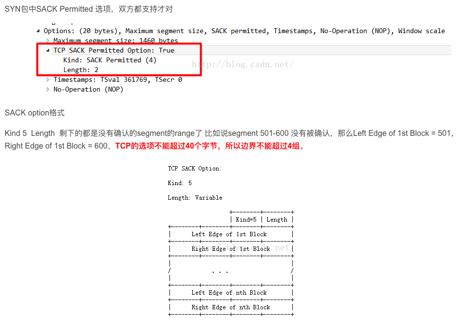

# TCP 

TCP 首部 如下图所示

TCP 是*面向 连接的*, *可靠的*, *字节流* 服务。

面向连接 意味着两个使用TCP的应用， 在彼此交换数据之前必须先建立一个TCP连接，  

可靠性：

* 应用层数据被分割成TCP因为最合适的数据库

* TCP 发送一个数据后，启动一个丁时区， 等待目的端确认收到这个报文段， 如果不能及时收到确认，将重发这个报文段

* 当TCP收到另一端的数据， 它将发送一个确认，这个确认不是立即发送， 通常将推迟几分之一秒

* TCP保持首部 和数据的校验和

* TCP 是作为IP报文来传输的， IP数据包的到达可能会失序，因此TCP报文的到达也可能会失序。如果必要，TCP将收到的争取顺序交给应用层

* IP 报会发生重复， TCP接收端必须丢弃重复的数据

* TCP提供流量控制，TCP每一方都有固定大小的缓冲空间，接收端只允许另一端发送接收端缓冲区所能接受的数据

* TCP 对字节流的内容不做任何解释，所以会发生粘包

TCP 提供全双工的服务 这意味着数据能够在两端互相传输

TCP 首部 有6个标志比特，他们中的多个可以同时被设置为1

* URG 紧急指针

* ACK 确认序号有效， 值代表的希望发送的seq号

* PSH 代表PUSH 接收方应该尽快将这个报文段交给应用层

* RST 代表RESET 表示重建链接

* SYN  同步序号 用来发起一个链接

* FIN  代表FINISH 发送端完成发送任务

TCP 的流量控制 有链接的每一段通过声明的窗口大小来提供， 窗口大小为字节，

在TCP的首部选项中， 最常见的是 MSS（max segment size） 最长报文大小。 每个连接方 通常都在通信的第一个报文段指明这个选项， 代表本端锁能接受的最大长度的报文段

# TCP的 建立和终止

* 请求端 发送一个个SYN 段 知名客户打算连接的服务器端口 以及初始序号（ISN） 

* 服务器端返回包含服务器自己的ISN 号的SYN 报文段 作为应答， 同时将确认序号设置为客户的ISN +1 ，对客户报文段进行确认

* 客户必须将确认号 设置为服务器的ISN +1 ， 对服务器的SYN报文进行确认

因为TCP 是全双工的， 因此三次握手的第二次握手，实际上可以这么理解： 服务器端 返回一个对客户端ISN 报文段的确认号： ISN +1, 紧接着 服务器端发送一个自己服务的的ISN 的SYN 报文。

为了 减少包量，可以直接将这两次合并成1次

# TCP 终止

建立连接要三次握手， 终止一个连接要经过4次挥手。 这是由TCP的半关闭造成的， 既然一个TCP连接是全双工，因此需要每个方向进行单独的关闭。 这原则就是当一方完成它的数据发送任务后， 就能发送一个FIN 来终止这个方向的连接。当一段收到一个FIN

它必须通知应用层 另一端已经终止了哪个方向的数据传输， 发送FIN通常是应用层进行关闭的结果（close 和 shutdown 方法， 后者比较优雅实现半关闭， 并等待缓冲区的数据发送完成。close 方法比较猛， 。） 

# 最大报文长度 MSS

最大报文长度表示TCP 传送往另一端的最大数据块长度 当一个连接建立时候， 连接的双方都要通告各自的mss

# TCP 的半关闭

TCP 提供了连接段在结束它的发送端后 还能接受来自另一端数据的能力，这就是所谓的半关闭。

# TCP 的状态转换图

# 2MSL 等待

TIME_WAIT 状态也称作为2MSL 等待状态， 每个具体TCP实现必须选择一个报文段的最大生存时间MSL， 他是任何报文段被丢弃前在网络内的最长时间。 

TCP 报文段以IP数据报在网络内传输， IP数据报有限制其生存时间的 TTL字段， 但是实际应用中， 对IP数据报的TTL的限制是基于跳数， 而不是定时器

对于一个具体实现给定的MSL值， 处理原则是： 当TCP执行一个主动关闭， 并发回最后一个ACK 后， 该链接必须在TIME_WAIT 状态停留时间为2被MSL， 这样可以让TCP 在此发送最后的ACK 以防止这个ACK 丢失（另一端超时后，并重发最后的FIN包）

这种2MSL 等待的另一个结果是这个TCP连接在2MSL等待期间， 定义这个连接的端口 （4元组） 不能再被使用， 这个连接只能在2MSL 结束后才能够再被使用

在连接处于2MSL等待期间，任何迟到的保温段都会被丢弃， 因为处于2MSL等待的连接在这段时间内不能被再用。

我们说过  客户端主动执行关闭，并进入TIME_WAIT是正常的， 服务器通常执行被动关闭， 不会进入TIME—WAIT状态。 这按时如果我们终止一个客户程序，并立即重新启动客户程序， 这个新客户程序将不能重用 相同的本地端口， 这不会带来问题， 因为客户使用的本地端口是随机的， 并不关心这个端口号是什么。

然而对于服务器端， 情况就有所不同： 因为服务器使用熟知的端口， 如果我们终止一个已经建立连接的服务器程序， 并试图立即重启这个服务器程序， 服务器程序将不能把它这个熟知的端口赋值给他的断电， 因为那个端口是处于2MSL连接的一部分。在重启服务器前， 需要等待一段时间。

# RST 复位报文段

一般来说， 无论何时一个报文段发往基准的链接出现错误， TCP都会发送一个复位报文段， 这里的基准连接 只的是由目的ip 目的端口，源ip 源端口 指明的连接。

## 不存在端口的链接请求

产生复位的一种常见情况是， 当连接请求到达时候， 目的端口没有进程在监听， 对于UDP 在端口没在使用的情况下， 会禅师一个ICMP端口不可达的信息， 而TCP则使用复位。

## 异常终止一个连接

正常终止一个连接 是一方发送FIN， 这也称作为有序释放连接, 因为在所有排队数据都已经发送之后， 才发送FIN. 正常情况下不会有任何数据丢失。，

异常终止一个连接对应用程序有两个优点 

* 丢弃任何代发数据， 并立刻发送复位异常报文

* RST 接收方会区分另一端执行的是异常关闭还是正常关闭。

# 同时关闭

# TCP 选项

常见的TCP选项是 最大报文长度和时间戳, SACK(选择ack)。

每个选项的开始1字节是kind 字段，说明选项类型，kind 字段为0 和1 选项仅仅占1个字节， ，其他的选择在kind 字节后还有len字节， 说明只的长度是总长度包括kind 字节和len字节

设置无操作的原因在于云晓发送方填充字段为4字节的倍数。 

其他 k i n d 值为 4 、 5 、6 和 7 的 四 个 选 项 称 为 选 择 A C K 及 回 显 选 项 。 由 于 回 显 选 项 已 被时间戳选项取代，而目前定义的选择 A C K选项仍未定论，并未包括在 R F C 1 3 2 3 中， 因此图 1 8 - 2 0没有将它们列出。另外，作为 T C P 事务(第 2 4 . 7 节)的 T / T C P 建议也指明 kind为11, 12和 13的三个选项

## SACK (selective Acknowledgment)

举个例子

* 服务发送4个片段给客户端，seg1(seq=1,len=80),seg2(seq=81,len=120), seg3(seq=201,len=160),seg4(seq=361,len=140)

* 服务器收到seg1和seg2的ACK = 201，所以此时seg1 seg2变成发送并已经确认范畴的数据包，被移除滑动窗口，此时服务器又可以多发80+120 byte数据

* 假设seg3由于某些原因丢失，这个时候服务器仍然可以像客户端发送数据，但是服务器会等待seg3的ACK，否则窗口无法滑动，卡主了

* seg3丢失了，即使后面的seg4收到了，客户端也无法告知服务器已经收到了seg4，试想一下，如果窗口也够大，服务器可以继续持续发送更多的片段，那么这些片段被客户端接收，只能存放到队列中，无法进行确认

正是因为后续OUT_OF_ORDER 的报文段的发送状况 也不清楚， 所以server端也不是特别清楚 要如何处理这种情况。不过一般来说只能有两种情况：

* 只重传超时的数据报， 这种方法是最常想到的， 比较实用与后面的数据报都能够正常接收的状况。 只重传超时的数据报，但是如果比较坏的情况下， 丢失了很多封包呢？ ** 那就需要一个个的等待超时， 非常浪费时间。**

* 重传这个片段以及以后所有的包， 这种方法在最坏的情况下， 看起来效率还是挺高的， 但是如果只丢失一个包， 就重传后面的所有接受到的包，** 流量浪费**很严重

对于以上的问题， RFC2018 提供了一个SACK的方法， 有效的解决了这个问题。

SACK 是TCP的一个选项， 来允许TCP单独确认非连续的片段， 用于告知真正丢失的包。 SACK 主要是接收方用来告知发送方哪些数据片段没有被接受.

要是用SACK 2个设备必须同时支持SACK才可以。 建立连接的时候， 需要使用SACK permitted 的option。 如果允许， 后续的传输过程TCP segment 可以携带SACK的option。

这个option 内容包含了一系列非连续的没有确认的数据的seq range

SACK 格式

# TCP 的交互数据量

一些有关TCP通信量的研究发现 如果按照分组数量计算， 约有一半的TCP报文包含成块数据，另一半则包含交互数据。成块数据与交互数据比例为：9：1 

## nagle 算法

