# tcp

## TCP

TCP 首部 如下图所示

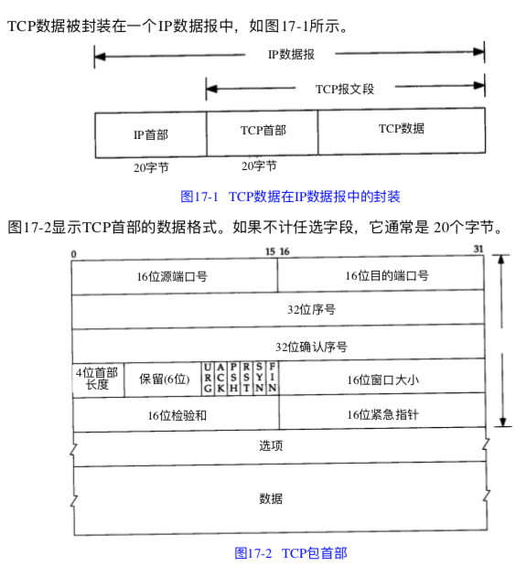

TCP 是_面向 连接的_, _可靠的_, _字节流_ 服务。

面向连接 意味着两个使用TCP的应用， 在彼此交换数据之前必须先建立一个TCP连接，

可靠性：

* 应用层数据被分割成TCP因为最合适的数据库
* TCP 发送一个数据后，启动一个丁时区， 等待目的端确认收到这个报文段， 如果不能及时收到确认，将重发这个报文段
* 当TCP收到另一端的数据， 它将发送一个确认，这个确认不是立即发送， 通常将推迟几分之一秒
* TCP保持首部 和数据的校验和
* TCP 是作为IP报文来传输的， IP数据包的到达可能会失序，因此TCP报文的到达也可能会失序。如果必要，TCP将收到的争取顺序交给应用层
* IP 报会发生重复， TCP接收端必须丢弃重复的数据
* TCP提供流量控制，TCP每一方都有固定大小的缓冲空间，接收端只允许另一端发送接收端缓冲区所能接受的数据
* TCP 对字节流的内容不做任何解释，所以会发生粘包

TCP 提供全双工的服务 这意味着数据能够在两端互相传输

TCP 首部 有6个标志比特，他们中的多个可以同时被设置为1

* URG 紧急指针
* ACK 确认序号有效， 值代表的希望发送的seq号
* PSH 代表PUSH 接收方应该尽快将这个报文段交给应用层
* RST 代表RESET 表示重建链接
* SYN 同步序号 用来发起一个链接
* FIN 代表FINISH 发送端完成发送任务

TCP 的流量控制 有链接的每一段通过声明的窗口大小来提供， 窗口大小为字节，

在TCP的首部选项中， 最常见的是 MSS（max segment size） 最长报文大小。 每个连接方 通常都在通信的第一个报文段指明这个选项， 代表本端锁能接受的最大长度的报文段

## TCP的 建立和终止

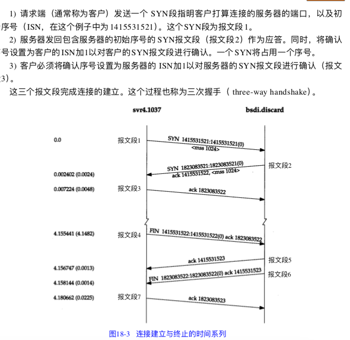

* 请求端 发送一个个SYN 段 知名客户打算连接的服务器端口 以及初始序号（ISN）
* 服务器端返回包含服务器自己的ISN 号的SYN 报文段 作为应答， 同时将确认序号设置为客户的ISN +1 ，对客户报文段进行确认
* 客户必须将确认号 设置为服务器的ISN +1 ， 对服务器的SYN报文进行确认

因为TCP 是全双工的， 因此三次握手的第二次握手，实际上可以这么理解： 服务器端 返回一个对客户端ISN 报文段的确认号： ISN +1, 紧接着 服务器端发送一个自己服务的的ISN 的SYN 报文。

为了 减少包量，可以直接将这两次合并成1次

## TCP 终止

建立连接要三次握手， 终止一个连接要经过4次挥手。 这是由TCP的半关闭造成的， 既然一个TCP连接是全双工，因此需要每个方向进行单独的关闭。 这原则就是当一方完成它的数据发送任务后， 就能发送一个FIN 来终止这个方向的连接。当一段收到一个FIN

它必须通知应用层 另一端已经终止了哪个方向的数据传输， 发送FIN通常是应用层进行关闭的结果（close 和 shutdown 方法， 后者比较优雅实现半关闭， 并等待缓冲区的数据发送完成。close 方法比较猛， 。）

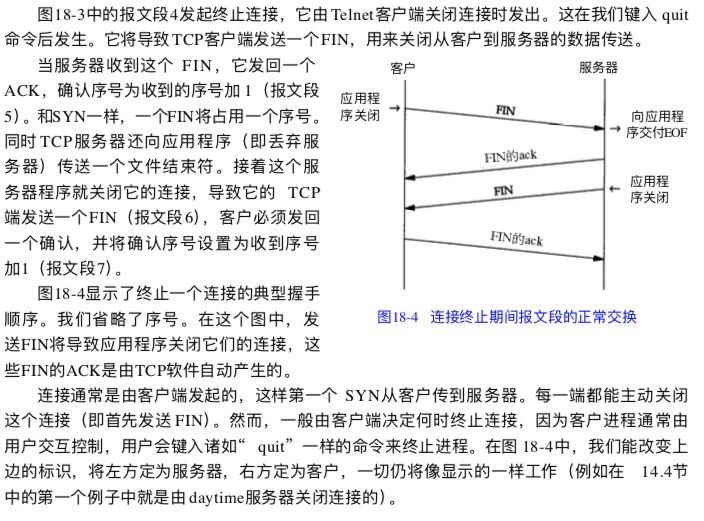

## 最大报文长度 MSS

最大报文长度表示TCP 传送往另一端的最大数据块长度 当一个连接建立时候， 连接的双方都要通告各自的mss

## TCP 的半关闭

TCP 提供了连接段在结束它的发送端后 还能接受来自另一端数据的能力，这就是所谓的半关闭。

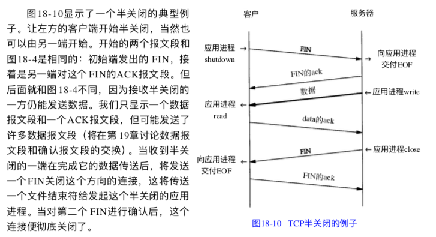

## TCP 的状态转换图

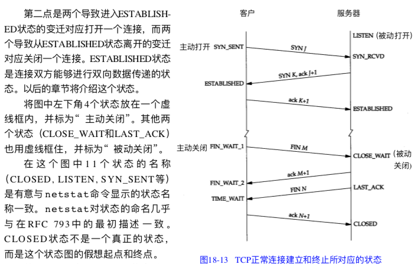

## 2MSL 等待

TIME\_WAIT 状态也称作为2MSL 等待状态， 每个具体TCP实现必须选择一个报文段的最大生存时间MSL， 他是任何报文段被丢弃前在网络内的最长时间。

TCP 报文段以IP数据报在网络内传输， IP数据报有限制其生存时间的 TTL字段， 但是实际应用中， 对IP数据报的TTL的限制是基于跳数， 而不是定时器

对于一个具体实现给定的MSL值， 处理原则是： 当TCP执行一个主动关闭， 并发回最后一个ACK 后， 该链接必须在TIME\_WAIT 状态停留时间为2被MSL， 这样可以让TCP 在此发送最后的ACK 以防止这个ACK 丢失（另一端超时后，并重发最后的FIN包）

这种2MSL 等待的另一个结果是这个TCP连接在2MSL等待期间， 定义这个连接的端口 （4元组） 不能再被使用， 这个连接只能在2MSL 结束后才能够再被使用

在连接处于2MSL等待期间，任何迟到的保温段都会被丢弃， 因为处于2MSL等待的连接在这段时间内不能被再用。

我们说过 客户端主动执行关闭，并进入TIME\_WAIT是正常的， 服务器通常执行被动关闭， 不会进入TIME—WAIT状态。 这按时如果我们终止一个客户程序，并立即重新启动客户程序， 这个新客户程序将不能重用 相同的本地端口， 这不会带来问题， 因为客户使用的本地端口是随机的， 并不关心这个端口号是什么。

然而对于服务器端， 情况就有所不同： 因为服务器使用熟知的端口， 如果我们终止一个已经建立连接的服务器程序， 并试图立即重启这个服务器程序， 服务器程序将不能把它这个熟知的端口赋值给他的断电， 因为那个端口是处于2MSL连接的一部分。在重启服务器前， 需要等待一段时间。

## RST 复位报文段

一般来说， 无论何时一个报文段发往基准的链接出现错误， TCP都会发送一个复位报文段， 这里的基准连接 只的是由目的ip 目的端口，源ip 源端口 指明的连接。

### 不存在端口的链接请求

产生复位的一种常见情况是， 当连接请求到达时候， 目的端口没有进程在监听， 对于UDP 在端口没在使用的情况下， 会禅师一个ICMP端口不可达的信息， 而TCP则使用复位。

### 异常终止一个连接

正常终止一个连接 是一方发送FIN， 这也称作为有序释放连接, 因为在所有排队数据都已经发送之后， 才发送FIN. 正常情况下不会有任何数据丢失。，

异常终止一个连接对应用程序有两个优点

* 丢弃任何代发数据， 并立刻发送复位异常报文
* RST 接收方会区分另一端执行的是异常关闭还是正常关闭。

## 同时关闭

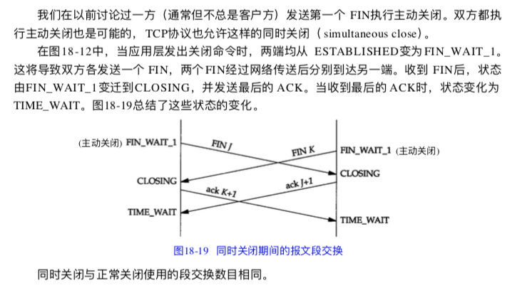

## TCP 选项

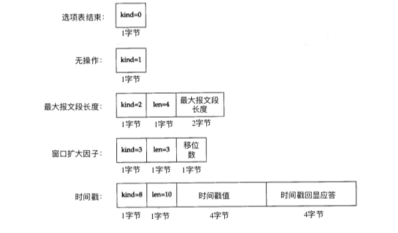

常见的TCP选项是 最大报文长度和时间戳, SACK\(选择ack\)。

每个选项的开始1字节是kind 字段，说明选项类型，kind 字段为0 和1 选项仅仅占1个字节， ，其他的选择在kind 字节后还有len字节， 说明只的长度是总长度包括kind 字节和len字节

设置无操作的原因在于云晓发送方填充字段为4字节的倍数。

其他 k i n d 值为 4 、 5 、6 和 7 的 四 个 选 项 称 为 选 择 A C K 及 回 显 选 项 。 由 于 回 显 选 项 已 被时间戳选项取代，而目前定义的选择 A C K选项仍未定论，并未包括在 R F C 1 3 2 3 中， 因此图 1 8 - 2 0没有将它们列出。另外，作为 T C P 事务\(第 2 4 . 7 节\)的 T / T C P 建议也指明 kind为11, 12和 13的三个选项

### SACK \(selective Acknowledgment\)

举个例子

* 服务发送4个片段给客户端，seg1\(seq=1,len=80\),seg2\(seq=81,len=120\), seg3\(seq=201,len=160\),seg4\(seq=361,len=140\)
* 服务器收到seg1和seg2的ACK = 201，所以此时seg1 seg2变成发送并已经确认范畴的数据包，被移除滑动窗口，此时服务器又可以多发80+120 byte数据
* 假设seg3由于某些原因丢失，这个时候服务器仍然可以像客户端发送数据，但是服务器会等待seg3的ACK，否则窗口无法滑动，卡主了
* seg3丢失了，即使后面的seg4收到了，客户端也无法告知服务器已经收到了seg4，试想一下，如果窗口也够大，服务器可以继续持续发送更多的片段，那么这些片段被客户端接收，只能存放到队列中，无法进行确认

正是因为后续OUT\_OF\_ORDER 的报文段的发送状况 也不清楚， 所以server端也不是特别清楚 要如何处理这种情况。不过一般来说只能有两种情况：

* 只重传超时的数据报， 这种方法是最常想到的， 比较实用与后面的数据报都能够正常接收的状况。 只重传超时的数据报，但是如果比较坏的情况下， 丢失了很多封包呢？  **那就需要一个个的等待超时， 非常浪费时间。**
* 重传这个片段以及以后所有的包， 这种方法在最坏的情况下， 看起来效率还是挺高的， 但是如果只丢失一个包， 就重传后面的所有接受到的包， **流量浪费**很严重

对于以上的问题， RFC2018 提供了一个SACK的方法， 有效的解决了这个问题。

**SACK 是TCP的一个选项， 来允许TCP单独确认非连续的片段， 用于告知真正丢失的包。 SACK 主要是接收方用来告知发送方实际收到了哪些数据段， 隐含的意思是 还有哪些数据段没有收到**

要是用SACK 2个设备必须同时支持SACK才可以。 建立连接的时候， 需要使用SACK permitted 的option。 如果允许， 后续的传输过程TCP segment 可以携带SACK的option。

这个option 内容包含了一系列非连续的没有确认的数据的seq range

SACK 格式

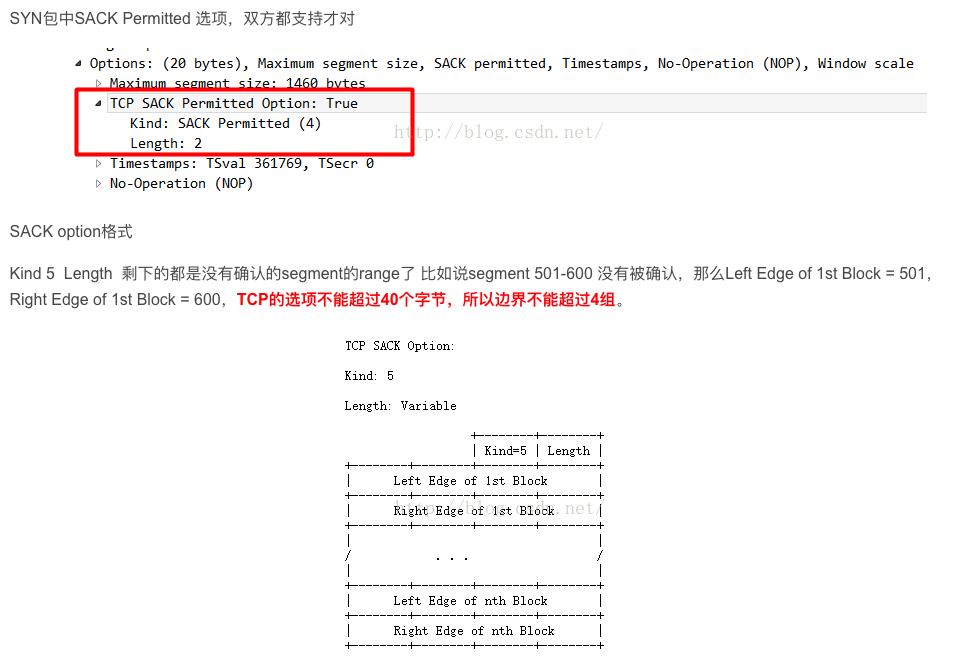

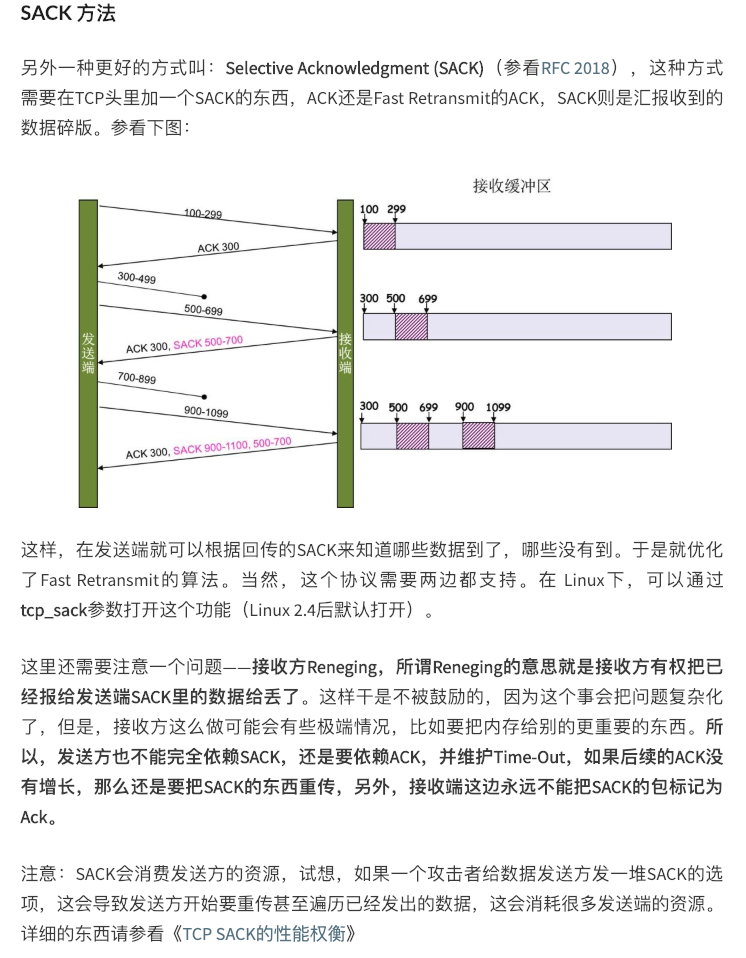

```text
SACK允许选项
       类型值: 4
       +---------+---------+
       | Kind=4  | Length=2|
       +---------+---------+
该选项只允许在有SYN标志的TCP包中，也即TCP握手的前两个包中，分别表示各自是否支持SACK。
SACK选项
       选项类型: 5
       选项长度: 可变，但整个TCP选项长度不超过40字节，实际最多不超过4组边界值。
                         +--------+--------+
                         | Kind=5 | Length |
       +--------+--------+--------+--------+
       |      Left Edge of 1st Block       |
       +--------+--------+--------+--------+
       |      Right Edge of 1st Block      |
       +--------+--------+--------+--------+
       |                                   |
       /            . . .                  /
       |                                   |
       +--------+--------+--------+--------+
       |      Left Edge of nth Block       |
       +--------+--------+--------+--------+
       |      Right Edge of nth Block      |
       +--------+--------+--------+--------+
```

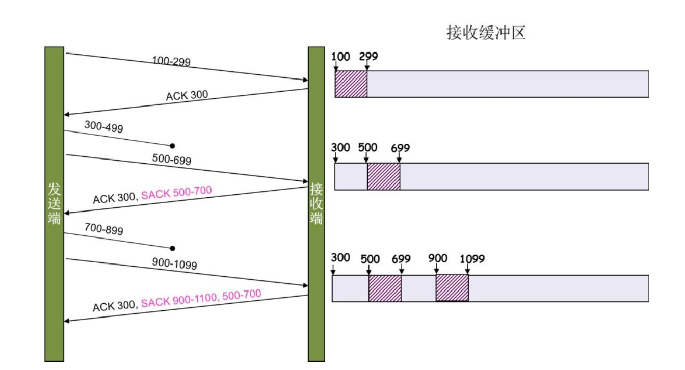

sack 选项要和ack 同时使用， 才能达到表示不连续数据块的意思

首先ack 表示了希望再接受的字节序开始， sack 还有left 和right， left 和right 之间表示的是已经收到的连续的数据段\[left, right-1\] 闭区间 所以第一个没收到的数据段是 ack 到第一个left-1

## TCP 的交互数据流

一些有关TCP通信量的研究发现 如果按照分组数量计算， 约有一半的TCP报文包含成块数据，另一半则包含交互数据。成块数据与交互数据比例为：9：1 这是因为成块数据的报文段基本上是满长度的。 而交互数据则小的多。

很明显， tcp 要处理两类数据， 但是使用的处理算法不相同，。

### nagle 算法

该算法 要求一个TCP 连接上最多只能有一个未被确认的未完成小分组。在该分组的确认到达之前不能发送其他的小分组。 相反， tcp收集这些少量的分组，并在确认到来时候一一个分组的方式发送出去。该算法的优越之处在于他是自适应的。确认到达越快， 数据也就发送的越快。

但是有些例外

* 如果包长度达到MSS 则允许发送
* 如果该包含有FIN 则允许发送
* 设置了TCP——NODELAY 选项 则云晓发送
* 未设置TCP——CORK 选项时候， 若所有发出去的小数据包， 均被确认，则允许发送

nagle 算法的主旨是 避免 发送大量的小包， nagle 算法并没有阻止发送小包， 它只是阻止了发送大量的小包， 诚然发送大量小包降低了网络利用率。 nagle 虽然提高了网络吞吐量， 但是实时性降低了。

对于一些交互性很强的应用程序来说是不允许的， 使用TCP NODELAY 选项可以禁止nagle算法 , 禁止nagle后 应用程序向内核提交的数据报会立即发送出去。但是禁止nagle 网络传输仍然受到TCP确认延迟机制的影响。

CORK 意思是塞子， TCP中的 中的CORK 意思是讲连接塞住， 使得数据先不发出去， 等到拔出塞子后再发， 设置该选项后， 内核会尽力把小数据拼接处一个大数据包（一个MTU） 再发送出去。 一定时间后， 内核仍然没有组合成一个mtu 时候也必须发送现有的数据，然而TCP CORT 并不像你想的那么完美， CORK并不会将连接完全塞住， 内核其实不知道应用层到底什么时候会把第二批数据用于和第一批数据拼接，以达到mtu 大小， 因此内核会做一个时间限制， 在该时间内没有拼接成一个大包，内核也会无条件发送， 也就是说若应用层程序发送小数据间隔不够短时候， tcp cork 就没有一点作用

nagle 算法和cork 算法非常相似， 但是他们的着重点不一样， nagle 主要避免网络中因为太小的包而阻塞。而cork 主要是为了提高网络的利用率。使总体上协议头占用的比例尽可能小。

### nagle 算法与延时确认 一起使用产生的问题

两种算法都有减少网络数据包的优点， 但是都增加了网络通信的延迟

两种算法都是为了减少网络通信的数据量但是结合在一块会有作用

例如客户端发送一个数据报，由于延时确认， 服务的不是马上确认

若客户端启动nagle 算法，要等到收到上一个数据的确认再发送下一个数据报

如此一来客户端和服务器端互相等待， 直到超时或者其他情况

## TCP 成块数据流

nagle 算法 是属于停止等待协议，数据发送方在发送下一个数据块之前，需要等待接受对已发送数据的确认， 这里主要介绍 成为 滑动窗口协议， **该协议允许发送方在停止并等待确认前可以连续发送多个分组**

### 正常数据流

使用TCP的滑动窗口协议时候， 接收方不必确认每一个收到的分组， 在TCP中， ACK是累积的--它表示接收方已经正确收到了一直到确认序列号减一的所有字节

### 滑动窗口

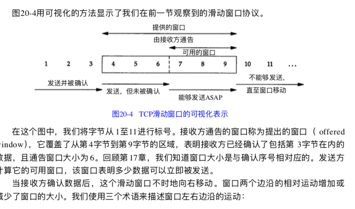

* 称窗口左边沿向右边沿靠近为窗口合拢。这种现象发生在数据被发送和确认时。
* 当窗口右边沿向右移动时将允许发送更多的数据，我们称之为窗口张开。这种现象发 生在另一端的接收进程读取已经确认的数据并释放了 T C P 的接收缓存时。
* 当右边沿向左移动时，我们称之为窗口收缩。 Host Requirements RFC强烈建议不要使 用这种方式。

### 窗口大小的通告

窗口大小通告表示这通告方的缓存还能接受数据的大小

### PUSH 标志

发送方使用该标志通知接收方进程将所收到的数据全部提交给接受进程， 这里的数据包括与PUSH一起传送的数据 以及接收方TCP已经为接受进程收到的其他数据。

当服务器的TCP接受到一个设置了PUSH标志的报文时候， 他需要立即将这些数据提交给服务进程而不能等待判断是否还会有额外的数据到达。

然而大多数的API没有向应用程序提供通知其TCP设置PUSH 标志的方法。

### 慢启动

在之前上文所有描述中， 发送方一开始便向网络发送多个报文段 ,直至达到接收方通告的窗口大小位置， 这种情况当发送方和接收方处于同一个局域网时候， 这种方式是可以的。

但是如果在发送方和接收方之间存在多个路由器和速率较慢的链路时候， 就有可能出现一些问题。一些中间路由器必须缓存分组， 并有可能耗尽存储空间。

**现在TCP需要支持一种叫慢启动的算法， 该算法通过观察新分组进入网络的速录应该与另一端返回确认的速率相同而进行工作**

慢启动为发送方TCP 增加了另一个窗口 **拥塞窗口 cwnd** 当与另一个网络的主机建立TCP连接时候， 拥塞窗口被初始化为1个报文段\(即另一端通告的最大报文段的大小MSS\) 没收到一个ack，拥塞窗口就增加一个报文段（cwnd 以字节为单位， 但是慢启动是以报文段大小为单位进行增加） 发送方取拥塞窗口和通告窗口最小值作为发送上限

**拥塞窗口是发送方使用的流量控制， 通告窗口则是以接收方使用的流量控制**

发送方开始发送一个报文段， 然后等待ack， 当收到ack时候， 拥塞窗口就从1 增加到2， 即可以发送两个报文段， 当收到 **两个报文段的ack时候** 拥塞窗口就增加为4 ，这是一种指数级增加的关系。

### 成块数据的吞吐量

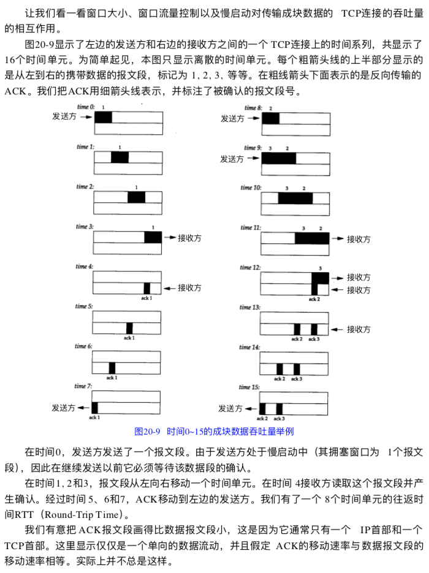

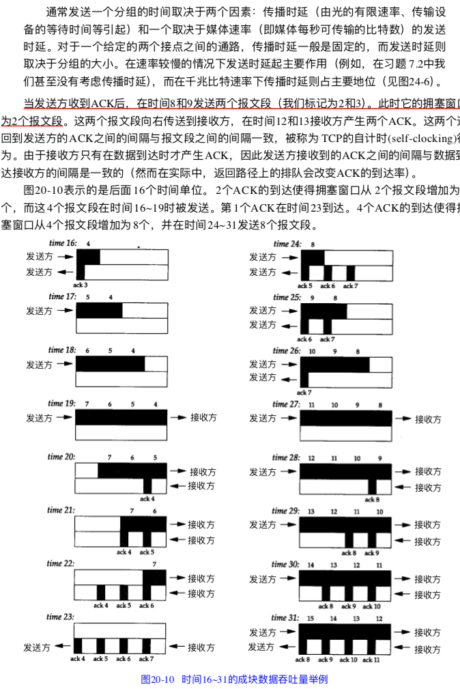

### 拥塞控制四大算法

拥塞控制就是防止过多的数据注入到网络中， 这样可以使网络中的路由器或者链路不知过载

拥塞控制和流量控制 的区别在于 拥塞控制是让网络能够承受现有的网络负荷，他是一个全局性的过程， 设计所有主机，路由器以及网络传输性能有关的所有因素。 而流量控制往往是点对点的通信量的控制， 即接收端控制发送端，用来抑制发送端的发送数据的速率，以便接收端来得急接受。

因此发送方在确定发送报文的速率时候， 既要根据接收方的接受能力， 又要从全局考虑不要使网络发生拥塞， 因此TCP需要发送方维护两个窗口

* 接受窗口 rwnd 接收方根据目前接受的缓存大小锁设定的窗口值
* 拥塞窗口 cwnd 发送方根据自己估算的网络拥塞程度所这是的窗口值， 反应了网络当前的容量

为了更好的对传输层进行拥塞控制， 给出了四种算法

* 满开始
* 拥塞避免
* 快重传
* 快恢复

#### 慢开始

上文已经讲过， 先另拥塞窗口为1， 没收到一个ack 就进行指数级增长。 当慢开始算法把拥塞窗口cwnd 增加到一个阀值ssthresh ， 改用拥塞避免算法

#### 拥塞避免

拥塞避免的算法是， 发送端的拥塞窗口cwnd 每经过一个往返的RTT，按线性规律缓慢增长。

#### 快重传

当发送方连续收到三个重复的ack报文， 直接重传对方尚未收到的报文段， 而不必等待那个报文段设置的重传计时器超时

#### 快恢复

当发送端收到连续三个冗余ack，就执行乘法减少算法， 把满开始阀值ssthresh 设置为出现拥塞时候发送方cwnd 的一半， 与满开始将拥塞窗口cwnd 设置为1 的不同之处， 它吧cwnd 的值设置为慢开始阀值ssthresh减半后的数值， 然后执行拥塞避免算法,使拥塞窗口缓慢线性增大

## TCP 的超时与重传

TCP 提供可靠的传输层， 使用的方法之一就是确认从另一端收到的数据， 但是数据和确认都可能会丢失，TCP 通过在发送时设置一个定时器来解决这种问题，如果当定时器溢出时候还没收到确认，就重传该数据。

对于每个TCP链接，TCP管理4中不同的定时器

* 重传定时器， 适用于当希望收到另一端的确认，
* 坚持定时器 ， 使窗口大小信息保持不断流动， 即使另一端关闭了接受窗口， 这个定时器也要定期去探测
* 保活定时器， 可以检测到一个空闲连接的另一端合适崩溃或者重启
* 2MSL 定时器， 测量一个连接处于TIME WAIT 状态的世界

### 往返时间测量

TCP超时与重传最重要的部分就是对一个给定连接的往返时间RTT的测量，由于路由器和网络流量均会变化， 因此我们认为这个RTT经常会变化， TCP应该跟踪这些变化相应的改变超时时间

### 拥塞避免算法

拥塞避免算法是处理丢失分组的方法， 丢失分组意味着源主机和目的主机之间的某处网络上发送了拥塞

有两种丢失分组的指示

* 发生超时
* 收到重复的确认

拥塞避免算法和慢启动是两个目的不同，独立的算法， 但是当拥塞发生时候\(发送方判定为超时\)， 我们希望降低分组进入网络的传输速率， 于是可以调用慢启动来做到这一点 ，在实际中两个算法通常在一起实现

拥塞避免和慢启动需要对每个连接维持两个变量： 一个拥塞窗口， 一个慢启动门限阀值ssthresh, 这样得到的算法工作过程如下：

* 对于一个给定的链接， 初始化cwnd为1个报文段，ssthresh 为65535 个字节
* tcp输出例程的输出不能超过cwnd 和接收方通告的窗口大小， 拥塞避免是发送方使用的流量控制， 而通告窗口是接收方使用的流量控制，前者是发送方感受到网络拥塞的估计而后者与接收方在该链接是可用缓存大小有关。
* 当拥塞发送时候（超时或者受到重复确认）sshthresh 被设置为当前窗口大小的一半（cwnd 和接收方通告窗口的最小值，最小为2个报文段） 此外如果是擦汗搜狐引起了拥塞， 则cwnd 被设置为1个报文段（就是慢启动）
* 当心的数据被对方确认， 就增加cwnd， 蛋增加的方法依赖于是否在进行慢启动或者拥塞避免， 如果cwnd 小于或者等于sshresh 则正在进行慢启动，否则进行拥塞避免。 慢启动一直持续到我们回到当拥塞发送所处位置的一半时候才停止， 然后转而执行拥塞避免

拥塞避免算法要求没此收到一个确认时候， 将cwnd 增加1， 与慢启动指数增加比起来，这是一种加性增长。

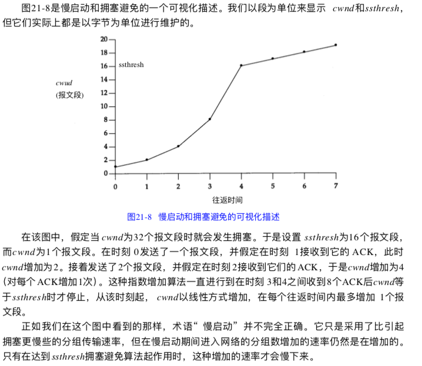

### 快速重传和快速恢复算法

上面的慢启动 + 拥塞避免 ， 发送方判断为超时，就是在规定时间段内没收到确认时候， 发送方认为发送了拥塞， 则 将sshthresh 设置为当前窗口一般， cwnd 设置为1个报文段，（慢启动重新开始）当慢启动到达阀值时候， 转而进行拥塞避免

下面说说快速重传和快速回复

在介绍这两种方法之前， 我们认识到， 如果收到一个失序的报文段时候， tcp会离职需要产生一个ACK\(一个重复的ack\) 这个重复的ack 不应该被延迟， 该重复的ack 的目的在于让跟对方知道收到一个失序的报文段 ,并告诉对方自己希望收到的序号

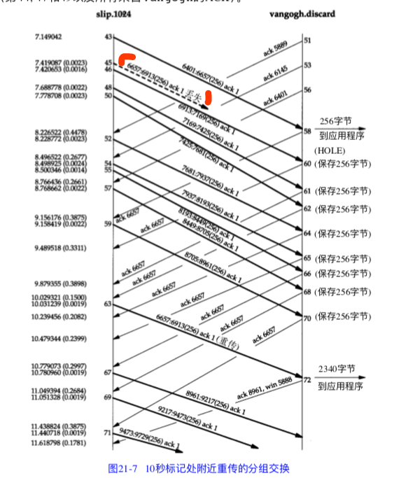

由于我们不知道一个重复的ACK是 由于一个丢失的报文段引起的， 还是由于仅仅出现了几个报文段的重新排序，因此我们需要等待少量的重复的ACK的到来， 假设这只是一些报文段的重新排序， 则在重新排序的报文被处理并产生一个新的ack之前，值可能产生1-2个重复的ack， 如果一连串收到3个或者3个以上的重复ack，就非常可能是一个报文段丢失了。于是我们就重传丢失的数据报文段， 而无需等待超时定时器溢出， 这就是快速重传算法， 接下来执行的不是慢启动算法而是拥塞避免算法， 这就是快速恢复算法。

一连串三个或者三个以上ack 报文段丢失的可能性就非常大， 参照上图。 接下来我们讨论一下 报文段的重新排序：

假设发送端 连续顺序发送了3个数据， A， B， C。 但是 接收端首先接受到的是A 和 C， 在B还没到达之前， 接收端可能会发送1-2个关于A数据包的ack，如果这时候C到达了， 这时候才发C 的ack， 因此这个过程会有重复ack的发送可能

因此快速重传和快速恢复算法 是一个先后问题， 处理的数据包的立刻重传， 之后执行拥塞避免算法。

下面两图是满开始 + 拥塞避免 算法 以及快速重传和快速回复算法的比较：

满开始 + 拥塞避免

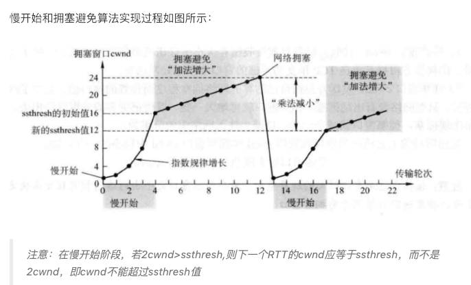

快速重传和快速恢复

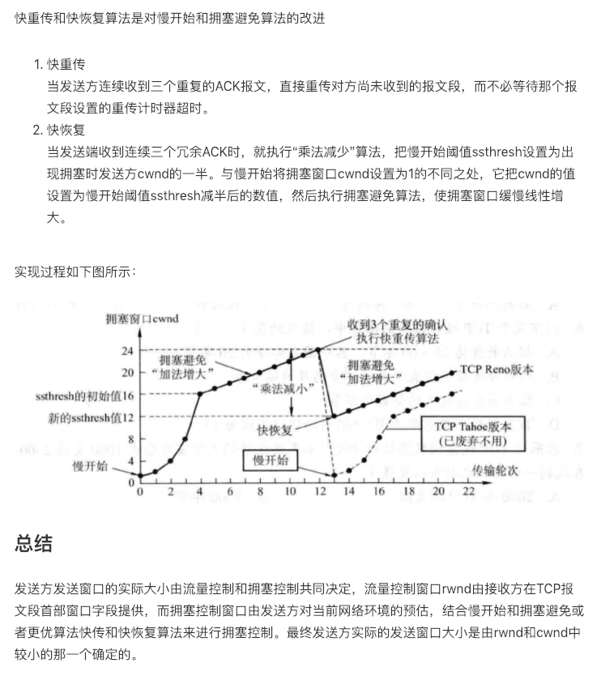

### 慢启动， 拥塞避免， 快速重传， 快速恢复 总结

首先理解 发送窗口和拥塞窗口， 发送窗口就是接收端通知发送端最大发送的数据长度， 拥塞窗口cwnd是为例避免拥塞设置的窗口， 最后运行发送的字节数是这两个窗口的最小值。

 **慢启动**  慢启动基本规律： 发送端首先发送1MSS ， 之后再发送2MSS， 再就是4MSS， 8MSS， 16 MSS ， 32MSS 。。。 指数级增长

但是拥塞窗口不能无限制持续增大，即使cwnd 值小于从接收端返回的窗口大小的字段， 也可能出现数据丢失现象，这个拥塞窗口大小是一个临界点， 因此引入了慢启动的另一个重要参数 **慢启动阀值** 初始值是64KB， 当发生一次数据丢失时候 ，阀值设置为当前cwnd的一半， 而此时cwnd 重新设置为1mss，继续使用慢启动

所以慢启动是数据丢失时候的前两次使用的， 刚开始发送数据时候， 使用慢启动方式，最开始发送1mss，之后当第一次出现丢包后， 阀值设置为当前cwnd 的一半， 然后再次启动慢启动， 从1mss 开始发送

不过当cwnd 再次增长到新的阀值的时候, 则开始使用拥塞避免算法

 **拥塞避免** 

当cwnd 再次大于或者等于阀值的时候， 启动拥塞避免算法

基本思想： 在cwnd 值第二次达到阀值的时候， 让拥塞窗口大小没经过一个rtt，时间值仅仅加1，以线性增长的方式慢慢增大， 而不是继续像慢启动一样指数方式增大， 显然这种增长方式 速度要慢于慢启动方案的cwnd增长速度， 当再次发生数据丢失的时候， 阀值

变为当前cwnd的一半， 同时把cwnd 置为1，重新进入慢启动数据发送过程， 依次类推， 当cwdn 达到阀值时候， 开始使用拥塞避免

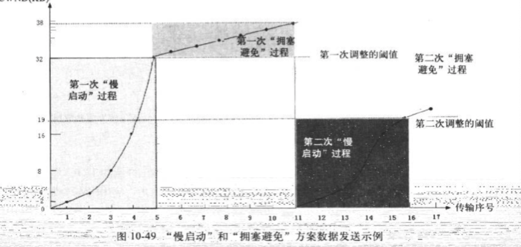

 **快速重传 快速恢复** 

慢启动和拥塞避免是1988年提出的， 1990年又提出了新的两种拥塞避免控制方案。 快重传和快恢复

快速重传的基本思想： 当接收端收到一个不是按序到达的数据段时候， tcp 实体迅速发送一个重复的ack 数据段，而不用等到有数据需要发送时候顺带发送确认， 在重复收到3个重复ack数据段后， 即认为对应确认号数据段已经丢失， tcp 不等重传定时器超时就重传已经丢失的数据段

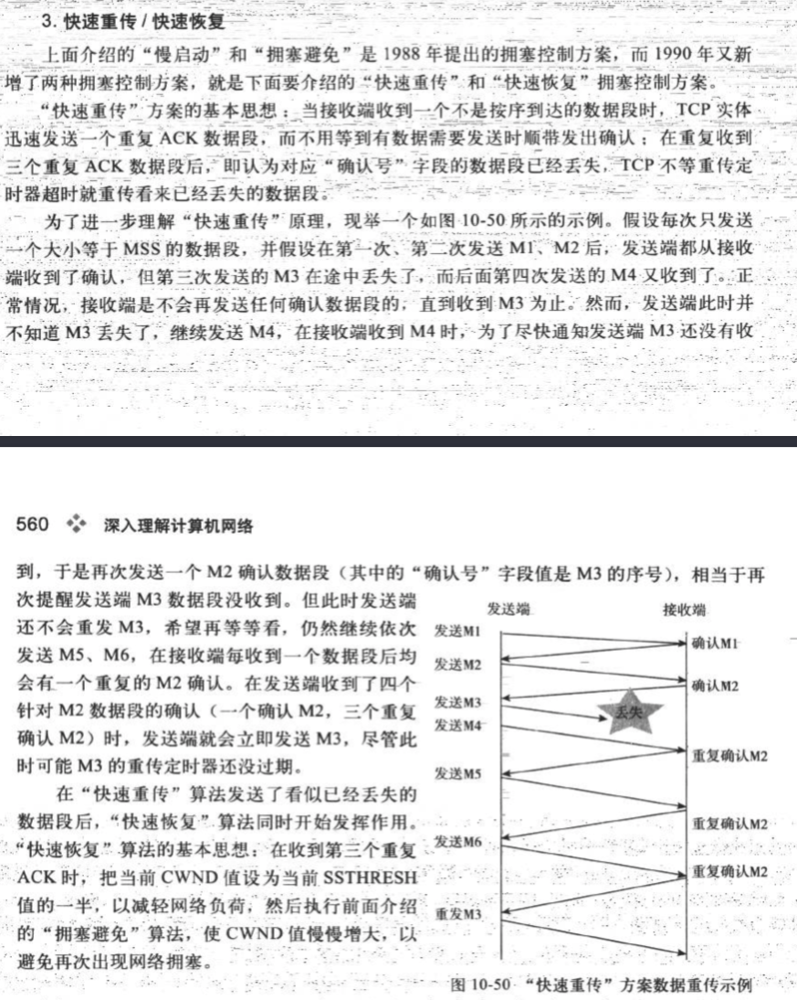

## TCP 坚持定时器

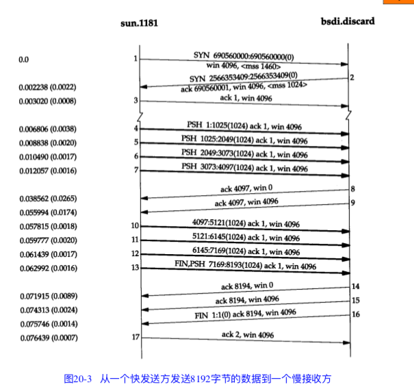

在上图中我们可以看到， 当发送方接受到报文段9时候， 它打开被报文段8关闭的窗口并立即开始发送数据， TCP 必须能够处理打开此窗口的ACK，也就是说TCP 不对ack报文进行确认， TCP只确认哪些包换数据的ack报文段

如果一个确认丢失了， 则双方就有可能因为等待对方的而连接终止： 接收方等待接受数据（因为它已经向发送方通告了一个非0的窗口） 而发送方则在等待允许它继续发送数据的窗口更新（此时接收方的ack可能已经丢了， 因此发送方可能一直会等下去）

为了防止这种死锁发送， 发送方使用一个坚持定时器来周期性的想接收方查询，以便发现窗口是否增大， 这些从发送方发出的报文段，成为窗口探查

**注意坚持定时器是发送方 向接收方发送的探测**

坚持定时器 与超时重传有不同， 那就是tcp **从不放弃发送窗口的探测**

### 糊涂窗口综合治理

基于滑动窗口， 拥塞窗口 的流量控制方案， 如TCP 所使用的， 会导致一种称为 **糊涂窗口综合征** 的状况，如果发送这种情况， 则少量的数据将通过连接进行交换， 而不是满长度的报文段

糊涂窗口综合症（Silly window syndrome），亦称愚蠢窗口综合症、愚笨窗口综合症，是TCP流量控制实现不良导致的一种计算机网络问题。当发送程序缓慢地创建数据，接收程序缓慢地消耗数据，或者两者同时存在时，滑动窗口运作会出现严重问题。如果一个服务器无法处理所有传入的数据而存在此问题，它会要求客户端减少一次发送的数据量（TCP網路封包的滑动窗口）。如果服务器仍然无法处理所有传入的数据，窗口会随此问题越来越小，有时甚至将使传输数据小于数据包头，使数据传输变得极为低效。这个问题的名字取自窗口缩小到“愚蠢”的值。

由于处理每个封包都存在一定量的开销，封包数的增加也可能使数据处理量减少。最终的结果就是抖动。

简单点讲就是： 窗口控制， 导致网络中传输的包，数据长度小于或者很小于包的首部

这种现象可以发生在两端的任何一端： 接收方可以通告一个小的窗口， 而发送方也可以发送小量的数据， 我们可以根据下面方法，在任何一端采取避免出现糊涂窗口综合征的现象。

* 接收方不通告小窗口
* 发送方避免出现糊涂窗口综合征的措施是只有以下条件之一满足才发送数据： a\) 可以发生一个满长度的报文段 b） 可以发送至少是接收方通告窗口大小一半的报文段 c） 可以发送任何数据 并且不希望接受ack（也就是说 我们还未被确认的数据） 或者该连接上不能使用nagle 算法

条件b 主要对付那些总是通告小窗口的主机， 条件c 是我们在有尚未被确认的数据以及在不能使用nagle算法的情况下，避免发送小的报文段，如果应用进程在进行小数据的写操作， （例如比该报文段还小） 条件c 可以避免出现糊涂窗口综合征

糊涂窗口的避免个人感觉可以 相对使用nagle 和 延迟发送 算法

## TCP 的保活定时器

我们发现 我们可以启动一个客户端到服务器端的连接， 然后离去数小时， 天，数个星期， 月， 而连接依然保持，中间路由器可以崩溃或者重启， 电话线可以被挂断再联通， 但是只要两段的主机没有被重启， 则连接依然保持建立。

这就意味着， 两个应用进程， 客户进程或者服务进程， 都没有使用**应用级别** 的定期器来探测非活动状态 这个探测是在内核层面实现的

保活定期器主要是为服务器应用程序提供的， 服务器应用程序希望知道客户机是否崩溃，从而可以代表客户使用资源。 保活定时器就是在服务端检测到这种半开放的连接。

