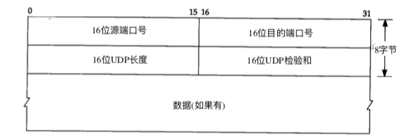

# UDP 

UDP 首部 如下图所示

UDP 首部比较简单， 总共8个字节， 包括2个字节的源端口， 2字节的目的端口， 2字节UDP长度， 2字节UDP校验和

UDP 长度字段指的是UDP首部和UDP数据的字节长度。

如果发送端没有计算校验和 而接受端检测到校验和有差错， 那么UDP数据报就要被悄悄的丢弃，不产生任何差错报文

IP层检测到IP首部校验和有差错时候， 也会这么做

# IP 分片

物理层网络一般要限制每次发送数据帧的长度， 任何时候IP层接受到一份要哦发送的IP数据包时候， 它要判断向本地哪个接口发送数据， 并查询接口获得其MTU。

IP把MTU与数据报长度进行比较， 如果需要则进行分配。 分片可以发生在原始发送端主机上。 也可以发生在中间路由器上。

IP分片是靠IP头中，的标示，标志 和偏移量 来确定这个子分片属于哪个分片的。

IP分片后， 重新组装由目的端的IP层来完成，其目的是使分片和组装过程对传输层是透明的。

标识字段 都包含一个唯一的值， 该值在数据报分片时候 被复制到每个分片中， 
标志字段用其中一个比特来表示更多的片，除了最后一个分片外，其他每个数据报的片都要把该比特设置为1
偏移字段指的是该片偏移原始数据报开始处的位置

另外当数据报被分片后， 每个片的总长度要改为该片的长度值

另外标志字段有一个比特位 表示“不分片” ,如果将这一bit置为1  IP将不对数据报进行分片， 相反数据报丢弃并发送一个ICMP差错报文（需要进行分片但是设置了不分片比特） 利用这个特性可以来解决路径MTU 的问题

尽管IP分片过程看起来是透明的， 但是也有一点不想使用它：

即使只丢失一片数据， 也要重传整个数据报，为什么会发送这种情况呢? 因为IP层本身没有超时重传机制， 它是由更高层来负责超时和重传（TCP有超时和重传机制， 但是UDP没有，） 当来自TCP报文段的某一片丢失后， TCP在超时后 会重发整个TCP报文段，该报文段对应一份IP报文，没有办法只重传数据报中的一个数据报片

注意： 使用UDP分容易导致IP分片（TCP 会尽量避免分片，） IP包被分片后， UDP或者TCP的首部仅仅存在第一片中

