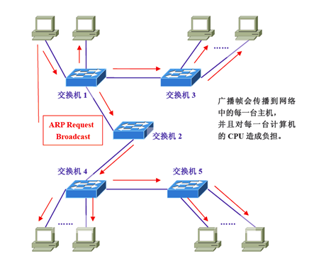
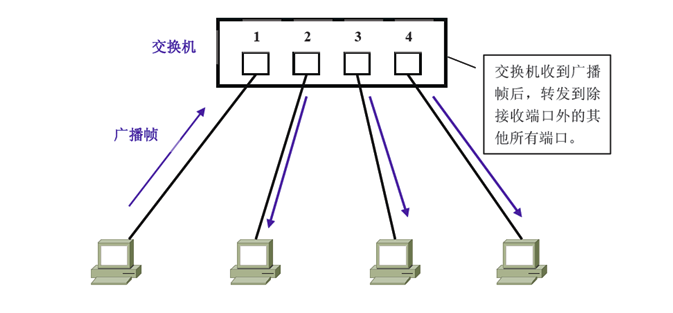
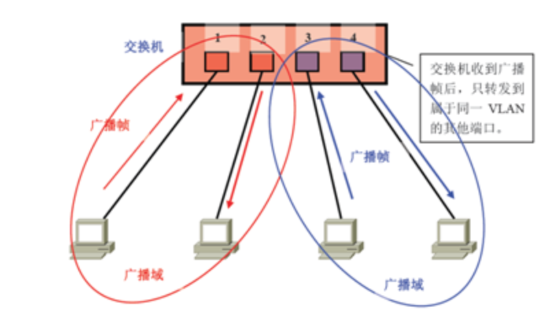
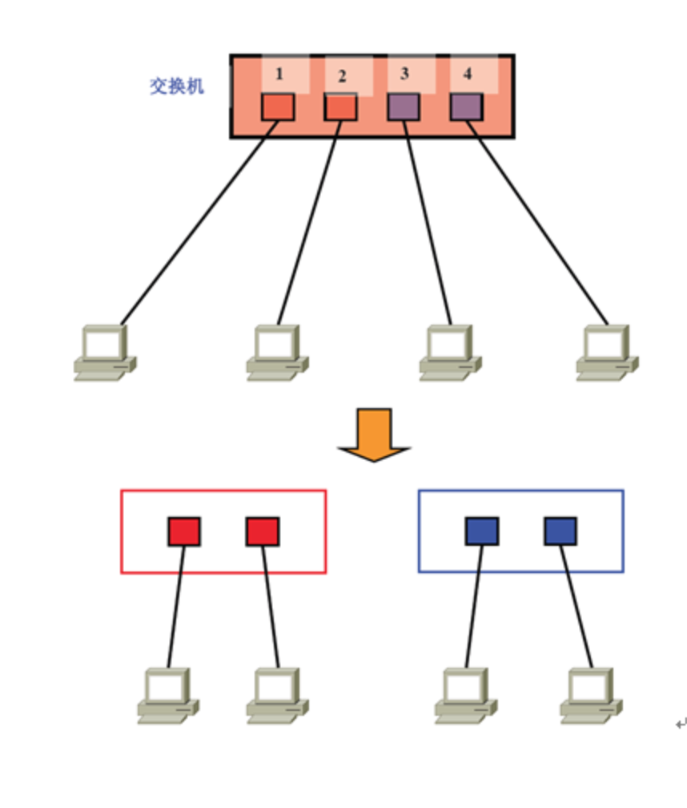
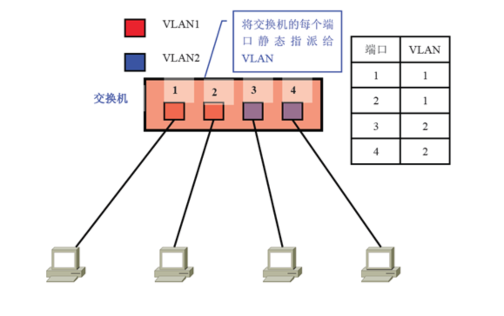
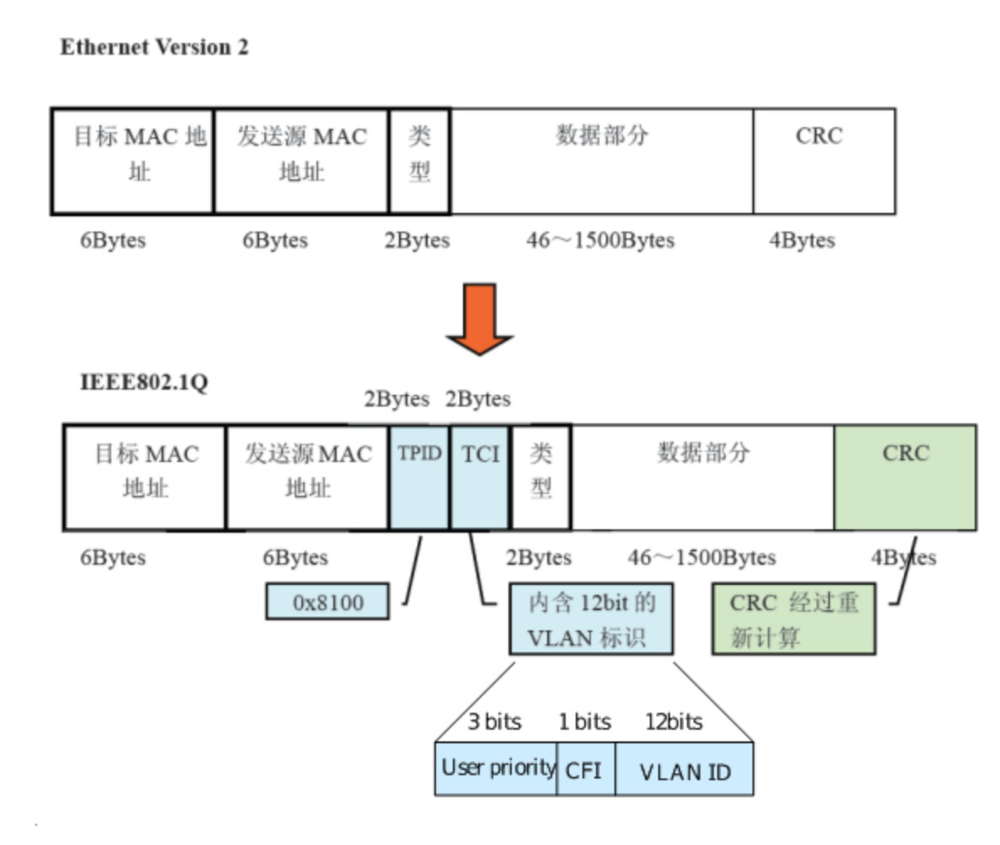
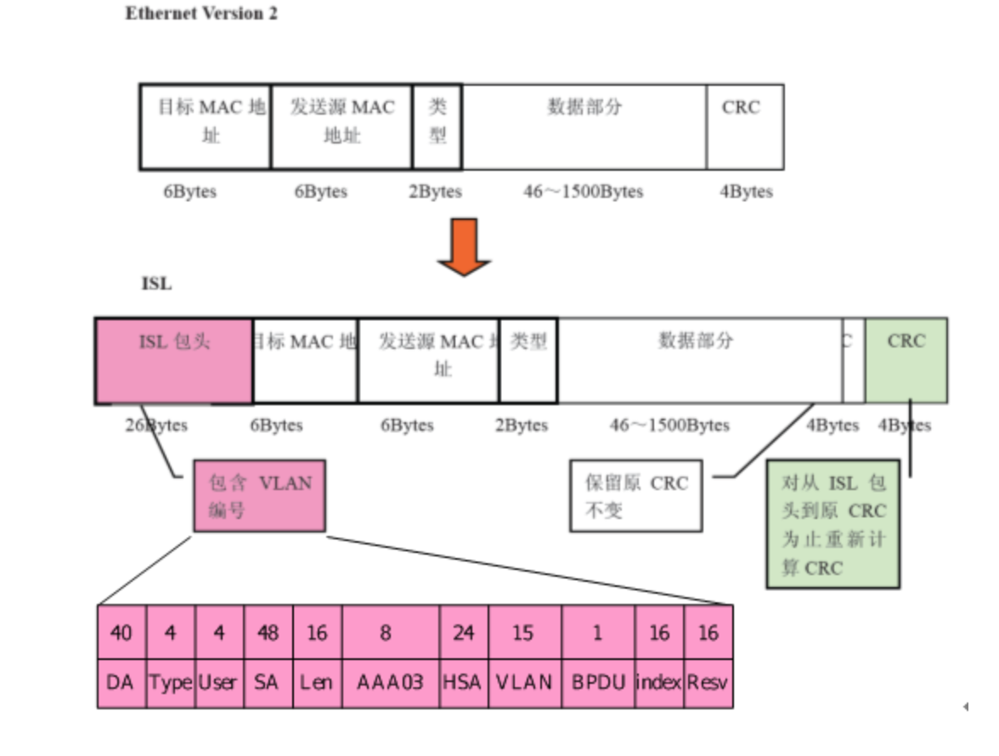

# vlan

## vlan

vlan 虚拟局域网， 一个vlan组成一个逻辑子网， 即一个逻辑广播域， 他可以覆盖过个网络设备。 vlan 工作在第二层和第三层。 vlan 之间的通信需要通过第三层的路由器来完成。

本来二层交换机只能构建单一的广播域， 不过使用vlan 后， 他能够将二层网络分割成多个广播域 ,为什么需要分割广播域， 是因为仅仅有一个广播域， 有可能会影响到网络整体的传输性能，

上图 计算机A 要与B 通信， 在基于以太网通信中， 必须在数据帧中指定目标mac地址才能正常通信， 因此A必须进行ARP广播请求， 尝试获取计算机B的MAc地址， 交换机1 收到广播帧后， 它会将它转发到交换机的其他所有端口， 也就是flooding， 接着交换机2 收到广播帧后， 也会flooding， 交换机3， 4， 5 还会flooding， 最终arp请求会被转发到统一网络中的所有客户机中。

广播消耗了网络整体带宽， 另外收到广播信息的计算机还需要消耗一部分的cpu士奇来进行处理。造成了网络带宽的和cpu 大量无谓消耗

广播信息出现的非常频繁， 除了arp 还有dhcp， rip等很多其他类型的广播信息

## vlan 实现机制

首先在一台未设置任何vlan的二层交换机上， 任何广播帧都会被转发给除接收端口以外的所有其他端口\(flooding\) , 例如， 计算机A发送广播信息后， 会被转发给端口2， 3，4

这时候， 如果在交换机上生成 红 蓝 两个vlan， 同事设置端口1， 2 属于vlan 端口3 4 属于vlan， 再从A发出广播帧的话，交换机就只会把它转发给同属一个vlan的其他端口， 也就是同属于红色的端口2， 不会转发给属于蓝色vlan的端口。

这样， vlan 通过限制广播帧转发的范围来分割了广播域，

如果为了只管描述vlan的话， 我们可以把它理解为将一台交换机在逻辑上分割了数台交换机， 一台交换机生成红蓝， 两个vlan， 也可以看做是讲交换机换做一红一蓝 两台虚拟的交换机。

## vlan 的划分方法，

### 静态vlan

静态vlan 又被成为基于端口的vlan， 顾名思义， 就是明确指定各端口属于哪个vlan的方法

如果计算机数目超过100台后， 设定操作就变得很复杂， 并且客户机每次变更端口， 都必须同时更改端口所属的vlan设定， 比较麻烦

### 动态vlan

动态vlan则是根据每个端口相连的计算机， 随时改变端口所属的vlan， 有3种

* 基于mac地址的vlan, 查询并记录端口所连计算机的网卡的mac地址来决定端口所属， 这个只跟mac地址有关系， 跟交换机端口则没关系, 如果计算机换了网卡， mac地址变更了，则需要重新设定
* 基于子网的vlan, 是通过所连计算机的IP地址， 来决定端口所属的vlan， 只要ip地址不变， 就可以加入原来设定的vlan, 一般路由器与三层交换机都使用基于子网的方法划分vlan
* 基于用户的vlan , 根据交换机端口所连的计算机上当前登录的用户来决定该端口属于哪个vlan

### vlan 帧结构

IEEE802.1Q所附加的VLAN识别信息，位于数据帧中“发送源MAC地址”与“类别域（Type Field）”之间。具体内容为2字节的TPID和2字节的TCI，共计4字节。 在数据帧中添加了4字节的内容，那么CRC值自然也会有所变化。这时数据帧上的CRC是插入TPID、TCI后，对包括它们在内的整个数据帧重新计算后所得的值。 基于IEEE802.1Q附加的VLAN信息，就像在传递物品时附加的标签。因此，它也被称作“标签型VLAN（Tagging VLAN）”。

TPID 是ieee 定义的新的类型， 表明这是一个加了802.1q 标签的帧， TPID 包含了一个固定值 0X8100

1. TCI \(Tag Control Information\) 

包括用户优先级\(User Priority\)、规范格式指示器\(Canonical Format Indicator\)和 VLAN ID。

User Priority：该字段为3-bit，用于定义用户优先级，总共有8个\(2的3次方\)优先级别。IEEE 802.1P 为3比特的用户优先级位定义了操作。最高优先级为7，应用于关键性网络流量，如路由选择信息协议（RIP）和开放最短路径优先（OSPF）协议的路由表更新。优先级6和5主要用于延迟敏感（delay-sensitive）应用程序，如交互式视频和语音。优先级4到1主要用于受控负载（controlled-load）应用程序，如流式多媒体（streaming multimedia）和关键性业务流量（business-critical traffic） － 例如，SAP 数据 － 以及“loss eligible”流量。优先级0是缺省值，并在没有设置其它优先级值的情况下自动启用。

CFI：CFI值为0说明是规范格式，1为非规范格式。它被用在令牌环/源路由FDDI介质访问方法中来指示封装帧中所带地址的比特次序信息。

VID：该字段为12-bit， VLAN ID 是对 VLAN 的识别字段，在标准 802.1Q 中常被使用。支持4096\(2的12次方\) VLAN 的识别。在4096可能的VID 中，VID＝0 用于识别帧优先级。 4095\(FFF\)作为预留值，所以 VLAN 配置的最大可能值为4094。 所以有效的VLAN ID范围一般为  **1-4094** 。

ISL（Inter Switch Link） ISL，是Cisco产品支持的一种与IEEE802.1Q类似的、用于在汇聚链路上附加VLAN信息的协议。 使用ISL后，每个数据帧头部都会被附加26字节的“ISL包头（ISL Header）”，并且在帧尾带上通过对包括ISL包头在内的整个数据帧进行计算后得到的4字节CRC值。换而言之，就是总共增加了30字节的信息。 在使用ISL的环境下，当数据帧离开汇聚链路时，只要简单地去除ISL包头和新CRC就可以了。由于原先的数据帧及其CRC都被完整保留，因此无需重新计算

## 交换机 端口工作模式

交换机端口有三种工作模式

* access 这种类型的端口只能属于1个vlan， 一般用于连接计算机的端口
* trunk 类型的端口可以允许多个vlan 通过， 可以接受和发送多个vlan报文， 一般用于交换机之间连接的端口
* hybrid 类型端口可以允许多个vlan 通过， 可以接受和发送多个vlan 报文， 可以用于交换机之间的连接， 也可以用于连接用户的计算机。 hybird 端口和trunk 端口 在接受数据时候 ，处理方法是一致的， 唯一不同是发送数据时候， hybird 端口可以允许多个vlan 报文发送时候不打标签， 而trunk 端口只允许确实vlan 的报文发送时候不打标签

## linux vlan 设备

linux 我们可以通过ip link add 命令增加一个vlan 设备， vlan 设备 , vlan 设备和网桥一样 是一种虚拟设备， 它需要绑定一个真实网卡才能完成实际的数据发送和接受。 上层协议通过调用ndo\_start\_xmit 函数接口在调用网卡驱动发送数据，所以上层协议首先调用vlan 虚拟设备的ndo\_start\_xmit 函数接口， 然后在vlan虚拟设备中将数据包打上tag，随后调用真实绑定的设备来发送数据。一个真实物理网卡可以承载多个vlan虚拟设备， 此时这个真实网卡就是trunk 端口了， 所以在虚拟化中， 我们一般也会让物理网卡连接的交换机端口也设置为trunk口。

vlan 设备下可以再绑定macvlan bridge

## 交换机 端口vlan 标签处理

交换机内部不存在 不带tag标签的数据帧报文， 内部流动的数据帧时钟是带有标签的。数据帧从外部设备流入交换机内部叫接受数据包过程， 而从交换机内部流出到外部设备叫做发送数据包过程

### access、trunk 、hybrid 端口接受数据包

* 不带vlan tag 的数据帧： 打上端口pvid， 如果确实pvid 在vlan 允许列表中的话，送入交换机的转发进程，查找mac 表找到相应的接口 负责丢弃
* 带vlan tag： access 处理过程， 如果vlan tag=pvid 允许通过进入交换机内部，否则丢弃数据包， trunk 口和hybird 处理过程： 如果vlan tag 在允许访问vlan 列表则进入交换机转发数据帧， 负责丢弃

### access trunk hybird 端口发送数据包

* 不带vlan tag 的数据帧： 不可能出现
* 带vlan tag 的数据帧：
  * access 口的处理过程是如果将tag 剥离 转发出去， 其中access 口只处理与pvid 相应的数据帧， 其他即使意外收到其他vlan的数据帧也不会处理
  * trunk 口处理过程是如果vlan tag = pvid， 剥离tag 转发出去， 如果vlan tag ！= pvid 直接转发出去
  * hubrid 口处理过程是如果该vlan 在本端口配置的属性是untag ， 则暴力tag 进行转发， 如果属性是tag， 则直接发送

PVID并不是加在帧头的标记，而是端口的属性，用来标识端口接收到的未标记的帧

## 引用

[https://blog.csdn.net/phunxm/article/details/9498829](https://blog.csdn.net/phunxm/article/details/9498829)

