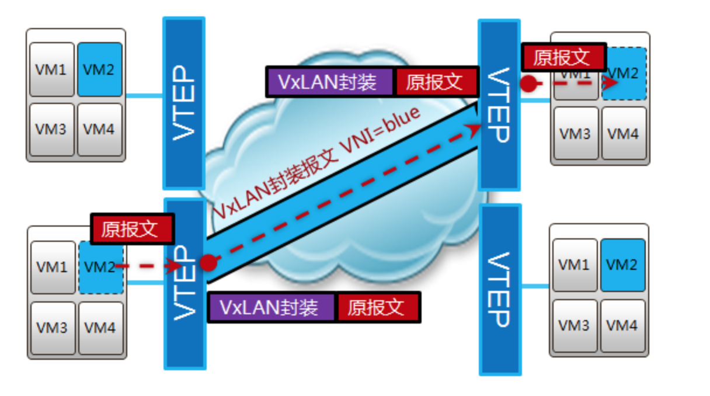
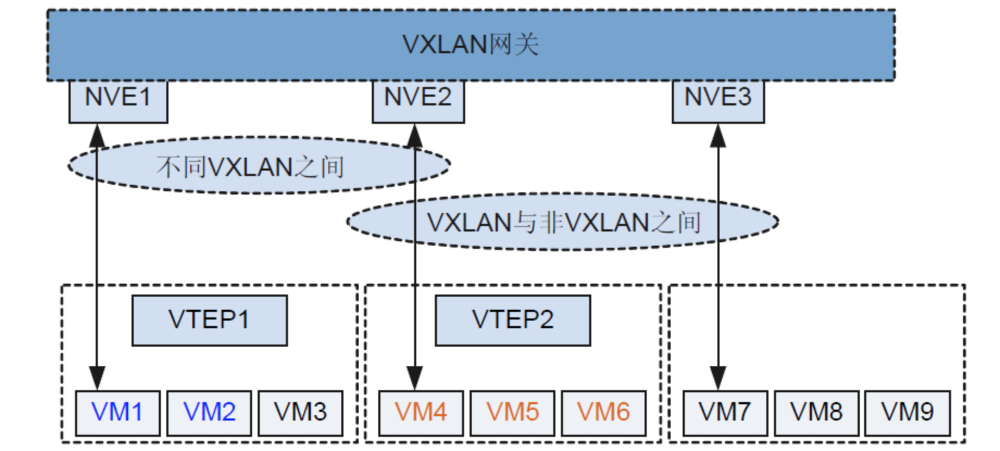
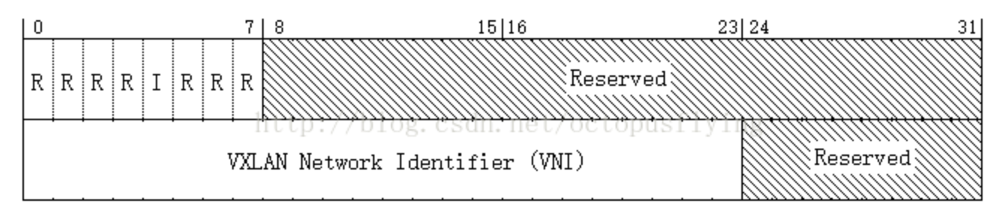
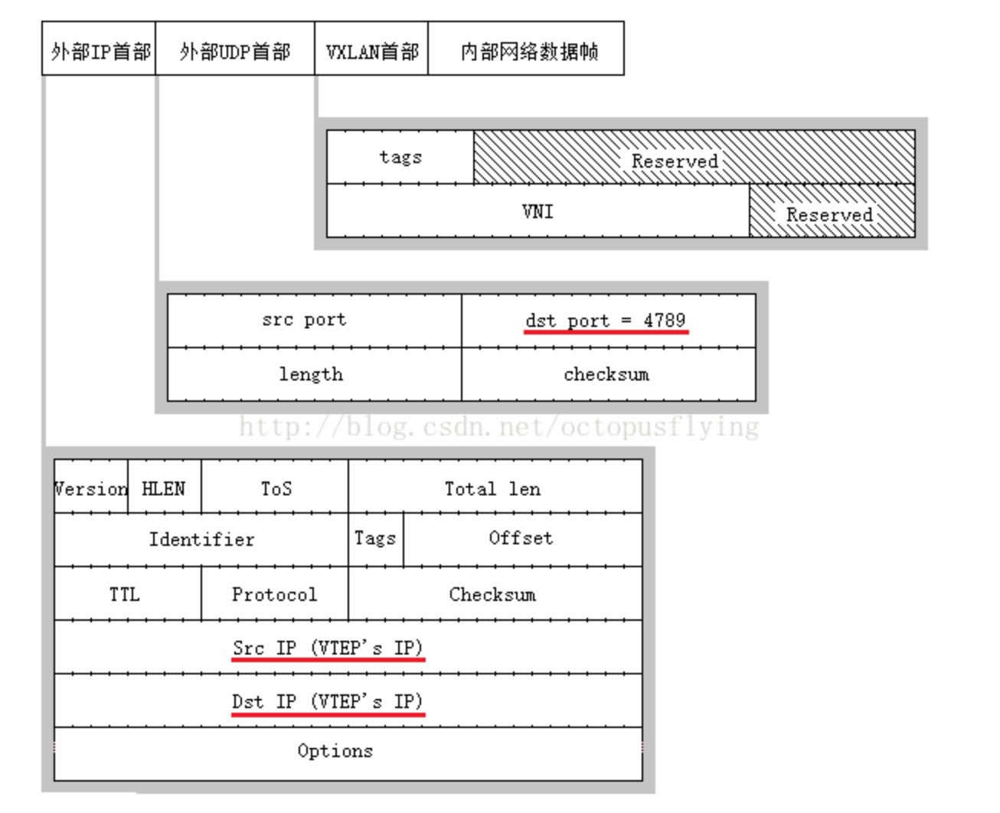

# vxlan

## 简介

传统数据中心网络大多采用与园区相似的二 三层架构， 二层交换， 三层路由。

优点是 部署容易， 符合数据中心分区模块的业务特点

但是随着数据中心从传统数据中心到 虚拟化数据中心和云化中心的演进， 以及动态迁移的技术出现， 要求IP 和mac 地址不变， 所以虚拟机的迁移只能在二层迁移， 不能夸二层迁移， 二层为了提高冗余性 采用设备的冗余和链路冗余 , 这样就需要采用STP 技术来防止环路， 由于STP 性能限制 ， 采用STP 破坏的二层网络， 通常不超过50个网络设备, 这样就极大限制了vm的迁移范围，应用收到了极大的限制， 为了实现vm 大范围垮地域的迁移， 就要求可能涉及的服务器都接入到一个更大的二层网络域中， 这就是大二层技术。

也跟mac 地址表的容量有关系

## STP

### STP 解决的问题

网桥的工作本质是在链路层转发和过滤帧， 那么就会有一些基本问题有待解决：

* 如何在数据链路层转发， 如何通过MAC层地址知道该向哪个LAN转发
* 如果一个网桥连接多个LAN， 而转发的数据帧并非直接相连的LAN所有， 那么应该选择哪条路径才能是经过的网桥数量最小， 路径最短
* 如果几个网桥桥接了几个lan，形成环路， 如何避免数据帧转发时候形成环路
* 当网络拓扑结构发生变化时候， 意味着从某个网桥转发的数据帧的最小路径可能发送变化

STP 用于解决这些问题， Spanning Tree Protocal , 但是Linux 系统仅仅实现了STP协议， STP协议定义了一种数据帧结构， 这种数据帧名字叫 BPDU bridge protocol Data unit, 通过不同网桥之间发送这种数据帧，相互通信应答， 起到解决上述问题的效果。

STP 协议， 最小生成树协议， 用于找到图中的最小生成树， 所以能避免生成环。

## 如何实现大二层网络

大二层网络 经常使用的是overlay 方式， overlay 与underlay相反， underlay 是底层的承载物理网络 ，overlay 跑在underlay上，。

overlay 一般是采用隧道封装技术， 常用的有vxlan

vlan 最多能配置4096 个， 这与数据链路层里， vlan id 占据的bit位有关

## 为什么需要vxlan

* 虚拟机规模受网络规格限制

在大二层网络环境下， 数据报文是通过查询mac地址表进行二层转发， 而mac地址表容量限制了虚拟机的数量

* 网络隔离能力限制

当前主流的网络隔离技术是vlan 或者vpn， 在大规模虚拟化网络部署中存在如下限制:

1 ieee 802.1q 定义的vlan tag 域 只有12bit， 仅能表示4096 个vlan， 无法满足大二层网络大量用户群的需求

2 传统二层网络 vlan /vpn 无法满足网络动态调整的需求

* 虚拟机迁移 范围 受网络架构限制

虚拟机启动后， 可能由于服务器资源问题， 需要将虚拟机迁移到新的服务器上， 为了保证虚拟机迁移过程中业务不中断， 则需要保证虚拟机ip mac 地址等参数保持不变， 这要求业务网络是一个二层网络，要求网络本身具备多路径冗余备份和可靠性

## 什么是vxlan

* vxlan : virtual extensible local area network . 虚拟化扩展lan， 虚拟化可扩展局域网

vxlan 是 NVO3\(network virtualization over layer3\)中的一种网络虚拟化技术， 通过将VM 或者物理服务器发出的数据包封装在UDP中， 并使用物理网络IP 、MAC 作为报文头进行封装， 然后在IP网络上传输， 到达目的后， 有隧道终点 解封装并将数据发送给目标虚拟机或者 物理服务器

* NVE:  network virtual endpoint

网络虚拟边缘节点NVE, 是实现网络虚拟化功能的网络实体， 报文经过NVE 封装后转换后， NVE之间就可以基于三层网络基础建立二层虚拟化网络。

* VTEP : vxlan Tunnel endpoint

VTEP是vxlan隧道端点， 封装在nve中， 用户vxlan 报文的封装和解封装

* VNI vxlan network identifier

vxlan 网络表示VNI ， 类似vlan id， 用于区分vxlan 段， 不同vxlan 段的虚拟机不能直接二层互相通信.

一个VNI 表示一个租户， 即使多个终端用户, 即使多个终端用户属于同一个VNI，也表示一个租户. VNI 有24 bit 组成， 支持多达 16M的（\(2^24-1\)/1024^2）的租户

## 数据报文转发

**vxlan 网关**

vm之间的通信模式有3种: 通VNI 下的不同VM， 不同VNI下的跨网访问, vxlan 和非vxlan之间的访问。如下vxlan 网关示意图

vxlan 网关分为二次网关和三层网关

位于同一网段的终端用户通信，二层网关收到用户报文后， 根据报文中的目的mac 类型转发

* mac 地址是广播， 组播地址， 按照对应的转发流程转发
* mac 地址为单播地址， 按照已知单播地址 报文转发

三层网关， 用于非同一网段的终端用户通信 或者 vxlan 与非vxlan 用户的通信

## vxlan 通信原理

vxlan 通过将逻辑网络中通信的数据帧封装在物理网络中进行传输， 封装和解封装过程有VTEP完成， VXLAN 将逻辑网络中的数据帧添加VXLAN首部后， 封装在物理网络的UDP报文中传送，

个人感觉之所以选择UDP， 没用IP，可能是有穿透NAT设备的需求， 如果只封装在IP中， 则无法穿透NAT设备， 如果封装在TCP中， 因为TCP是可靠性的， 延迟比较高， 如果vxlan 中的data部分也是tcp 包， 那tcp封装tcp， 一旦出现丢包现象， 不容易排查问题， 不知道是underlay的问题， 还是overlay 的问题。 因此选择UDP， 但是UDP是不可靠的， 那么它的可靠性需要封装在vxlan date 里协议来支持， 如果UDP里最终封装的是tcp包， 那就由tcp协议去维护， 如果本身也是维护的是UDP包， 那丢了也就丢了

vxlan 首部格式如下

vxlan 由8字节组成，第一个字节为标志位， 其中标志位I设置为1 表示为一个合法的vxlan首部， 其余标志则为预留， 在传输过程中必须置为0 ， 滴2-4字节为保留位，滴5-7 字节为vxlan 的标识符， 一种24bit，相当于vlan id， 所以可以最多有2^24 个租户， 简称VNI， 滴8个字节也胃保留字段

vxlan在传输过程中， 将逻辑链路网络的数据帧添加vxlan首部后， 一次添加udp，ip，以太网首部后， 在物理网络中传输， 数据帧的封装格式可以用下图描述：

需要注意的是，外部UDP首部的目的端口号为4789，该数值为默认VXLAN解析程序的端口，外层IP首部中的源IP和目的IP地址均填写通信双方的VTEP地址，协议的其余部分和传统网络相同。

## 通信过程

① 发送方向接收方发送数据帧，帧中包含了发送方和接收方的虚拟MAC地址。 ② 发送方连接的VTEP节点收到了数据帧，通过查找发送方所在的VXLAN以及接收方所连接的VTEP节点，将该报文添加VXLAN首部、外部UDP首部、外部IP首部后，发送给目的VTEP节点。 ③ 报文经过物理网络传输到达目的VTEP节点。 ④ 目的VTEP节点接收到报文后，拆除报文的外部IP首部和外部UDP首部，检查报文的VNI以及内部数据帧的目的MAC地址，确认接收方与本VTEP节点相连后，拆除VXLAN首部，将内部数据帧交付给接收方。 ⑤ 接收方收到数据帧，传输完成。

