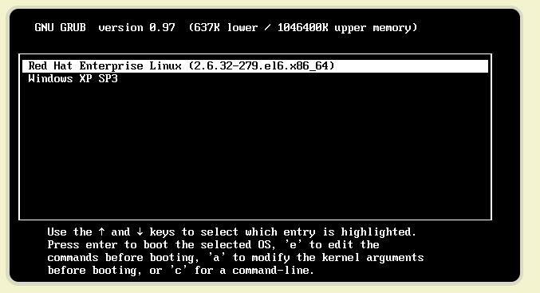

# 系统启动顺序

## 硬件启动顺序

### 零、boot的含义

先问一个问题，"启动"用英语怎么说？

回答是boot。可是，boot原来的意思是靴子，"启动"与靴子有什么关系呢？ 原来，这里的boot是bootstrap（鞋带）的缩写，它来自一句谚语：

"pull oneself up by one's bootstraps"

字面意思是"拽着鞋带把自己拉起来"，这当然是不可能的事情。最早的时候，工程师们用它来比喻，计算机启动是一个很矛盾的过程：必须先运行程序，然后计算机才能启动，但是计算机不启动就无法运行程序！

早期真的是这样，必须想尽各种办法，把一小段程序装进内存，然后计算机才能正常运行。所以，工程师们把这个过程叫做"拉鞋带"，久而久之就简称为boot了。

计算机的整个启动过程分成四个阶段。

### BIOS

上个世纪70年代初，"只读内存"（read-only memory，缩写为ROM）发明，开机程序被刷入ROM芯片，计算机通电后，第一件事就是读取它。这块芯片里的程序叫做"基本輸出輸入系統"（Basic Input/Output System），简称为BIOS。

#### 硬件自检

BIOS程序首先检查，计算机硬件能否满足运行的基本条件，这叫做"硬件自检"（Power-On Self-Test），缩写为POST。

如果硬件出现问题，主板会发出不同含义的蜂鸣，启动中止。如果没有问题，屏幕就会显示出CPU、内存、硬盘等信息。

#### 启动顺序

硬件自检完成后，BIOS把控制权转交给下一阶段的启动程序。

这时，BIOS需要知道，"下一阶段的启动程序"具体存放在哪一个设备。也就是说，BIOS需要有一个外部储存设备的排序，排在前面的设备就是优先转交控制权的设备。这种排序叫做"启动顺序"（Boot Sequence）。

打开BIOS的操作界面，里面有一项就是"设定启动顺序"。

### 主引导记录

BIOS按照"启动顺序"，把控制权转交给排在第一位的储存设备。

这时，计算机读取该设备的第一个扇区，也就是读取最前面的512个字节。如果这512个字节的最后两个字节是0x55和0xAA，表明这个设备可以用于启动；如果不是，表明设备不能用于启动，控制权于是被转交给"启动顺序"中的下一个设备。

这最前面的512个字节，就叫做"主引导记录"（Master boot record，缩写为MBR）。

#### 住引导记录结构

"主引导记录"只有512个字节，放不了太多东西。它的主要作用是，告诉计算机到硬盘的哪一个位置去找操作系统。

主引导记录由三个部分组成：

（1） 第1-446字节：调用操作系统的机器码。

（2） 第447-510字节：分区表（Partition table）。

（3） 第511-512字节：主引导记录签名（0x55和0xAA）。

其中，第二部分"分区表"的作用，是将硬盘分成若干个区。

#### 分区表

硬盘分区有很多好处。考虑到每个区可以安装不同的操作系统，"主引导记录"因此必须知道将控制权转交给哪个区。

分区表的长度只有64个字节，里面又分成四项，每项16个字节。所以，一个硬盘最多只能分四个一级分区，又叫做"主分区"。

### 硬盘启动

这时，计算机的控制权就要转交给硬盘的某个分区了，这里又分成三种情况。

#### 卷引导记录

"卷引导记录"的主要作用是，告诉计算机，操作系统在这个分区里的位置。然后，计算机就会加载操作系统了。

#### 扩展分区和逻辑分区

所谓"扩展分区"，就是指这个区里面又分成多个区。这种分区里面的分区，就叫做"逻辑分区"（logical partition）。

#### 启动管理器

在这种情况下，计算机读取"主引导记录"前面446字节的机器码之后，不再把控制权转交给某一个分区，而是运行事先安装的"启动管理器"（boot loader），由用户选择启动哪一个操作系统。

Linux环境中，目前最流行的启动管理器是Grub。



### 操作系统

控制权转交给操作系统后，操作系统的内核首先被载入内存。

以Linux系统为例，先载入/boot目录下面的kernel。内核加载成功后，第一个运行的程序是/sbin/init。它根据配置文件（Debian系统是/etc/initab）产生init进程。这是Linux启动后的第一个进程，pid进程编号为1，其他进程都是它的后代。

然后，init线程加载系统的各个模块，比如窗口程序和网络程序，直至执行/bin/login程序，跳出登录界面，等待用户输入用户名和密码。

## 操作系统启动顺序

上文讲到， 加载/boot 下的kernel后， 需要在用户态产生一个init 进程。当然现在比如centos7 第一个init 进程是systemd ， 在之前的init 进程则不一样, 但是他们的pid 都是1， 其他进程都是他们的后代

之后init 进程加载各个模块， 比如窗口或者网络程序等等

### init 进程

先不说systemd，

init 进程的一大任务 就是去运行哪些开机启动的程序， 但是不同场合 需要不同的程序， 因此就出现了运行级别这个说法， 也就是说启动是根据运行级别， 来确定运行哪些程序

Linux预置七种运行级别（0-6）。一般来说，0是关机，1是单用户模式（也就是维护模式），6是重启。运行级别2-5，各个发行版不太一样，对于Debian来说，都是同样的多用户模式（也就是正常模式）。

init进程首先读取文件 /etc/inittab，它是运行级别的设置文件。如果你打开它，可以看到第一行是这样的：

```text
　id:2:initdefault:
```

initdefault的值是2，表明系统启动时的运行级别为2。如果需要指定其他级别，可以手动修改这个值。

那么，运行级别2有些什么程序呢，系统怎么知道每个级别应该加载哪些程序呢？......回答是每个运行级别在/etc目录下面，都有一个对应的子目录，指定要加载的程序。

```text
　/etc/rc0.d
　　/etc/rc1.d
　　/etc/rc2.d
　　/etc/rc3.d
　　/etc/rc4.d
　　/etc/rc5.d
　　/etc/rc6.d
```

```text
　$ ls  /etc/rc2.d
　　
　　README
　　S01motd
　　S13rpcbind
　　S14nfs-common
　　S16binfmt-support
　　S16rsyslog
　　S16sudo
　　S17apache2
　　S18acpid
　　...
```

可以看到，除了第一个文件README以外，其他文件名都是"字母S+两位数字+程序名"的形式。字母S表示Start，也就是启动的意思（启动脚本的运行参数为start），如果这个位置是字母K，就代表Kill（关闭），即如果从其他运行级别切换过来，需要关闭的程序（启动脚本的运行参数为stop）。后面的两位数字表示处理顺序，数字越小越早处理，所以第一个启动的程序是motd，然后是rpcbing、nfs......数字相同时，则按照程序名的字母顺序启动，所以rsyslog会先于sudo启动。

根据数字大小来决定运行顺序

但是实际上这些文件都是软链接的 /etc/init.d/ 下的文件

```text
　　$ ls -l /etc/rc2.d
　　
　　README
　　S01motd -> ../init.d/motd
　　S13rpcbind -> ../init.d/rpcbind
　　S14nfs-common -> ../init.d/nfs-common
　　S16binfmt-support -> ../init.d/binfmt-support
　　S16rsyslog -> ../init.d/rsyslog
　　S16sudo -> ../init.d/sudo
　　S17apache2 -> ../init.d/apache2
　　S18acpid -> ../init.d/acpid
　　...
```

### 用户登录

开机启动程序加载完毕以后，就要让用户登录了。

```text
操作系统 -> /boot  -> init process -> run level ->/etc/init.d/ -> user login
```

用户登录一般有三种方式

```text
命令行

ssh 登录

图形界面
```

* 命令行

    init 调用getttyc 程序（get teletype）让用户输入用户名和密码， 输入完成后，再调用lgin 程序， 核对密码， 如果正确， 则从/etc/passwd 读取用户指定的shell, 启动这个shell

    /etc/passwd 文件内容

```text
root:x:0:0:root:/root:/bin/bash
bin:x:1:1:bin:/bin:/sbin/nologin
daemon:x:2:2:daemon:/sbin:/sbin/nologin
adm:x:3:4:adm:/var/adm:/sbin/nologin
lp:x:4:7:lp:/var/spool/lpd:/sbin/nologin
sync:x:5:0:sync:/sbin:/bin/sync
shutdown:x:6:0:shutdown:/sbin:/sbin/shutdown
halt:x:7:0:halt:/sbin:/sbin/halt
mail:x:8:12:mail:/var/spool/mail:/sbin/nologin
operator:x:11:0:operator:/root:/sbin/nologin
games:x:12:100:games:/usr/games:/sbin/nologin
ftp:x:14:50:FTP User:/var/ftp:/sbin/nologin
nobody:x:99:99:Nobody:/:/sbin/nologin
systemd-network:x:192:192:systemd Network Management:/:/sbin/nologin
dbus:x:81:81:System message bus:/:/sbin/nologin
polkitd:x:999:998:User for polkitd:/:/sbin/nologin
sshd:x:74:74:Privilege-separated SSH:/var/empty/sshd:/sbin/nologin
postfix:x:89:89::/var/spool/postfix:/sbin/nologin
tcpdump:x:72:72::/:/sbin/nologin
dockerroot:x:998:995:Docker User:/var/lib/docker:/sbin/nologin
```

* ssh 登录 

    这时系统调用sshd程序（Debian还会再运行/etc/pam.d/ssh ），取代getty和login，然后启动shell。

* 图形界面 

    init进程调用显示管理器，Gnome图形界面对应的显示管理器为gdm（GNOME Display Manager），然后用户输入用户名和密码。如果密码正确，就读取/etc/gdm3/Xsession，启动用户的会话。

### 进入login shell

```text
这里关心的是各个bash 配置文件的加载顺序

debian 默认的shell 是bash，他会读入一些列的配置文件， 在这一步骤中，三种情况有稍微差别
```

* 命令行

    首先读取/etc/profile 这是对所有用户都有效的配置， 依次寻找下面的文件

```text
　　~/.bash_profile
　　~/.bash_login
　　~/.profile
```

```text
需要注意的是， 这三个文件只要有一个存在就不需要读入后面的文件了，比如，要是 ~/.bash_profile 存在，就不会再读入后面两个文件了。
```

* ssh登录：与第一种情况完全相同。
* 图形界面登录：只加载 /etc/profile 和 ~/.profile。也就是说，~/.bash\_profile 不管有没有，都不会运行。

### 打开non-login shell

老实说，上一步完成以后，Linux的启动过程就算结束了，用户已经可以看到命令行提示符或者图形界面了。但是，为了内容的完整，必须再介绍一下这一步。

用户进入操作系统以后，常常会再手动开启一个shell。这个shell就叫做 non-login shell，意思是它不同于登录时出现的那个shell，不读取/etc/profile和.profile等配置文件。

```text
操作系统 -> /boot  -> init process -> run level -> /etc/init.d/ -> user login
```

 **non-login shell的重要性，不仅在于它是用户最常接触的那个shell，还在于它会读入用户自己的bash配置文件 ~/.bashrc。大多数时候，我们对于bash的定制，都是写在这个文件里面的。**

## 引用

[http://www.ruanyifeng.com/blog/2013/02/booting.html](http://www.ruanyifeng.com/blog/2013/02/booting.html) [http://www.ruanyifeng.com/blog/2013/08/linux\_boot\_process.html](http://www.ruanyifeng.com/blog/2013/08/linux_boot_process.html)

